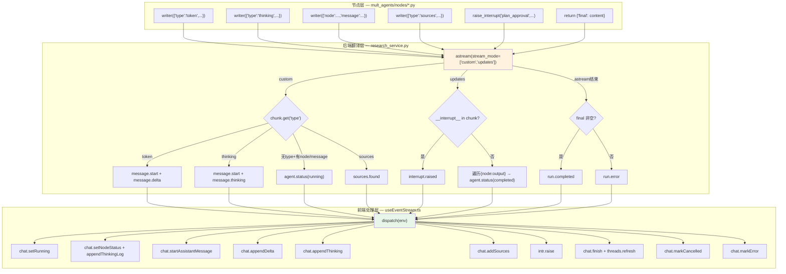

# SSE 流式通信 — 事件全链路与技术债（Q10-Q11 + 行业实践 + 自评）

> 核查日期 2026-09-09
> 版本基准：FastAPI 0.115 · LangGraph 0.2（astream v1 默认，v2 为 1.1+ 新增）· Vue 3.4 · WHATWG Fetch Living Standard
> 项目场景：DeepResearch 多智能体研究平台
> 关联文档：[协议与架构（Q1-Q3）](SSE面试准备_协议与架构.md) · [可靠性与运维（Q4-Q7+Q9）](SSE面试准备_可靠性与运维.md)

---

### Q10. 10 种 SSE 事件从节点发出到前端 store 更新，全链路的代码在哪里？每个事件由谁触发？

**延展**：
1. `agent.status` 的 `phase="running"` 和 `phase="completed"` 由不同通道触发，如果两个通道乱序到达，前端时间线会怎样？
2. `message.start` 的多气泡合并策略（messageIdMap）在什么场景下会失效？

**结论**：
10 种 SSE 事件的发出方不是节点，而是 `research_service.py` 作为唯一翻译层。节点只调 LangGraph 原生通道——`writer(payload)` 发 custom 事件、`raise_interrupt(kind, payload)` 发 interrupt、`return state_patch` 发 updates。`research_service.py` 遍历 `astream` 产出的 `(mode, chunk)` 元组，翻译成 SSE 事件 yield 出去。前端 `useEventStream.ts` 的 `dispatch()` 函数是唯一处理方，按 `env.type` switch-case 分发到 `chat.ts` 和 `interrupt.ts` 两个 Pinia store。

**原理展开**：
三层架构的精确分工：

**第一层：节点层**（`mult_agents/nodes/*.py`）—— 只调 LangGraph 原生 API，不感知 SSE 协议：
- `writer({"type": "token", "node": "write", "text": "..."})` → custom 通道，token 级流式
- `writer({"type": "thinking", "node": "write", "text": "..."})` → custom 通道，深度思考增量
- `writer({"node": "web_search", "message": "..."})` → custom 通道，旧格式进度消息（无 `type` 字段）
- `writer({"type": "sources", "sources": [...]})` → custom 通道，来源发现
- `raise_interrupt("plan_approval", {...})` → interrupt → updates 通道 `__interrupt__`
- `return {"final": content, ...}` → updates 通道 `{node_name: node_output}`

**第二层：后端翻译层**（`research_service.py`）—— 唯一 SSE 事件发出方，把原生通道翻译成 10 种 SSE 事件：

| 触发条件 | 行号 | 翻译逻辑 |
|---|---|---|
| 流入口直接构造 | L283 / L941 | `run.started` |
| custom + `evt_type="token"` + 首次该 node | L310 / L990 | `message.start` |
| custom + `evt_type="token"` | L311 / L991 | `message.delta` |
| custom + `evt_type="thinking"` + 首次该 node | L321 / L999 | `message.start` |
| custom + `evt_type="thinking"` | L322 / L1000 | `message.thinking` |
| custom + 旧格式（无 type，有 node+message） | L336 | `agent.status` (phase=running) |
| custom + `evt_type="progress"` | L329 | `agent.status` (running) — **死代码** |
| custom + `evt_type="sources"` | L341 / L1007 | `sources.found` |
| updates + `__interrupt__` in chunk | L356 / L1021 | `interrupt.raised` |
| updates + 遍历 `{node_name: node_output}` | L367 / L1031 | `agent.status` (phase=completed) |
| updates + `node_output.get("final")` 有值 | L381 | 提取 final → 流末尾发 `run.completed` |
| astream 正常结束 + final 非空 | L393 / L1046 | `run.completed` |
| astream 正常结束 + final 空 + 快照有 final | L408 / L1058 | `run.completed` |
| astream 正常结束 + final 空 + 快照空 | L415 / L1063 | `run.error` (code=NoFinalOutput) |
| `except asyncio.CancelledError` | L421 / L1068 | `run.cancelled` |
| `except Exception` | L429 / L1075 | `run.error` |
| mode=modify + resume_value 为空 | L952 | `run.error` (code=InvalidResume) |
| mode=answer + resume_value 为 None | L963 | `run.error` (code=InvalidResume) |

**第三层：前端处理层**（`useEventStream.ts` dispatch → `chat.ts` / `interrupt.ts`）—— 唯一 SSE 事件处理方：

| SSE 事件 | dispatch 行号 | store 方法 | store 文件:行号 | 作用 |
|---|---|---|---|---|
| `run.started` | L89 | `chat.setRunning` | `chat.ts:172` | `t.running = true` |
| `agent.status` | L95 | `chat.setNodeStatus` + `chat.appendThinkingLog` | `chat.ts:147` + `129` | push 到 agentTimeline + 追加 thinkingLogs |
| `message.start` | L101 | `chat.startAssistantMessage` | `chat.ts:90` | 首个创建主气泡，后续映射 |
| `message.delta` | L116 | `chat.appendDelta` | `chat.ts:115` | `msg.content += text` |
| `message.thinking` | L133 | `chat.appendThinking` | `chat.ts:121` | `msg.thinking += text` |
| `sources.found` | L139 | `chat.addSources` | `chat.ts:152` | 去重后 push 到 msg.sources |
| `interrupt.raised` | L144 | `intr.raise` | `interrupt.ts` | 弹出 HITL 中断卡片 |
| `run.completed` | L149 | `chat.finish` + `clearMsgIdMap` + `threads.refresh` | `chat.ts:177` | `msg.status='done'`，清理映射 |
| `run.cancelled` | L156 | `chat.markCancelled` + `threads.refresh` | `chat.ts:216` | `msg.status='cancelled'` |
| `run.error` | L162 | `chat.markError` + `threads.refresh` | `chat.ts:229` | `msg.status='error'`，显示错误 |

**发出 custom 事件的全部节点 writer 调用清单**：

| 节点 | 文件 | 行号 | payload 格式 | 触发的 SSE 事件 |
|---|---|---|---|---|
| plan | `plan.py` | L27 | `{"node":"plan","message":"正在生成研究计划..."}` | `agent.status`(running) |
| plan | `plan.py` | L103 | `{"node":"plan","message":"已达修改上限..."}` | `agent.status`(running) |
| clarify | `clarify.py` | L306 | `{"node":"clarify","message":"正在判断..."}` | `agent.status`(running) |
| clarify | `clarify.py` | L313/367/414 | `{"node":"clarify","message":"需要澄清..."}` | `agent.status`(running) |
| web_search | `web_search.py` | L30/43/47/85/125 | `{"node":"web_search","message":"..."}` | `agent.status`(running) |
| local_rag | `local_rag.py` | L29/38/66 | `{"node":"local_rag","message":"..."}` | `agent.status`(running) |
| deep_dive | `deep_dive.py` | L23/92 | `{"node":"deep_dive","message":"..."}` | `agent.status`(running) |
| write | `write.py` | L28/77/146/162/172 | `{"node":"write","message":"..."}` | `agent.status`(running) |
| _parsing | `_parsing.py` | L79/114/123 | `{"node":node,"message":"..."}` | `agent.status`(running) |
| _parsing | `_parsing.py` | L95 | `{"type":"token","node":node,"text":text}` | `message.delta` |
| _parsing | `_parsing.py` | L103 | `{"type":"token","node":node,"text":content}` | `message.delta`（ainvoke 降级） |
| _parsing | `_parsing.py` | L90 | `{"type":"thinking","node":node,"text":reasoning}` | `message.thinking` |
| write | `write.py` | L96 | `{"type":"token","node":"write","text":text}` | `message.delta` |
| write | `write.py` | L51 | `{"type":"token","node":"write","text":hint}` | `message.delta`（证据不足提示） |
| write | `write.py` | L101 | `{"type":"token","node":"write","text":content}` | `message.delta`（ainvoke 降级） |
| write | `write.py` | L91 | `{"type":"thinking","node":"write","text":reasoning}` | `message.thinking` |
| web_search | `web_search.py` | L139 | `{"type":"sources","sources":[...]}` | `sources.found` |
| local_rag | `local_rag.py` | L118 | `{"type":"sources","sources":[...]}` | `sources.found` |

**发出 interrupt 的全部节点调用清单**：

| 节点 | 文件 | 行号 | kind | 触发场景 |
|---|---|---|---|---|
| plan | `plan.py` | L67 | `plan_approval` | 研究计划生成后等待用户审批 |
| clarify | `clarify.py` | L314 | `clarification` | 规则快速通道命中，需要用户澄清 |
| clarify | `clarify.py` | L369 | `clarification` | LLM 判断需要澄清 |
| clarify | `clarify.py` | L416 | `clarification` | 追问（信息不充分） |
| analyze | `analyze.py` | L62 | `clarification` | 证据缺口，需要用户补充或自动搜索 |
| write | `write.py` | L124 | `report_review` | 报告初稿生成后等待用户审核 |

**代码示例**：
```python
# research_service.py L296-343 — 后端翻译层核心（custom 通道处理）
if mode == "custom":
    if isinstance(chunk, dict):
        evt_type = chunk.get("type", "")

        if evt_type == "token":                     # 业务层 type=token
            node = chunk.get("node", "")
            text = chunk.get("text", "")
            mid = f"{run_id}:{node}"
            last_token_node = node
            if node not in seen_nodes:               # 首次出现 → 发 message.start
                seen_nodes.add(node)
                yield sse(event("message.start", message_id=mid, node=node))
            yield sse(event("message.delta", message_id=mid, text=text))

        elif evt_type == "thinking":                # 业务层 type=thinking
            # ...同理发 message.start + message.thinking

        elif evt_type == "progress":                 # 死代码：无节点发出此 type
            yield sse(event("agent.status", node=node, label=label, phase="running"))

        # 旧格式兼容：{node, message} 无 type 字段
        elif "node" in chunk and "message" in chunk and "type" not in chunk:
            yield sse(event("agent.status", node=node, label=label, phase="running"))

        elif evt_type == "sources":
            yield sse(event("sources.found", sources=sources))
    continue
```

```typescript
// useEventStream.ts L85-171 — 前端唯一分发器
function dispatch(threadId: string, env: EventEnvelope): void {
  const idMap = getMsgIdMap(threadId)
  switch (env.type as EventType) {
    case 'run.started':
      chat.ensureThread(threadId); chat.setRunning(threadId); clearMsgIdMap(threadId)
      break
    case 'agent.status':
      chat.setNodeStatus(threadId, env.data); chat.appendThinkingLog(threadId, ...)
      break
    case 'message.start':
      if (!idMap.has(env.data.message_id)) {
        if (idMap.size === 0) {                     // 首个 → 创建主气泡
          chat.startAssistantMessage(threadId, env.data.message_id, env.data.node)
          idMap.set(env.data.message_id, env.data.message_id)
        } else {                                    // 后续节点 → 映射到主气泡
          const primaryId = idMap.values().next().value!
          idMap.set(env.data.message_id, primaryId)
        }
      }
      break
    case 'message.delta':
      let primaryId = idMap.get(env.data.message_id)
      if (!primaryId) { /* 惰性初始化 */ }
      chat.appendDelta(threadId, primaryId, env.data.text)
      break
    case 'run.completed':
      chat.finish(threadId, env.data); clearMsgIdMap(threadId); void threads.refresh(threadId)
      break
    // ...
  }
}
```

**图解**：


三层分工明确：节点层只管"发生了什么"（调 writer/interrupt/return），翻译层只管"怎么转成 SSE 事件"（mode+chunk → type+data），前端层只管"怎么更新 UI"（dispatch → store）。任何一层改动不扩散到其他层——节点新增 writer 调用只需翻译层加一个 elif 分支，前端新增 SSE 事件只需 dispatch 加一个 case。

**边界与陷阱**：
- `agent.status` 的 `phase="running"` 由 custom 通道触发，`phase="completed"` 由 updates 通道触发。如果 LangGraph 先 yield updates 再 yield custom（理论上不会，但时序无强保证），前端时间线会先显示 completed 再显示 running。当前实现没有做时序校正，依赖 LangGraph 的 yield 顺序保证。
- `message.start` 的多气泡合并依赖 `messageIdMap`——第一个 `message.start` 创建主气泡并记录 ID，后续节点的 `message.start` 映射到同一 ID。如果 `clearMsgIdMap` 被提前调用（如 `run.completed` 后重连），新节点的 token 会创建新气泡而不是合并。

**延展解答**：
乱序到达的影响：`agent.status(running)` 由 custom 通道发，`agent.status(completed)` 由 updates 通道发。LangGraph 保证同一节点的 custom 事件先于 updates 产出（因为 updates 是节点 return 后才 yield 的），所以正常流程下不会乱序。但如果重连后从 checkpoint 续跑，已完成的节点不会重新发 custom 事件，只会发 updates——此时前端会收到 `agent.status(completed)` 但没有对应的 `running`。`chat.setNodeStatus` 直接 push 到 `agentTimeline`，不做状态机校验，所以时间线上会出现只有 completed 没有 running 的节点——这是正常行为，UI 层需要容忍。

messageIdMap 失效场景：`run.completed` 时 `clearMsgIdMap` 清理映射。如果用户在 `run.completed` 后立即发起新消息走 resume，resume 的 `run.started` 会重新 `clearMsgIdMap`——此时如果旧 run 的某个 `message.delta` 因为网络延迟还在路上（理论上 SSE 是有序的，但极端情况下浏览器微任务调度可能错位），新 run 的 `message.start` 会创建新主气泡，旧 delta 会被映射到新气泡。实践中不会发生因为 SSE 是单连接有序的，旧连接关闭后不会有新数据。

---

### Q11. `research_service.py` 里的 `elif evt_type == "progress"` 是死代码？这种两层 type 混淆是怎么产生的，怎么避免？

**延展**：
1. 如果有人新加一个节点发了 `{"type": "progress", ...}`，这段死代码会"复活"吗？
2. 怎么从架构层面防止"定义了但没人发"或"发了但没人处理"的事件类型不匹配问题？

**结论**：
`research_service.py` L325 的 `elif evt_type == "progress":` 是死代码——项目中没有任何节点发出过 `{"type": "progress", ...}` 的 custom 事件。所有进度消息走的是 L332 的旧格式兼容分支（`{"node": "...", "message": "..."}` 无 `type` 字段）。这个死代码的根因是两层 type 体系混淆：开发者定义了业务层 `type="progress"` 的处理分支，但节点代码实际发的是旧格式 payload（不带 `type`），两边没对齐。

**原理展开**：
问题根源是 custom 通道的 payload 格式在项目演进中发生了变化，但后端处理逻辑没有同步清理：

**第一阶段（旧格式）**：早期节点代码发出的 writer payload 是 `{"node": "write", "message": "正在撰写最终报告..."}`——没有 `type` 字段，只有 `node` 和 `message`。后端 L332 的 `elif "node" in chunk and "message" in chunk and "type" not in chunk:` 分支处理这种格式，翻译成 `agent.status(running)`。

**第二阶段（新格式）**：后来引入了带 `type` 的 payload——`{"type": "token", ...}` / `{"type": "thinking", ...}` / `{"type": "sources", ...}`。后端新增了 L302/L314/L339 三个分支处理这些。同时有人"预设"了一个 `type="progress"` 的分支（L325），打算让节点发 `{"type": "progress", "node": "...", "message": "..."}`。但**节点代码从未改过来**——所有进度消息仍然发旧格式 `{"node": ..., "message": ...}` 而不是 `{"type": "progress", ...}`。

验证方法：全局搜索 `mult_agents/nodes/` 目录下所有 `writer(` 调用，payload 只有三种格式：
1. `{"type": "token", "node": ..., "text": ...}` — token 级流式
2. `{"type": "thinking", "node": ..., "text": ...}` — 深度思考
3. `{"type": "sources", "sources": [...]}` — 来源发现
4. `{"node": ..., "message": ...}` — 旧格式进度消息（无 `type`）

没有任何 `{"type": "progress", ...}` 的调用。

**为什么这段死代码不被发现**：
- 单元测试只验证"发了 writer payload 后前端收到正确的 SSE 事件"，不验证"后端处理分支是否有对应的发出方"。
- 集成测试走完整流程，旧格式进度消息走 L332 分支正常工作，功能没问题。
- 静态类型检查不覆盖 `writer()` 的 payload 内容——LangGraph 的 `StreamWriter` 签名是 `(value: Any) -> None`，不约束 payload schema。

**从架构层面避免**：
理想方案是用 Pydantic 定义 custom 事件的 payload schema，类似 SSE 事件的 `EVENT_REGISTRY`：

```python
# 假想的 custom 事件 payload 注册表
CUSTOM_EVENT_REGISTRY = {
    "token": TokenPayload,          # {"type":"token","node":str,"text":str}
    "thinking": ThinkingPayload,     # {"type":"thinking","node":str,"text":str}
    "sources": SourcesPayload,       # {"type":"sources","sources":list}
    "progress": ProgressPayload,     # {"type":"progress","node":str,"message":str}
}
```

节点代码发 writer 前用注册表校验 payload，后端处理时也查注册表。这样"定义了但没人发"的分支在 CI 阶段就会被发现——注册表里有 `progress` 但没有节点调用它。但当前项目没有这层约束，因为 custom 通道的 payload 是动态 dict，没有 schema。

**代码示例**：
```python
# 死代码 — research_service.py L325-329
elif evt_type == "progress":
    node = chunk.get("node", "")
    message = chunk.get("message", "")
    label = NODE_LABELS.get(node, node)
    yield sse(event("agent.status", node=node, label=label, phase="running"))
    # ⚠️ 永远不会执行：没有节点发出 {"type":"progress",...}

# 实际生效的旧格式兼容 — research_service.py L332-336
elif "node" in chunk and "message" in chunk and "type" not in chunk:
    node = chunk.get("node", "")
    message = chunk.get("message", "")
    label = NODE_LABELS.get(node, node)
    yield sse(event("agent.status", node=node, label=label, phase="running"))
    # ✅ 所有进度消息走这里：节点发的是 {"node":"write","message":"..."}
```

```python
# 节点实际发出的 payload — write.py L28
writer({"node": "write", "message": "正在撰写最终报告..."})
# 没有 "type" 字段 → 走 L332 旧格式兼容分支

# 如果要"复活"死代码分支，节点需要改成：
writer({"type": "progress", "node": "write", "message": "正在撰写最终报告..."})
# 但这个改动没有意义——L325 和 L332 的翻译逻辑完全相同
```

**边界与陷阱**：
- 死代码不会造成功能 bug——旧格式兼容分支兜底了所有进度消息。但它是技术债：新人读代码时会以为 `type="progress"` 是活跃的事件类型，浪费理解成本。
- 如果有人按 `type="progress"` 的"设计意图"给节点新增 `writer({"type": "progress", ...})` 调用，L325 分支会"复活"——但效果和旧格式 L332 完全一样，多此一举。
- 更大的风险是"发了但没人处理"：如果节点发了 `{"type": "tool_call", ...}` 但后端没有 `elif evt_type == "tool_call":` 分支，chunk 会落入 `continue`（L343），静默丢弃。前端永远看不到 tool 调用信息。

**延展解答**：
复活场景：有人新增 `{"type": "progress", ...}` 的 writer 调用后，L325 分支会执行。但因为 L325 和 L332 的翻译逻辑完全相同（都是 `agent.status` + `phase="running"`），功能上没有区别。正确的做法是删除 L325 的死代码分支，统一到旧格式兼容分支——或者反过来，统一所有进度消息为 `{"type": "progress", ...}` 新格式，删除 L332 旧格式兼容分支。当前项目的做法是"不碰不动"，留着死代码作为技术债。

架构层面防止不匹配：可以在 `events.py` 里定义 `CustomEventPayload` 的 Pydantic 模型和注册表，节点代码 import 后构造 payload，后端处理时也查注册表。或者用 TypeScript 的 discriminated union 在前端约束——`type` 是判别字段，每种 `type` 对应固定的 data 形状。但 custom 通道的 payload 是 Python dict 到 JSON 的动态转换，没有编译期约束，只能靠运行时校验和文档约定。

---

## 四、行业最佳实践对照

| 最佳实践 | 本项目实现 | 状态 |
|---|---|---|
| SSE 端点用 GET + EventSource | POST + fetch ReadableStream | ⚠️ 因需 POST body 而偏离标准，代价是手动帧解析和重连 |
| 结构化事件协议（type + data schema） | EventEnvelope + 10 种事件 + Pydantic 校验 | ✅ 比常规 `data: text` 更严谨 |
| 心跳保活 | `: ping\n\n` 注释帧，15s 可配置 | ✅ 符合 SSE 规范的注释帧用法 |
| 断线重连 | 自建指数退避状态机 + state 检查 + resume 续流 | ✅ 比原生 EventSource 重连更智能（断点续研 vs 从头开始） |
| 取消机制 | task.cancel() 真正中断 LLM 调用 | ✅ 比关闭 EventSource 更彻底 |
| 并发拦截 | TaskRegistry + 409 | ✅ 防止同 thread 并发 |
| 多 worker 支持 | Redis Pub/Sub 广播取消信号 | ✅ 已预留，单机模式降级 |
| 代理穿透 | `X-Accel-Buffering: no` + `Cache-Control: no-cache` | ✅ Nginx/CloudFlare 兼容 |
| 背压处理 | 纯 async 链路，TCP 层背压穿透到 LLM API | ✅ 天然背压 |
| Last-Event-ID 追踪 | 不使用，靠 LangGraph checkpoint | ⚠️ 不符合 SSE 规范，但 checkpoint 更可靠 |
| SSE 事件 ID（id 字段） | 不使用 | ⚠️ 牺牲了断线重连的精确续传，靠 checkpoint 替代 |
| 事件压缩（gzip/brotli） | 不使用 | ⚠️ SSE 文本格式不支持内容协商，需在 HTTP 层做 |
| SSE over HTTP/2 多路复用 | 未使用 | ⚠️ HTTP/1.1 chunked transfer，HTTP/2 可减少连接数 |
| 幂等取消（cancel 多次调用） | 幂等：not_running 返回 200 | ✅ |
| 进程崩溃恢复 | scan_orphans + interrupted_by_restart 标记 | ✅ 多 worker + Redis 兜底 |

### 如果重新设计的改进方向

1. **GET 端点 + POST 创建任务分离**：参考 Vercel AI SDK 模式——POST /research 创建任务返回 thread_id，GET /stream/{thread_id} 用 EventSource 订阅。这样能用 EventSource 原生重连 + Last-Event-ID，同时 POST 只创建不订阅。代价是两次请求延迟增加。
2. **SSE 事件 ID + Last-Event-ID**：在 EventEnvelope 加 `id` 字段（递增序号），前端缓存最后收到的 id，重连时发给后端。后端从 checkpoint + event log 重建断点。比纯 checkpoint 更精细——可以续传到具体 token 级别。
3. **HTTP/2 多路复用**：把多个 thread 的 SSE 连接复用到一条 HTTP/2 连接上，减少 TCP 连接数和 TLS 握手开销。
4. **事件压缩**：在 HTTP 层用 `Content-Encoding: gzip` 压缩 SSE 帧。LLM token 的 JSON 信封有大量重复结构（`{"type":"message.delta","ts":...,"data":{"message_id":"xxx","text":"..."}}`），gzip 可压缩 60%+。
5. **WebSocket 降级**：对于需要双向通信的场景（如 HITL 的实时交互），可在 SSE 基础上加 WebSocket 降级通道。但当前 HITL 用 SSE `interrupt.raised` + POST /resume 足够。

## 五、自评清单

- [x] 能否说出 3 个适用场景和 2 个不适用场景？
  - 适用：LLM token 流式输出、多步骤研究进度推送、HITL 中断通知
  - 不适用：高频双向通信（如实时协作编辑）、二进制流（如视频推流）
- [x] 能否不看书复述 2 个核心问题的完整原理链条？
  - Q1：POST vs GET+EventSource 的取舍 → 放弃自动重连/事件ID/帧解析 → 手动实现三件事
  - Q4：断线重连状态机 → 退避 → state 检查 → 消息对齐 → resume 续流
- [x] 能否手写核心问题的代码示例？
  - consumeSSE 的 buffer split 逻辑、_astream_with_heartbeat 的 asyncio.wait 超时模式
- [x] 能否描述 2 个常见故障的排查思路？
  - 心跳不生效：检查 `proxy_buffering off` + `X-Accel-Buffering: no` + 心跳间隔 < proxy_read_timeout
  - 重连失败：检查 GET /state 返回的 resumable + status + PG checkpoint 是否存在
- [x] 能否结合项目回答"为什么选它？遇到什么问题？怎么解决的？"
  - 选 SSE 不选 WebSocket：单向推送足够，SSE 协议简单
  - 遇到 POST 不能用 EventSource：改用 fetch ReadableStream + 手动帧解析
  - 遇到断线重连不能从头开始：用 LangGraph checkpoint 做断点续研
- [x] 能否回答"如果 QPS/数据量翻 10 倍，现有方案的瓶颈和改进？"
  - 瓶颈：LLM API 限流、PG 连接池、单进程 GIL
  - 改进：多 worker + Redis Pub/Sub、PgBouncer、水平扩容