# SSE 流式通信 — 协议与架构（速记表 + 口述稿 + Q1-Q3）

> 核查日期 2026-09-09
> 版本基准：FastAPI 0.115 · LangGraph 0.2（astream v1 默认，v2 为 1.1+ 新增）· Vue 3.4 · WHATWG Fetch Living Standard · HTTP/SSE 协议 RFC 文本（WHATWG 草案）
> 项目场景：DeepResearch 多智能体研究平台，后端 FastAPI + LangGraph async generator，前端 Vue3 + fetch ReadableStream，SSE 作为 LLM token 级流式输出的唯一通信通道
> 关联文档：[可靠性与运维（Q4-Q7+Q9）](SSE面试准备_可靠性与运维.md) · [事件全链路与技术债（Q10-Q11）](SSE面试准备_事件全链路与技术债.md)

## 一、速记表

| 技术点/功能点 | 本项目方案 | 常规 SSE 方案 | 关键差异 |
|---|---|---|---|
| 传输层 | POST + fetch ReadableStream 手动解析 | GET + EventSource API | 本项目需 POST body 携带 query，故弃用 EventSource |
| 事件格式 | `data: {type,ts,data}\n\n` 结构化信封 | `data: text\n\n` 任意文本 | 本项目统一 EventEnvelope，前端可按 type 分发 |
| 事件类型 | 10 种语义事件（run.started → run.completed） | 通常只有 `data` 事件 | 本项目覆盖生命周期 + token 增量 + HITL 中断 |
| 心跳保活 | `: ping\n\n` 注释帧，15s 间隔，可配置 | 通常无，或靠 `retry:` 字段 | 本项目用注释帧穿透代理，不触发前端 onEvent |
| 断线重连 | 自建指数退避状态机 + state 检查 + resume 续流 | EventSource 自动重连 + `Last-Event-ID` | 本项目需 POST + checkpoint 续流，无法用原生重连 |
| 取消机制 | POST /cancel → TaskRegistry task.cancel() → CancelledError | 关闭 EventSource（前端断开） | 本项目后端真正中断 LLM 调用，不只断开连接 |
| 续流恢复 | mode=continue/answer/modify + LangGraph checkpoint | 无（SSE 是无状态协议） | 本项目实现断点续研，保留已检索数据 |
| 并发拦截 | TaskRegistry + 409 ConcurrentRunError | 无 | 同一 thread 不允许并发 run |
| 多气泡合并 | messageIdMap 映射各节点 token 到主气泡 | 不涉及 | 一次研究 N 个节点输出合并到一个气泡 |
| 半包/黏包 | buffer split `\n\n` + 半帧留存下轮 | EventSource 内部处理 | 本项目手动解析需自行兜底 |

## 二、面试口述稿

### 1 分钟极简版

我在 DeepResearch 项目中实现了一套基于 SSE 的 LLM token 级流式通信。和常规 SSE 用 GET + EventSource 不同，我的端点需要 POST 携带用户查询，所以前端用 fetch + ReadableStream 手动解析 SSE 帧。后端用 FastAPI 的 StreamingResponse 挂一个 async generator，LangGraph 的 astream 把 LLM 每个 token 通过自定义事件 yield 出去，格式是 `data: {type, ts, data}\n\n` 的结构化信封，共 10 种事件类型覆盖了从 run.started 到 run.completed 的完整生命周期。我还做了心跳保活防止代理超时断连、指数退避重连 + LangGraph checkpoint 断点续研、TaskRegistry 并发拦截和 task.cancel() 真正中断 LLM 调用。

### 3 分钟完整版

**SSE 协议选型（约 30 秒）**
痛点是 LLM token 流式输出需要实时推送，WebSocket 双向通信过重且需自定义心跳/重连，SSE 单向推送天然适配。但标准 EventSource 只支持 GET，我的 /stream 端点需要 POST body 携带 query 和参数，所以前端改用 fetch + ReadableStream 手动解析 `\n\n` 分帧，放弃了 EventSource 的自动重连，自建指数退避重连状态机。

**结构化事件协议（约 40 秒）**
常规 SSE 传 `data: text`，前端需要自己解析。我设计了 EventEnvelope 信封 `{type, ts, data}`，10 种语义事件：run.started/agent.status/message.start/message.delta/message.thinking/sources.found/interrupt.raised/run.completed/run.cancelled/run.error。前端按 type switch-case 分发到 Pinia store，未知 type 静默忽略保证向前兼容。后端用 Pydantic 校验每种事件的 data schema，前后端类型定义从同一份 event-protocol.json 生成。

**断线重连 + 断点续研（约 50 秒）**
EventSource 自动重连靠 `retry:` 和 `Last-Event-ID`，但我的 SSE 是 POST 不能自动重连。自建状态机：网络错误后指数退避（1s→2s→4s…→30s，上限 5 次），重连前先 GET /state 检查可恢复性，如果 resumable 则先 syncThreadMessages 拉取服务端最新消息对齐（清掉半截 streaming 消息），再 POST /resume mode=continue 让 LangGraph 从 checkpoint 续跑，已检索的 sources/findings 全部保留。

**取消 + 并发控制（约 30 秒）**
常规 SSE 取消就是关 EventSource，但后端 LLM 还在跑。我用 TaskRegistry 注册 asyncio.Task，POST /cancel 调 task.cancel()，CancelledError 在 generator 内部 await 点抛出，真正中断 LLM 调用并发 run.cancelled 事件。同一 thread 并发 run 返回 409，多 worker 场景用 Redis Pub/Sub 广播取消信号。

**心跳保活（约 20 秒）**
代理（Nginx/CloudFlare）默认 60s 无数据就断连，LLM 长思考可能 30s+ 无 token 输出。用 `: ping\n\n` 注释帧，SSE 规范中 `:` 开头的行被浏览器忽略不触发 onEvent，但数据流保持活跃，15s 间隔可配置。

## 三、问题深度拆解

> 版本基准：FastAPI 0.115（StreamingResponse）· LangGraph 0.2（astream + checkpointer）· Vue 3.4（fetch ReadableStream）· WHATWG Fetch + SSE 草案
> 项目场景：DeepResearch 多智能体研究平台，FastAPI 后端 + Vue3 前端，SSE 作为 LLM token 级流式输出的唯一通道，替代轮询和 WebSocket

### Q1. 你的 SSE 端点为什么用 POST + fetch 而不是 GET + EventSource？这个取舍带来了什么代价？

**延展**：
1. 如果未来端点需要支持 GET（如分享链接直接打开），你会怎么设计？
2. fetch + ReadableStream 手动解析 SSE 帧时，如何处理黏包/半包问题？

**结论**：
项目 /stream 端点需要接收用户查询 query、user_id、thread_id、hitl_enabled 等参数，这些数据量大且包含中文，放 URL query string 不合适——GET 的 URL 长度限制在 Nginx 默认 8K，中文编码后膨胀严重，而且 query 参数会出现在 access log 里暴露用户输入。所以选择 POST + JSON body，前端用 fetch 发起请求、ReadableStream 消费响应。代价是放弃了 EventSource 的三个内置能力：自动重连（`retry:` 字段）、事件 ID 追踪（`Last-Event-ID` 请求头）、浏览器原生 SSE 帧解析。这三件事全部要手动实现。

**原理展开**：
EventSource 是 WHATWG 定义的浏览器原生 SSE 客户端，构造函数签名是 `new EventSource(url: string, { withCredentials?: boolean })`——只接受 URL，不支持传入 body。这是 W3C 在 2009 年设计 SSE 规范时的有意约束：SSE 定位为"服务器推送"协议，客户端只是说"我要订阅这个流"，不需要在握手时发送大量数据。如果要在订阅时传递参数，规范的预期是放 URL path（`/stream/123`）或 query string（`/stream?thread=123`）。

但本项目有两个约束使得 GET 不合适：

第一，用户查询可能很长。研究类查询如"请调研当前 AI Agent 领域的前沿进展，包括主流框架、典型应用场景和落地挑战"有 40+ 中文字符，URL 编码后每个中文字符变成 `%E8%AF%B7` 等 9 字节，40 个字符膨胀到 360 字节。加上 user_id、thread_id、tenant_id 等参数，URL 总长度可能超过 2K。虽然 Nginx 默认 `large_client_header_buffers` 允许 8K，但生产环境可能有 CDN/WAF 层限制在 2K 甚至更短。

第二，用户查询是敏感数据。GET 请求的 URL 会被记录在 Nginx access log、CDN 日志、浏览器 history 里，违反隐私设计原则。POST body 不被 access log 默认记录（需要 `request_body` 指令显式开启），安全审计面更小。

代价分析——放弃 EventSource 后需要手动实现的三件事：

1. **帧解析**：EventSource 内部按 `\n\n` 分割 SSE 帧，解析 `data:` / `event:` / `id:` / `retry:` 前缀。手动实现需要自己 split + buffer 兜底半包。本项目 `consumeSSE` 函数的核心逻辑：
   - 用 `resp.body.getReader()` 获取 ReadableStream 的 reader
   - 用 TextDecoder 解码 Uint8Array 到字符串
   - 按 `\n\n` 分帧，最后一个元素可能是半帧（缺少结尾 `\n\n`），留到下一轮拼接
   - 只处理 `data:` 前缀的行，其他（如 `: ping` 注释帧）丢弃

2. **重连**：EventSource 在连接断开时自动重连，间隔由服务端 `retry:` 字段控制（默认 3s）。手动实现需要自建指数退避状态机，且需要判断"该不该重连"——用户主动取消时不应重连，网络断开时应重连。本项目用 `isUserCancelled(threadId)` 检查 chat store 的消息状态来区分。

3. **事件 ID 追踪**：EventSource 自动管理 `Last-Event-ID` 请求头，重连时发给服务端。本项目不需要——因为断点续研不靠 SSE 事件 ID，而是靠 LangGraph checkpoint。重连后走 /resume mode=continue，LangGraph 从 checkpoint 续跑，已处理的 token 不会重复输出。

**代码示例**：
```typescript
// agent_front/src/api/sse.ts — 手动 SSE 帧解析核心逻辑
export async function consumeSSE(
  resp: Response,
  onEvent: (env: EventEnvelope) => void,
  onDone?: () => void,
  onError?: (err: Error) => void,
): Promise<void> {
  if (!resp.ok) {
    const text = await resp.text().catch(() => '')
    throw new Error(text || `请求失败: ${resp.status}`)
  }
  if (!resp.body) throw new Error('当前环境不支持流式响应')

  const reader = resp.body.getReader()
  const decoder = new TextDecoder('utf-8')
  let buffer = ''  // 跨 chunk 的半帧缓冲

  try {
    while (true) {
      const { done, value } = await reader.read()
      if (done) break
      buffer += decoder.decode(value, { stream: true })

      // 按 \n\n 切帧；最后一个元素可能是半帧，留到下一轮
      const frames = buffer.split('\n\n')
      buffer = frames.pop() || ''

      for (const frame of frames) {
        const line = frame.trim()
        if (!line.startsWith('data:')) continue  // 跳过注释帧和 event/id 帧
        const payload = line.slice(5).trim()
        if (!payload) continue
        try {
          const env = JSON.parse(payload) as EventEnvelope
          onEvent(env)
        } catch {
          // 单帧 JSON 解析失败不中断整条流（向前兼容）
        }
      }
    }
    onDone?.()
  } catch (err) {
    if (err instanceof Error && err.name === 'AbortError') {
      onDone?.()  // 用户主动取消不算错误
      return
    }
    onError?.(err instanceof Error ? err : new Error(String(err)))
    throw err
  } finally {
    reader.releaseLock()
  }
}
```

**边界与陷阱**：
- `decoder.decode(value, { stream: true })` 的 `stream: true` 参数很关键——一个 UTF-8 多字节字符（如中文）可能被 split 到两个 chunk 的边界，`stream: true` 让 TextDecoder 保留不完整的字节到下次调用。不加这个参数，中文会乱码。
- `frames.pop()` 留半帧的假设是：SSE 帧以 `\n\n` 结尾，split 后最后一个元素要么是空字符串（帧恰好完整），要么是半帧。但如果服务端发了一个 `data: xxx` 后面没有 `\n\n` 就断了，这个半帧会被留到下一轮——这是正确行为。
- 如果服务端发了 `event: custom\ndata: xxx\n\n`，本项目只取 `data:` 行，`event:` 行被丢弃。标准 EventSource 会把 `event:` 映射到 `addEventListener('custom', ...)`，本项目用 JSON 里的 `type` 字段代替。

**延展解答**：
GET 支持方案：如果未来需要分享链接直接打开研究页面，可以设计一个 GET 端点 `/api/v1/research/stream/{thread_id}`，用 path 参数传递 thread_id，query 参数传递可选的 user_id。但 query 文本仍需 POST，所以可以设计一个两步流程：先 POST /research 创建任务拿到 thread_id + run_id，再 GET /stream/{thread_id} 订阅。这是 Vercel AI SDK 的设计——POST 创建 stream，GET 订阅 stream。

黏包/半包处理：核心是 buffer 模式。每次 `reader.read()` 拿到的 chunk 可能包含多个完整帧（黏包）或半个帧（半包）。用 `\n\n` split 后，`pop()` 取出的最后一个元素一定是"不完整的或空的"——如果完整帧以 `\n\n` 结尾，pop 出来的是空字符串；如果不完整，pop 出来的是半帧文本。这个半帧留在 buffer 里等下次 chunk 拼接。只有当 `done=true` 时，buffer 里的残留才是真正不完整的帧（服务端异常断连），此时丢弃。

### Q2. 你的 SSE 事件协议设计了 10 种事件类型，为什么不用简单的 `data: text` 直接推 token？结构化信封带来了什么好处和代价？

**延展**：
1. 如果后端新增事件类型，前端不更新代码会怎样？
2. `message.delta` 和 `message.thinking` 为什么要分开？合并成一个字段不行吗？

**结论**：
常规 SSE 做 LLM 流式输出通常只发 `data: {"text": "hello"}\n\n`，前端拼接 text 即可。但本项目是多智能体研究平台，一次研究经历 intent→plan→search→analyze→write 等多个节点，每个节点都有 token 输出、思考过程、来源数据、进度状态，还有 HITL 中断需要暂停等待用户审批。如果全塞进一个 `data: text`，前端需要解析文本猜语义，事件之间没有时序保证。所以设计了 EventEnvelope `{type, ts, data}` 信封，10 种事件类型覆盖完整生命周期，前端按 type 精确分发，代价是每帧多了 ~30 字节的 type+ts overhead。

**原理展开**：
SSE 协议本身只定义了三种字段：`data`（数据行）、`event`（事件类型，映射到 addEventListener）、`retry`（重连间隔）。标准用法是服务端发 `event: token\ndata: {"text":"hello"}\n\n`，前端 `addEventListener('token', handler)`。但这有两个问题：

第一，`event` 字段不支持结构化 data schema。`event: token` 告诉前端"这是个 token 事件"，但 token 事件的 data 结构是什么？前端需要查文档或猜。本项目用 JSON 信封 `{type: "message.delta", ts: 1234567890, data: {message_id: "xxx", text: "hello"}}`，type 字段在 JSON 里，data 字段也是 JSON，可以用 Pydantic 定义 schema，用 event-protocol.json 做前后端单一事实源。

第二，`event` 字段和 SSE 帧解析耦合。如果用 `event: token`，前端 EventSource 需要注册 `addEventListener('token', ...)`。本项目不用 EventSource 而用 fetch 手动解析，手动解析 `event:` 字段需要额外逻辑。把 type 放在 JSON data 里，解析更简单——只取 `data:` 行，JSON.parse 后按 `env.type` 分发。

10 种事件类型的设计逻辑——按生命周期分组：

- **生命周期事件**（流一定以其中之一结束）：`run.started`（开始）→ `run.completed`（正常完成）/ `run.cancelled`（用户取消）/ `run.error`（异常）。这是协议不变式①：流一定会结束。
- **消息事件**（LLM 输出）：`message.start`（一条消息开始，含 message_id 和 node）→ `message.delta`（token 增量）→ `message.thinking`（深度思考 reasoning 增量）。delta 和 thinking 分开是因为前端展示不同：delta 渲染为正文，thinking 折叠在"思考过程"区域。
- **进度事件**：`agent.status`（节点级进度，如"意图识别"→"研究规划"→"网络检索"），`sources.found`（新来源发现）。
- **HITL 事件**：`interrupt.raised`（人工干预中断，含 kind: plan_approval/clarification/report_review）。

好处：前端 `dispatch` 函数用 switch-case 精确分发，每种 type 有对应的 data 类型（TypeScript `EventDataMap`），编译器检查字段名拼写和类型。新增事件类型时，后端在 EVENT_REGISTRY 注册 Pydantic model，前端在 EventType 联合类型加一个成员，switch-case 的 default 分支静默忽略——向前兼容。

代价：每帧 JSON 信封 overhead 约 30-50 字节（`{"type":"message.delta","ts":1234567890123,"data":{"message_id":"abc123","text":"你"}}` 约 90 字节，其中实际 token 数据只有 `"text":"你"` 约 15 字节）。但 SSE 帧本身就有 `data: ` 前缀和 `\n\n` 后缀的 overhead，相对于 LLM token 的语义价值，这个 overhead 可忽略。在高 QPS 场景下，可以用 MessagePack 替代 JSON 把 overhead 降到 30 字节以内，但 SSE 规范要求文本格式，所以不适用。

**代码示例**：
```python
# app/backend/schemas/events.py — 事件信封 + 注册表 + 格式化
class EventEnvelope(BaseModel):
    """SSE 行统一外层：data: {json}"""
    type: str
    ts: int = Field(default_factory=lambda: int(time.time() * 1000))
    data: dict

EVENT_REGISTRY: dict[str, type[BaseModel]] = {
    "run.started": RunStartedData,
    "message.delta": MessageDeltaData,
    "run.completed": RunCompletedData,
    # ... 共 10 种
}

def event(type_: str, **data) -> EventEnvelope:
    """构造 SSE 事件信封，Pydantic 校验 data schema"""
    model = EVENT_REGISTRY[type_](**data)  # 校验失败直接抛 ValidationError
    return EventEnvelope(type=type_, data=model.model_dump())

def sse(envelope: EventEnvelope) -> str:
    """格式化为 SSE 行：data: {json}\n\n"""
    return f"data: {envelope.model_dump_json()}\n\n"
```

```typescript
// agent_front/src/types/events.gen.ts — 前端类型定义，从后端 event-protocol.json 对应生成
export type EventType =
  | 'run.started' | 'agent.status' | 'message.start' | 'message.delta'
  | 'message.thinking' | 'sources.found' | 'interrupt.raised'
  | 'run.completed' | 'run.cancelled' | 'run.error'

// 类型映射表：type → data 类型，switch-case 编译器检查
export interface EventDataMap {
  'run.started': RunStartedData
  'message.delta': MessageDeltaData
  // ...
}

// 前端 dispatch：按 type 精确分发
switch (env.type as EventType) {
  case 'message.delta': {
    const d = env.data as EventDataMap['message.delta']
    chat.appendDelta(threadId, primaryId, d.text)
    break
  }
  default: break  // 未知 type 静默忽略（向前兼容，不变式③）
}
```

**边界与陷阱**：
- `ts` 字段是毫秒级时间戳，用 `int(time.time() * 1000)` 生成。如果服务端时钟不准，前端用 ts 做时序排序会出错。但在单进程场景下 ts 单调递增，够用。分布式场景需要考虑 NTP 同步。
- Pydantic 校验失败会抛 `ValidationError`，在 generator 内如果不 catch 会变成 `run.error` 事件。这是正确行为——data schema 不匹配是 bug，不应静默吞掉。
- `message.delta` 的 `message_id` 格式是 `{run_id}:{node}`，如 `abc123:write`。前端用 messageIdMap 把多个节点的 message_id 映射到第一个节点创建的主气泡，实现多节点 token 合并到一个气泡。

**延展解答**：
新增事件类型的前端兼容：协议不变式③规定"前端对未知 type 静默忽略"。dispatch 函数的 default 分支是 `break`——不做任何操作。所以后端新增 `tool.call` 事件时，未更新的前端会静默跳过，不会报错。但用户看不到 tool 调用的信息，升级前端后才能看到。这是向前兼容的标准做法，和 gRPC 的 unknown field handling 一致。

delta 和 thinking 分开的原因：LLM 的 reasoning model（如 DeepSeek-R1）输出分两部分——reasoning（思考过程）和 content（最终回答）。如果合并成一个字段，前端需要解析分隔符，且 reasoning 和 content 的渲染方式不同（reasoning 折叠展示，content 正常渲染）。分开后，前端 `message.delta` 追加到 `msg.content`，`message.thinking` 追加到 `msg.thinking`，UI 层各管各的渲染逻辑。

### Q3. 后端 async generator 的 yield 是怎么把 LLM token 传到 SSE 流的？整条数据通道是怎样的？

**延展**：
1. 如果 LangGraph 的 astream 在某个节点卡了 30 秒不产出，SSE 流会怎样？
2. `StreamingResponse` 的背压（backpressure）是怎么处理的？

**结论**：
数据通道是：LangGraph 节点内的 LLM `.astream()` → LangGraph 的 `StreamWriter` → `graph.astream(stream_mode=["custom", "updates"])` → 后端 async generator 的 `async for mode, chunk in ...` → `yield sse(event(...))` → FastAPI `StreamingResponse` → ASGI (uvicorn) → HTTP chunked transfer → 前端 fetch ReadableStream → `reader.read()` → `consumeSSE` → `dispatch` → Pinia store。整条链路是纯 async 的，没有 Thread+Queue 桥接，没有后台线程。

**原理展开**：
FastAPI 的 `StreamingResponse` 接受一个 async generator，每次 yield 的字符串作为一个 HTTP chunk 发送给客户端。底层是 ASGI 的 `send(channel, message)` 调用——uvicorn 事件循环在 generator 的 `yield` 点把数据写入 TCP socket。这是协程级别的推流，不需要额外线程。

LangGraph 的 `graph.astream(input_state, config, stream_mode=["custom", "updates"])` 返回一个 async iterator，每次 yield 一个 `(mode, chunk)` 元组：

- `mode="custom"`：节点内部用 `StreamWriter` 发出的自定义事件。LLM token 级流式的核心——节点代码里 `writer({"type": "token", "node": "write", "text": "你"})`，astream 立刻 yield 这个 chunk 出来。不需要等节点执行完，token 在 LLM 产出的瞬间就穿透 graph 到达后端 generator。
- `mode="updates"`：节点执行完成后的状态更新，如 `{"write": {"final": "报告全文"}}`。用于检测节点完成、提取 final 结果、检测 `__interrupt__`。

后端 generator 的核心循环：

```python
async for mode, chunk in _astream_with_heartbeat(
    self._app.astream(input_state, config, stream_mode=["custom", "updates"]),
    heartbeat_interval,
):
    if mode == "heartbeat":
        yield HEARTBEAT_FRAME  # ": ping\n\n"
        continue
    if mode == "custom":
        if isinstance(chunk, dict):
            evt_type = chunk.get("type", "")
            if evt_type == "token":
                yield sse(event("message.delta", message_id=mid, text=text))
            elif evt_type == "thinking":
                yield sse(event("message.thinking", message_id=mid, text=text))
    if mode == "updates":
        # 节点完成、interrupt 检测、final 提取
```

关键设计——为什么不用 Thread+Queue 桥接？项目早期版本（workflow_service.py）用 Thread 跑 LangGraph 同步 invoke，把结果 put 到 Queue，另一个 async generator 从 Queue get 数据 yield。这个模式有三个问题：

1. 线程间 Queue 的 put/get 有 GIL 竞争开销
2. Thread 里的同步 invoke 不支持 token 级流式——只能等整个节点执行完
3. Thread 的异常不能直接传播到 async generator，需要手动桥接

LangGraph 0.2 的 `astream` 是原生 async 的，`StreamWriter` 的回调在 graph 的事件循环里执行，token 在 LLM 产出的瞬间通过 `astream` 的 `custom` mode 穿透出来。后端 generator 直接 `async for` 消费，纯协程，无线程切换。

**图解**：

```mermaid
flowchart LR
    subgraph "LangGraph Node"
        A[LLM .astream] -->|token| B[StreamWriter]
    end
    B -->|custom event| C[graph.astream]
    C -->|mode, chunk| D[后端 async generator]
    D -->|yield sse event| E[StreamingResponse]
    E -->|HTTP chunked| F[ASGI/uvicorn]
    F -->|TCP socket| G[浏览器 fetch]
    G -->|ReadableStream| H[consumeSSE reader.read]
    H -->|JSON.parse| I[dispatch onEvent]
    I -->|switch type| J[Pinia store]

    style A fill:#e1f5fe
    style D fill:#fff3e0
    style H fill:#e8f5e9
    style J fill:#fce4ec
```


数据从 LLM 产出到 Pinia store 更新，经过 7 个环节，全链路 async，没有同步阻塞点。每个环节都是"生产者-消费者"模式：上游 yield/push，下游 await/consume，天然有背压——如果前端读取慢，TCP 窗口收缩，uvicorn 的 send 会 await，generator 的 yield 会阻塞，LangGraph 的 astream 会阻塞，最终 LLM 的 API 调用会阻塞。背压从 TCP 层一路传递到 LLM API 层，不会因为生产过快导致 OOM。

**代码示例**：
```python
# app/backend/service/research_service.py — 核心流式 generator（简化版）
async def stream_research(self, query: str, thread_id: str, ...) -> AsyncGenerator[str, None]:
    self._ensure_initialized()
    run_id = uuid.uuid4().hex[:12]
    config = {"configurable": {"thread_id": thread_id}}
    input_state = create_initial_state(query=query, ...)

    yield sse(event("run.started", thread_id=thread_id, run_id=run_id))

    seen_nodes: set[str] = set()
    try:
        async for mode, chunk in _astream_with_heartbeat(
            self._app.astream(
                input_state, config, stream_mode=["custom", "updates"]
            ),
            heartbeat_interval,  # 15s，超过无产出则发心跳
        ):
            if mode == "heartbeat":
                yield HEARTBEAT_FRAME  # ": ping\n\n"，穿透代理保活
                continue

            if mode == "custom" and isinstance(chunk, dict):
                evt_type = chunk.get("type", "")
                if evt_type == "token":
                    node = chunk.get("node", "")
                    text = chunk.get("text", "")
                    mid = f"{run_id}:{node}"
                    if node not in seen_nodes:
                        seen_nodes.add(node)
                        yield sse(event("message.start", message_id=mid, node=node))
                    yield sse(event("message.delta", message_id=mid, text=text))

            if mode == "updates" and isinstance(chunk, dict):
                if "__interrupt__" in chunk:
                    # HITL 中断：发 interrupt.raised 后 break
                    for intr in chunk["__interrupt__"]:
                        yield sse(event("interrupt.raised", interrupt_id=intr.id, ...))
                    break

                for node_name, node_output in chunk.items():
                    yield sse(event("agent.status", node=node_name, ...))
                    if isinstance(node_output, dict):
                        value = node_output.get("final")
                        if value:
                            final = str(value)

        # 正常结束
        if final:
            yield sse(event("run.completed", message_id=..., final_state="done", final=final))
        else:
            yield sse(event("run.error", code="NoFinalOutput", message="未产生最终结果"))

    except asyncio.CancelledError:
        yield sse(event("run.cancelled", reason="user_cancelled"))
        raise  # 必须重新抛出，否则 task 不会被标记为 cancelled

    except Exception as e:
        yield sse(event("run.error", code=type(e).__name__, message=str(e)))
```

**边界与陷阱**：
- generator 没有 `finally` 块。这是有意的结构性设计——旧版 workflow_service.py 在 finally 里引用 try 块的局部变量，在 generator 未进入 try 时（如 `astream` 抛异常在 yield 之前）会 NameError 挂起。新版的每个 except 分支各自发对应的结束事件后直接退出，不依赖 finally。
- `yield` 在 async generator 中的语义：当 `yield` 执行时，generator 暂停，控制权返回给 StreamingResponse 的消费者（ASGI 层）。ASGI 层把数据写入 TCP socket 后，再次 `__anext__()` generator 恢复执行。如果 TCP 写入阻塞（客户端慢），generator 会暂停在 yield 点——这是背压的体现。
- `_astream_with_heartbeat` 包装器用 `asyncio.wait({pending}, timeout=interval)` 实现心跳。超时不取消 pending future——避免杀掉正在执行的 graph step。超时只 yield 一个 heartbeat 帧，下一轮继续等 pending。

**延展解答**：
astream 卡 30 秒：`_astream_with_heartbeat` 的 `asyncio.wait` 在 15s 超时后 yield `("heartbeat", None)`，generator yield `": ping\n\n"` 心跳帧。客户端收到心跳帧知道连接还活着，不会超时断连。astream 内部的 future 不会被取消，继续等待 graph step 完成。30s 后 graph step 终于产出 token，`asyncio.wait` 返回 done，yield 正常的 token 事件。心跳帧和 token 事件交替产出，流不断。

背压处理：StreamingResponse 的底层是 ASGI 的 `send(channel, {"type": "http.response.body", "body": data, "more_body": True})`。uvicorn 在 `send` 里调用 `transport.write(data)`，如果 TCP 发送缓冲区满，`transport.write` 会把数据放入内存缓冲并等待 `connection_made` 回调。在 `send` await 期间，generator 的 yield 暂停。如果客户端长时间不读取，TCP 窗口关闭，uvicorn 的内存缓冲会增长。理论上如果客户端永远不读取，内存会 OOM。但 SSE 场景下客户端（浏览器）通常会持续读取，不会出现这种情况。如果要做严格背压，可以在 generator 里加一个 `await asyncio.sleep(0)` 检查点，让事件循环有机会调度其他任务。

