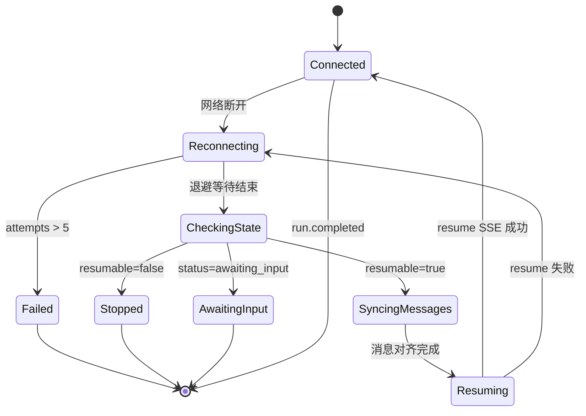
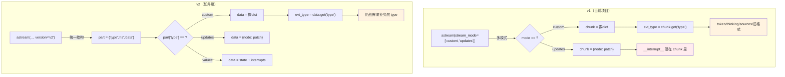

# SSE 流式通信 — 可靠性与运维（Q4-Q7 + Q9）

> 核查日期 2026-09-09
> 版本基准：FastAPI 0.115 · LangGraph 0.2（astream v1 默认，v2 为 1.1+ 新增）· Vue 3.4 · WHATWG Fetch Living Standard
> 项目场景：DeepResearch 多智能体研究平台
> 关联文档：[协议与架构（Q1-Q3）](SSE面试准备_协议与架构.md) · [事件全链路与技术债（Q10-Q11）](SSE面试准备_事件全链路与技术债.md)

---

### Q4. 断线重连你用了自建指数退避状态机，为什么不直接用 EventSource 的自动重连？重连后怎么保证不丢数据、不重复数据？

**延展**：
1. 重连时为什么要先调 GET /state 检查可恢复性，而不是直接重连？
2. 消息对齐用"整体替换"而不是"增量补齐"，会不会丢掉用户正在输入的内容？

**结论**：
EventSource 的自动重连在断线后 `retry` 秒（默认 3s）自动重新 GET 同一个 URL，但本项目的 SSE 端点是 POST，不能自动重连。而且 EventSource 重连后服务端从头开始执行，之前已产出的 token 会重复——用户看到的是"从头来一遍"。本项目用 LangGraph checkpoint 做断点续研：重连前 GET /state 检查 `resumable` 字段，如果可恢复则先 syncThreadMessages 拉取服务端最新消息列表整体替换本地状态（清掉半截 streaming 消息），再 POST /resume mode=continue，LangGraph 从 checkpoint 续跑，已检索的 sources/findings 全部保留，已输出的 token 不会重复。

**原理展开**：
EventSource 的自动重连机制——断线后浏览器等待 `retry` 毫秒（服务端可通过 `retry: 5000\n\n` 设置），然后重新 GET 原始 URL，带上 `Last-Event-ID: xxx` 请求头。服务端可以读这个头判断"客户端最后收到哪个事件"，从下一个事件开始发。但这个机制有三个前提：

1. 端点是 GET——EventSource 不支持 POST
2. 服务端维护了事件 ID 到事件内容的映射——能从 Last-Event-ID 找到断点
3. 重连是幂等的——同一个 URL 重复请求不会产生副作用

本项目三个前提都不满足。所以自建重连状态机，核心思路是"重连不是重新订阅，而是断点续研"：

```
网络断开
  │
  ▼
1. 指数退避等待（1s → 2s → 4s → 8s → 16s，上限 30s，最多 5 次）
  │
  ▼
2. 检查用户是否已切走或发起新 run（isUserCancelled / currentThreadId 变更）
  │  是 → 停止重连
  │  否 ↓
  ▼
3. GET /threads/{id}/state — 检查可恢复性
  │  status=awaiting_input → HITL 中断态，停止重连，rebuild interrupt 卡片
  │  resumable=false → 已结束，拉一次消息对齐后停止
  │  resumable=true ↓
  ▼
4. syncThreadMessages — GET /threads/{id}/messages 拉取服务端最新消息列表
  │  整体替换本地消息（清掉半截 streaming 消息，以服务端为唯一事实）
  │
  ▼
5. POST /resume mode=continue — LangGraph 从 checkpoint 续跑
  │  None 输入 = 从最后 checkpoint 续跑，已检索数据保留
  │
  ▼
6. consume SSE — 消费续流的新 token，setAttempts(0) 重置退避计数
```

为什么不直接重连而要先检查 state？因为断线期间可能发生：

- 服务端正常完成了研究（`resumable=false`）——重连会 409，因为 thread 已完成
- 服务端在 HITL 中断态等待用户输入（`status=awaiting_input`）——重连不会产出新 token，需要 rebuild interrupt 卡片
- 服务端崩溃后重启，进程内 TaskRegistry 丢失——重连时 /resume 会重新建 task，但需要确认 checkpoint 仍在（PG 持久化）
- 用户已手动停止——`isUserCancelled(threadId)` 返回 true，不应自动重连

消息对齐策略——整体替换 vs 增量补差的取舍：

整体替换（`replaceThreadMessages`）的逻辑是：从服务端 GET /threads/{id}/messages 拿到完整消息列表（已完成的 user+assistant 消息），把本地 chat store 的 messages 数组整体替换。这会清掉断线时正在 streaming 的半截消息——但那个半截消息本来就是不完整的，服务端 checkpoint 里保存的是"已完成的消息"，半截消息在后端不存在。

不会丢掉用户正在输入的内容——用户输入的消息在 Composer 组件里，不在 chat store 的 messages 里。Composer 的 input 是局部 ref，和 chat store 无关。用户提交后才 `addUserMessage` 写入 store。如果断线时用户正在打字，那些文字在 Composer 的 ref 里，不受 `replaceThreadMessages` 影响。

**代码示例**：
```typescript
// agent_front/src/composables/useEventStream.ts — 断线重连状态机
async function scheduleReconnect(threadId: string): Promise<void> {
  const attempts = getAttempts(threadId) + 1
  setAttempts(threadId, attempts)

  if (attempts > RECONNECT_MAX_ATTEMPTS) {  // 5 次
    chat.markError(threadId, { code: 'RECONNECT_FAILED', message: '连接已断开，自动恢复失败' })
    chat.setReconnecting(threadId, false)
    return
  }

  // 指数退避：1s * 2^(attempts-1)，上限 30s
  const delay = Math.min(
    RECONNECT_BASE_DELAY_MS * 2 ** (attempts - 1),
    RECONNECT_MAX_DELAY_MS,
  )
  chat.setReconnecting(threadId, true)
  await sleep(delay)

  // 重连前检查：用户可能已切走或发起新 run
  if (threads.currentThreadId !== threadId) {
    chat.setReconnecting(threadId, false)
    return
  }
  if (isUserCancelled(threadId)) {
    chat.setReconnecting(threadId, false)
    return
  }

  // ① 状态检查：决定是否继续重连
  let state
  try {
    state = await fetchThreadState(threadId)
  } catch {
    await scheduleReconnect(threadId)  // 递归重试
    return
  }

  if (state.status === 'awaiting_input') {
    chat.setReconnecting(threadId, false)
    setAttempts(threadId, 0)
    void intr.rebuild(threadId)  // 重建 HITL 卡片
    return
  }

  if (!state.resumable) {
    await syncThreadMessages(threadId)
    chat.setReconnecting(threadId, false)
    return
  }

  // ② 消息对齐：清除半截 streaming 消息
  await syncThreadMessages(threadId)

  // ③ resume 续流（mode=continue）
  try {
    const resp = await postStream('/api/v1/research/resume', {
      thread_id: threadId,
      mode: 'continue',
    })
    chat.setReconnecting(threadId, false)
    await consumeSSE(resp, (env) => dispatch(threadId, env), ...)
    setAttempts(threadId, 0)
  } catch (err) {
    if (isAbortError(err) || isUserCancelled(threadId)) return
    await scheduleReconnect(threadId)  // 递归重试
  }
}
```

**图解**：


重连状态机有 7 个状态：Connected（正常流式）、Reconnecting（退避等待中）、CheckingState（调 GET /state）、SyncingMessages（消息对齐）、Resuming（POST /resume 续流中）、AwaitingInput（HITL 中断态，停止重连）、Stopped（不可恢复，停止）、Failed（重试超限）。只有 Resuming 失败才会回到 Reconnecting 重新退避，其他终态都是不可逆的。

**边界与陷阱**：
- `RECONNECT_MAX_ATTEMPTS = 5` 意味着最坏情况下重连耗时 `1+2+4+8+16 = 31s`（第 5 次延迟上限 30s，实际 16s）。如果用户网络 30s 仍不稳定，前端标记 RECONNECT_FAILED，需要用户手动刷新页面。
- 递归调用 `scheduleReconnect` 有栈溢出风险吗？不会——每次递归前 `await sleep(delay)` 会 yield 到事件循环，调用栈不会累积。但如果 `fetchThreadState` 一直失败，5 次后会被 `attempts > MAX` 截断。
- `setAttempts(threadId, 0)` 只在 resume 成功后重置。如果 resume SSE 成功但 consume 过程中再次断线，会从 attempts=0 重新开始——正确行为。

**延展解答**：
先调 GET /state 的原因：直接 POST /resume 在 thread 不可恢复时（如已 completed）会返回 409 或跑空，浪费一次请求且前端拿不到有意义的错误。GET /state 返回结构化状态 `{status, resumable, next_nodes, ...}`，前端据此决定"重连还是不重连还是重建 HITL 卡片"，避免无效的 resume 请求。

整体替换丢内容的场景：如果断线时 chat store 里有用户刚发但后端还没收到的消息——不会出现，因为 `onSend` 先 `addUserMessage` 再 `postStream`，如果 postStream 失败消息已经在 store 里了。但 syncThreadMessages 从服务端拉的消息列表不包含这条（后端没收到）。所以 `replaceThreadMessages` 会丢掉这条"发出去但没收到回执"的消息。当前项目接受这个行为——因为断线意味着 POST 请求也失败了，用户消息根本没到服务端。如果要做到"不丢"，需要在 store 里标记每条消息的 delivery status（sent/delivered），sync 时只替换 confirmed 的消息，保留 unconfirmed 的。这是 IM 应用的做法，对研究助手场景过重了。

### Q5. 你的取消机制用 task.cancel() 而不是关 EventSource，这两者有什么本质区别？CancelledError 在 generator 里怎么处理的？

**延展**：
1. task.cancel() 后 LLM API 调用真的会立刻停止吗？还是会等到下一个 yield 点？
2. 多 worker 场景下，worker A 的 task.cancel() 能取消 worker B 上的任务吗？

**结论**：
关闭 EventSource 只断开客户端到服务端的 TCP 连接，但服务端的 LLM API 调用仍在运行——用户不看了，但 LLM token 还在烧钱。本项目用 TaskRegistry 注册 asyncio.Task，POST /cancel 调用 `task.cancel()`，asyncio 在 generator 的下一个 await 点抛出 `CancelledError`，generator 捕获后发 `run.cancelled` 事件再重新抛出。这样 LLM 的 `astream` 也会收到 CancelledError，底层 HTTP 请求的 `httpx.AsyncClient` 会在 await 点中断，真正停止 LLM 调用，省 token 费用。

**原理展开**：
EventSource 关闭的本质——`eventsource.close()` 调用 `XMLHttpRequest.abort()`，浏览器关闭 TCP 连接。服务端的 ASGI 层（uvicorn）会收到 `http.disconnect` 事件，StreamingResponse 的 generator 在下一个 `yield` 点收到 `GeneratorExit` 异常。但此时：

1. `yield` 点在 `async for mode, chunk in astream(...)` 内部，`GeneratorExit` 会让 astream 的 `__aiter__` 抛出异常
2. 但 astream 内部的 LLM 调用可能正在 `await httpx.AsyncClient.post()` 等待 API 响应
3. `GeneratorExit` 会在 astream 的 `aclose()` 里传播，最终触达 httpx 的 `aclose()`
4. httpx 的 `aclose()` 会尝试发送 HTTP 请求体剩余部分并等待服务端确认——如果 LLM API 正在生成（streaming response），httpx 会尝试读取剩余 chunk

这个链路太长，且各层对 `GeneratorExit` 的处理不统一。有些库会吞掉异常，有些会等 I/O 完成。实际上，关闭 EventSource 后服务端 LLM 调用"大概率还在跑"——因为 `httpx` 的连接关闭是异步的，LLM API 的 streaming response 可能还在产出 token。

本项目的方案——TaskRegistry + task.cancel()：

```python
class TaskRegistry:
    _tasks: dict[str, RunningTask] = {}

    async def cancel(self, thread_id: str) -> bool:
        entry = self._tasks.get(thread_id)
        if entry is not None and not entry.task.done():
            entry.task.cancel()  # 在下一个 await 点抛 CancelledError
            return True
        # 多 worker：Redis Pub/Sub 广播
        if self._redis is not None:
            await self._redis.publish(CANCEL_CHANNEL, json.dumps({...}))
            return True
        return False
```

`task.cancel()` 的语义——asyncio 在 task 的"当前 await 点"抛入 `CancelledError`。generator 的当前 await 点是 `async for mode, chunk in _astream_with_heartbeat(...)`，具体是 `asyncio.wait({pending}, timeout=interval)` 或 `anext(aiter)`。CancelledError 在这里抛出，进入 generator 的 `except asyncio.CancelledError` 分支：

```python
except asyncio.CancelledError:
    logger.info("[STREAM] generator 被取消 | thread=%s | run=%s", thread_id, run_id)
    yield sse(event("run.cancelled", reason="user_cancelled"))
    raise  # 必须重新抛出
```

这里有个微妙的设计——`yield` 在 except 块里。async generator 在 except 块里 yield 是合法的，但需要理解其语义：yield 时 generator 暂停，数据 `run.cancelled` 事件被 StreamingResponse 发给客户端。客户端收到后知道"用户取消已确认"。然后 generator 恢复执行，`raise` 重新抛出 CancelledError，asyncio 框架捕获后标记 task 为 cancelled。

`raise` 不能省——如果 except 块里不重新抛出 CancelledError，asyncio 认为 task 已经"处理了取消"，不会标记 task 为 cancelled。但实际语义是"用户取消了研究"，task 确实应该结束——重新抛出让框架正确清理。

多 worker 场景：单进程模式下 `self._tasks` 字典里有该 thread 的 task，直接 `task.cancel()`。但多 worker（如 gunicorn -w 4）部署时，用户连接在 worker A，POST /cancel 可能路由到 worker B。worker B 的 `_tasks` 里没有这个 thread，需要通过 Redis Pub/Sub 广播取消信号。worker A 订阅 `task:cancel` 频道，收到消息后在本进程找到 task 并 cancel。Redis 还写一个 `cancel:{thread_id}` 键（TTL 300s），用于进程重启后的孤儿扫描。

**代码示例**：
```python
# app/backend/router/research_router.py — TaskRegistry 包装 generator
async def _stream_with_registry(
    thread_id: str, run_id: str, gen: AsyncGenerator[str, None]
) -> AsyncGenerator[str, None]:
    registry = get_task_registry()
    current_task = asyncio.current_task()

    if current_task is not None:
        registry._tasks[thread_id] = RunningTask(
            thread_id=thread_id,
            run_id=run_id,
            task=current_task,
            started_at=time.time(),
        )
        current_task.add_done_callback(lambda _: registry._cleanup(thread_id))

    try:
        async for chunk in gen:
            yield chunk
    except asyncio.CancelledError:
        logger.info("[STREAM] generator 被取消 | thread=%s | run=%s", thread_id, run_id)
        raise

# app/backend/router/research_router.py — 取消端点
@router.post("/cancel")
async def cancel_research(payload: CancelRequest):
    registry = get_task_registry()
    if not registry.is_running(payload.thread_id):
        return {"thread_id": payload.thread_id, "cancelled": False, "reason": "not_running"}

    hit = await registry.cancel(payload.thread_id)
    if hit:
        return {"thread_id": payload.thread_id, "cancelled": True}
    else:
        return JSONResponse(
            status_code=202,
            content={"thread_id": payload.thread_id, "cancelled": False, "reason": "signal_sent"},
        )
```

```typescript
// agent_front/src/views/ChatView.vue — 前端停止逻辑
async function onStop() {
  const threadId = threads.currentThreadId
  if (threadId) {
    try { await cancelResearch(threadId) } catch { /* 乐观更新 */ }
  }
  chat.markCancelled(threadId)       // 前端立刻标记消息为 cancelled
  chat.setUserStopped(threadId, true) // 标记用户主动停止
}
```

**边界与陷阱**：
- `asyncio.current_task()` 返回的是 StreamingResponse 消费 generator 的那个 task。`_stream_with_registry` 在 generator 的第一行注册，所以 `current_task()` 是正确的 task。但如果有中间件包装（如 Starlette 的 background task），`current_task()` 可能不对——需要确认调用链。
- `task.cancel()` 的传播有延迟——CancelledError 在"下一个 await 点"抛出，如果当前正在执行同步代码（如 CPU 密集的 JSON 解析），cancel 不会立刻生效。但 LangGraph 的节点主要是 LLM 调用（async I/O），所以总有 await 点。
- Redis Pub/Sub 广播不保证可靠——如果 worker A 的订阅断开了，广播消息会丢失。worker A 的 task 会继续跑直到完成或用户再次发送 cancel。`cancel:{thread_id}` 键（TTL 300s）是兜底——worker A 重启后 scan_orphans 会发现这个键，标记 thread 为 interrupted_by_restart。

**延展解答**：
task.cancel() 后 LLM 是否立刻停止：取决于 LLM API 客户端的实现。httpx 的 `AsyncClient.post()` 在收到 CancelledError 后会尝试关闭 HTTP 连接——发送 TCP FIN 包。但 LLM API 服务端（如 DashScope）收到 FIN 后是否立刻停止生成，取决于服务端实现。实际上 DashScope 的 streaming API 在客户端断连后会继续生成完当前 chunk 然后停止——通常 100ms 内。从用户角度看，cancel 后 token 费用基本不再增长（可能多烧 1-2 个 chunk 的费用）。

多 worker 场景：worker A 的 task.cancel() 不能直接取消 worker B 上的 task——asyncio 的 Task 是进程内对象，不能跨进程操作。通过 Redis Pub/Sub 广播，worker B 收到消息后在本地 `_tasks` 里找到对应 task 并 cancel。这要求每个 worker 都订阅了 `task:cancel` 频道。`_subscribe_loop` 有断线指数退避重连（1s→30s 上限），但重连期间的消息会丢失。`cancel:{thread_id}` 键 + scan_orphans 是最终兜底。

### Q6. 心跳保活用 `: ping\n\n` 注释帧，为什么不用 `retry:` 字段或者 WebSocket ping？

**延展**：
1. 心跳间隔设为 15s，依据是什么？
2. 如果代理（Nginx）配了 `proxy_read_timeout 60s`，心跳能保活吗？

**结论**：
`retry:` 是 EventSource 的重连间隔字段，语义是"断线后多少毫秒重连"，不是心跳——本项目不用 EventSource 所以 `retry:` 无效。WebSocket ping 是双向协议的心跳，但本项目用 SSE 单向推送，引入 WebSocket 会增加协议复杂度。`: ping\n\n` 是 SSE 规范中的注释帧——以 `:` 开头的行被浏览器（和本项目的手动解析器）忽略，不触发 onEvent，但数据流保持活跃，能穿透 Nginx/CloudFlare 等代理的超时断连。

**原理展开**：
SSE 协议中 `:` 开头的行是注释（comment line），规范定义：浏览器收到 `:xxx\n\n` 后不做任何事——不触发 onmessage、不触发 onerror、不改变 readyState。但这个帧确实通过 HTTP chunked transfer 传到了客户端，TCP 连接有数据流动，中间代理看到"连接有数据传输"，不会因为 `proxy_read_timeout` 超时而断连。

为什么需要心跳？三类中间件会断掉"看起来空闲"的连接：

1. **Nginx `proxy_read_timeout`**：默认 60s，如果 60s 内没有从上游读到数据，Nginx 认为上游挂了，断开连接返回 502
2. **CloudFlare / CDN**：默认 100s 空闲断连
3. **浏览器/操作系统 TCP keepalive**：通常 2 小时，但某些 NAT 环境更短

LLM 研究流程中，某些节点（如 deep_dive 证据裁判）需要调用多个搜索 API + LLM 分析，可能 20-30s 不产出 token。没有心跳的话，Nginx 会在 60s 时断连，前端收到 onerror 触发重连——但此时 LangGraph 还在跑，重连会 409。

`_astream_with_heartbeat` 的实现——用 `asyncio.wait({pending}, timeout=interval)` 超时后 yield 心跳：

```python
async def _astream_with_heartbeat(astream_iter, interval):
    aiter = astream_iter.__aiter__()
    pending = None

    while True:
        if pending is None:
            pending = asyncio.ensure_future(anext(aiter))

        done, _ = await asyncio.wait({pending}, timeout=interval)
        if pending in done:
            mode, chunk = pending.result()
            pending = None
            yield mode, chunk  # 正常数据
        else:
            yield "heartbeat", None  # 超时，发心跳
```

关键设计——超时不取消 pending future。`asyncio.wait` 的 `timeout` 参数不会取消 future——只是让 `wait` 返回。`pending` future 继续在事件循环里运行，下一轮 `asyncio.wait({pending})` 会继续等它。这避免了"心跳超时杀掉正在执行的 graph step"的问题。如果用 `asyncio.wait_for(anext(aiter), timeout=interval)`，超时会 raise `TimeoutError` 并取消 anext 的 future——graph step 被 cancel，数据丢失。

15s 间隔的依据：Nginx 默认 `proxy_read_timeout 60s`，心跳间隔必须 < 60s 才能保活。15s 留了 4 倍安全边际，应对网络抖动导致的延迟。如果设为 55s，一次网络抖动 6s 就会超 60s。15s 间隔下，即使心跳帧延迟 5s 到达 Nginx，Nginx 看到的最近数据是 20s 前，远小于 60s。代价是每 15s 多发 8 字节（`: ping\n\n`）——对带宽可忽略。

**代码示例**：
```python
# app/backend/service/research_service.py — 心跳常量与间隔
HEARTBEAT_FRAME = ": ping\n\n"  # SSE 注释帧，浏览器忽略不触发 onEvent

def _get_heartbeat_interval() -> float:
    try:
        from backend.config.settings import get_business_settings
        return float(get_business_settings().sse_heartbeat_seconds)
    except Exception:
        return 15.0  # 默认 15s

# generator 内的心跳产出
async for mode, chunk in _astream_with_heartbeat(
    self._app.astream(input_state, config, stream_mode=["custom", "updates"]),
    heartbeat_interval,
):
    if mode == "heartbeat":
        yield HEARTBEAT_FRAME  # yield ": ping\n\n"
        continue
    # ... 正常事件处理
```

```python
# app/backend/service/research_service.py — 心跳包装器
async def _astream_with_heartbeat(astream_iter, interval):
    if interval <= 0:
        async for mode, chunk in astream_iter:
            yield mode, chunk
        return

    aiter = astream_iter.__aiter__()
    _sentinel = object()
    pending: asyncio.Future | None = None

    while True:
        if pending is None:
            try:
                pending = asyncio.ensure_future(anext(aiter))
            except StopAsyncIteration:
                return

        try:
            done, _ = await asyncio.wait({pending}, timeout=interval)
            if pending in done:
                try:
                    mode, chunk = pending.result()
                except StopAsyncIteration:
                    pending = None
                    return
                pending = None
                yield mode, chunk
            else:
                yield "heartbeat", None  # 超时但 pending 仍在运行
        except asyncio.CancelledError:
            if pending is not None and not pending.done():
                pending.cancel()  # 取消时才 cancel pending
            raise
```

**边界与陷阱**：
- `proxy_read_timeout 60s` + 心跳 15s 能保活——但 Nginx 还有 `proxy_send_timeout`（默认 60s）控制向上游发送数据的超时。如果客户端长时间不读取，Nginx 向上游的写缓冲会满，`proxy_send_timeout` 触发。但这通常不会发生——SSE 是服务端推送，Nginx 向上游不发数据。
- 如果 Nginx 配了 `proxy_buffering on`（默认），Nginx 会缓冲上游的 response body，不立即转发给客户端。SSE 需要配 `proxy_buffering off` 或 `X-Accel-Buffering: no` 响应头。本项目 StreamingResponse 设了 `X-Accel-Buffering: no`。
- `sse_heartbeat_seconds: 0` 关闭心跳——在某些短查询场景下可以关闭以减少无用帧。但如果 LLM 响应慢，关闭心跳会触发代理断连。

### Q7. 如果 QPS 翻 10 倍，你的 SSE 方案瓶颈在哪？怎么演进？

**延展**：
1. 单进程能支撑多少并发 SSE 连接？
2. 如果要支持 10 万并发，架构怎么改？

**结论**：
当前方案的瓶颈在三个层面：(1) 单进程 async generator 的 LLM 调用是串行的——一个研究任务占一个 asyncio task，LLM API 调用在 task 内 await，不阻塞其他 task，但 Python GIL 限制了 CPU 密集部分（如 JSON 序列化、Pydantic 校验）的并行度；(2) LangGraph checkpoint 存在 PG，高并发下 PG 的连接池和写入是瓶颈；(3) 每个 SSE 连接占用一个 TCP 文件描述符 + asyncio 事件循环槽位。10 倍 QPS 下（从 10 并发到 100 并发）单进程能扛，100 倍（1000 并发）需要多 worker + Redis 协调。

**原理展开**：
当前方案的并发模型——每个 SSE 请求对应一个 asyncio task，task 内的 async generator 在 LLM API 的 await 点让出控制权，事件循环调度其他 task。理论上一单进程可以撑数万并发连接——asyncio 的事件循环是 O(1) 调度，GIL 只在 CPU 密集操作时持有。

但实际瓶颈在：

1. **LLM API 限流**：DashScope/Qwen 的 API 有 QPS 限制（通常 50-100 QPS）。一个研究任务可能调用 5-10 次 LLM（intent + plan + search + analyze + write），10 并发研究 = 50-100 次 LLM 调用，已到 API 限流上限。这是外部瓶颈，不能通过架构优化解决，只能增加 API 配额或用多模型分流。

2. **PG 连接池**：LangGraph 的 AsyncPostgresSaver 用 `asyncpg` 连接池，默认 `min_size=5, max_size=20`。每个研究任务的 astream 在每个 checkpoint 写入时需要一个 PG 连接。10 并发研究可能同时写 checkpoint，20 连接够用。100 并发时连接池耗尽，需要调大 `max_size` 或用 PgBouncer 做连接池代理。

3. **内存**：每个 SSE 连接的 buffer + LangGraph state + LLM context 大约 50-200 KB。1000 并发 = 50-200 MB，可接受。但如果 LLM 返回大量 token（如长报告），buffer 会增长。StreamingResponse 的 chunked transfer 不缓冲全量，内存风险低。

4. **文件描述符**：每个 SSE 连接占 1 个 FD，每个 PG 连接占 1 个 FD，每个 Redis 连接占 1 个 FD。Linux 默认 `ulimit -n 1024`，需要调到 `65535`。uvicorn 的 `--limit-concurrency` 也可控制。

演进路线：

| QPS | 并发连接 | 方案 | 架构变更 |
|---|---|---|---|
| 1x | 10 | 当前：单进程 uvicorn | 无 |
| 10x | 100 | 单进程 + 调大连接池 | PG max_size=50, Redis 连接池 |
| 50x | 500 | 多 worker (gunicorn -w 4) | Redis Pub/Sub 取消广播, 负载均衡 |
| 100x | 1000 | 多 worker + Nginx 负载均衡 | Nginx `proxy_buffering off`, SSE 长连接保持 |
| 500x | 5000 | 水平扩容 + 粘性会话 | Nginx `ip_hash`, 每台 1000 连接 |
| 1000x | 10000 | 消息队列解耦 | Kafka/RabbitMQ 做 LLM 任务队列 |

关键拐点在 50x——单进程撑不住 500 并发时，需要多 worker。多 worker 的核心问题是 TaskRegistry 的进程内 `_tasks` 字典不共享——已经在代码里预留了 Redis Pub/Sub 广播取消信号的机制。但 LangGraph checkpoint 存在 PG，多 worker 可以共享——只要 thread_id 一致，任何 worker 都能 astream(None, config) 从 checkpoint 续跑。

SSE 连接的粘性问题：用户在 worker A 发起 /stream，SSE 连接挂在 worker A。如果断线重连，DNS/Nginx 可能路由到 worker B。worker B POST /resume 可以从 PG checkpoint 续跑——不需要原 worker。这是 checkpoint 模式比"内存中保持 generator 状态"的优势：状态在 PG，不在进程内存，任何 worker 都能恢复。

**代码示例**：
```python
# 多 worker 启动配置（伪代码）
# gunicorn -w 4 -k uvicorn.workers.UvicornWorker --timeout 0 app:app
# --timeout 0 防止 gunicorn 杀掉长连接 SSE worker

# TaskRegistry 已有的多 worker 支持
class TaskRegistry:
    def __init__(self, redis=None):
        self._tasks: dict[str, RunningTask] = {}  # 进程内
        self._redis = redis                        # 跨进程协调

    async def cancel(self, thread_id: str) -> bool:
        # 先查本进程
        entry = self._tasks.get(thread_id)
        if entry is not None and not entry.task.done():
            entry.task.cancel()  # 本进程命中
            return True
        # 跨进程广播
        if self._redis is not None:
            await self._redis.publish(CANCEL_CHANNEL, json.dumps({
                "thread_id": thread_id,
                "instance_id": self._instance_id,
                "ts": int(time.time()),
            }))
            await self._redis.setex(f"cancel:{thread_id}", 300, "1")
            return True
        return False

    async def _subscribe_loop(self):
        backoff = 1.0
        while True:
            try:
                pubsub = self._redis.pubsub()
                await pubsub.subscribe(CANCEL_CHANNEL)
                backoff = 1.0
                async for message in pubsub.listen():
                    if message.get("type") != "message":
                        continue
                    await self._handle_cancel_broadcast(message.get("data"))
            except asyncio.CancelledError:
                raise
            except Exception as exc:
                await asyncio.sleep(backoff)
                backoff = min(backoff * 2, 30.0)
```

**边界与陷阱**：
- gunicorn 默认 `timeout 30s` 会杀掉超时 worker——SSE 长连接可能持续几分钟到几十分钟。必须设 `--timeout 0` 或 `--timeout 120` 并配合心跳保活。
- Nginx 的 `proxy_read_timeout` 需要设为大于心跳间隔的值，如 `proxy_read_timeout 90s`（心跳 15s × 6 = 90s 安全）。
- LangGraph 的 AsyncPostgresSaver 用 `asyncpg.create_pool(min_size=5, max_size=20)`——多 worker 时每个 worker 独立连接池，4 worker × 20 连接 = 80 PG 连接。PG 默认 `max_connections=100`，需要调大或用 PgBouncer。

### Q9. 你项目里用 LangGraph astream 的 v1 模式，v2 是什么？为什么不升级到 v2？两层 type 体系是怎么设计的？

**延展**：
1. 如果升级到 v2，`research_service.py` 的核心循环代码需要改什么？不改能跑吗？
2. v2 的 `interrupts` 字段和 v1 的 `__interrupt__` 混入 state，具体差异是什么？

**结论**：
本项目使用 LangGraph astream 的 **v1 默认模式**——`graph.astream(input_state, config, stream_mode=["custom", "updates"])`，不传 `version="v2"`。v1 的输出结构随 stream_mode 数量动态变化：单模式返回裸 dict，多模式返回 `(mode, data)` 元组，子图再加一层 namespace 三元组。v2（LangGraph 1.1+ 新增）统一为固定结构 `{"type", "ns", "data"}`，7 种事件类型枚举。不升级的原因是 v1 多模式下的 `(mode, data)` 元组已足够用——后端只需一个 `if mode == "custom"` / `if mode == "updates"` 分支，不涉及子图嵌套，结构简单。但 v1 的核心痛点是：框架层的 `mode` 和业务层的 `evt_type` 容易混淆，`evt_type="progress"` 死代码就是这种混淆的产物。

**原理展开**：
LangGraph astream 有两个版本，本质是输出结构的范式差异：

v1 的输出结构**动态变化**，取决于 stream_mode 的组合：
- 单模式 `stream_mode="updates"` → 直接返回裸 dict：`{"agent": {"messages": [...]}}`
- 多模式 `stream_mode=["values", "updates"]` → 返回 `(mode, data)` 元组：`("updates", {"agent": {...}})`
- 开启子图 + 多模式 → 返回 `(namespace, mode, data)` 三元组：`(("subgraph_id",), "values", {"messages": [...]})`

同一个 `async for` 循环里 chunk 的结构会随 stream_mode 变化，类型不安全。前端 SSE 场景如果要直接序列化 v1 产出，解析逻辑要随 mode 变化写多个分支。

v2 统一为**固定结构 StreamPart**：`{"type": "updates" | "values" | "messages" | "custom" | "checkpoints" | "tasks" | "debug", "ns": [], "data": {...}}`。不管开多少个 stream_mode、有没有子图，永远是同一个结构，靠 `type` 区分 7 种事件。`values` 类型额外自带 `interrupts` 字段。

**关键：两层 type 体系**。即使升级到 v2，框架层的 `type` 只告诉你"这是一个 custom 事件"，不会告诉你业务层是什么事件。本项目在 custom 事件的 data 内部定义了自己的业务 `type`：

| 层级 | `type` 的含义 | 取值 | 谁定义 |
|---|---|---|---|
| **LangGraph v2 StreamPart** | 图流的事件种类 | `values` / `updates` / `messages` / `custom` / `checkpoints` / `tasks` / `debug` | LangGraph 框架 |
| **项目自定义 payload** | custom 事件内部的业务子类型 | `token` / `thinking` / `sources` / 旧格式无 type | 本项目节点代码 |

对比代码：
```python
# v1（当前项目）—— mode 是元组的第一个元素
async for mode, chunk in self._app.astream(
    input_state, config, stream_mode=["custom", "updates"]
):
    if mode == "custom":
        evt_type = chunk.get("type", "")   # 业务层 type，在 payload 字典里
        if evt_type == "token": ...
        if evt_type == "thinking": ...
    if mode == "updates": ...

# v2（如果升级）—— part["type"] 是框架层 type
async for part in self._app.astream(
    input_state, config, stream_mode=["custom", "updates"], version="v2"
):
    match part["type"]:                    # 框架层 type
        case "custom":
            chunk = part["data"]
            evt_type = chunk.get("type", "")  # 仍然需要业务层 type
            if evt_type == "token": ...
        case "updates":
            patch = part["data"]              # updates 的 data 是 {node: patch}
```

v2 解决的是框架层结构不统一的问题（裸 dict / 元组 / 三元组），**不解决业务层自定义事件分类的问题**。`token` / `thinking` / `sources` 这些业务子类型，无论 v1 还是 v2，都必须自己定义和区分。

**中断(interrupt)行为差异**：
- v1：中断信息混入 state 字典，key 是 `__interrupt__`，污染业务 state。后端检测 `if "__interrupt__" in chunk:` 提取。
- v2：中断在 `values` 类型的 `interrupts` 属性，不污染业务 data。但本项目用 `stream_mode=["custom", "updates"]` 不含 `values`，所以 v2 下 interrupt 仍会出现在 `updates` 的 data 里——因为 LangGraph 的 interrupt 机制是通过 updates 通道的 `__interrupt__` key 传播的，不是 values 独占。

**代码示例**：
```python
# 本项目 v1 的核心循环 — research_service.py L287-343（简化）
async for mode, chunk in _astream_with_heartbeat(
    self._app.astream(
        input_state, config, stream_mode=["custom", "updates"]  # v1 默认
    ),
    heartbeat_interval,
):
    if mode == "heartbeat":
        yield HEARTBEAT_FRAME
        continue

    if mode == "custom":                        # 框架层：custom 通道
        if isinstance(chunk, dict):
            evt_type = chunk.get("type", "")    # 业务层：token/thinking/sources/旧格式
            if evt_type == "token":
                yield sse(event("message.delta", message_id=mid, text=text))
            elif evt_type == "thinking":
                yield sse(event("message.thinking", message_id=mid, text=text))
            elif "node" in chunk and "message" in chunk and "type" not in chunk:
                yield sse(event("agent.status", node=node, label=label, phase="running"))
            elif evt_type == "sources":
                yield sse(event("sources.found", sources=sources))

    if mode == "updates":                        # 框架层：updates 通道
        if "__interrupt__" in chunk:            # v1：interrupt 混在 state 里
            for intr in chunk["__interrupt__"]:
                yield sse(event("interrupt.raised", interrupt_id=intr.id, ...))
            break
        for node_name, node_output in chunk.items():
            yield sse(event("agent.status", node=node_name, label=label, phase="completed"))
```

**边界与陷阱**：
- v1 的 `__interrupt__` 混入 updates 的 state dict，和 `node_name: node_output` 在同一个 chunk 里遍历。如果不先 `if "__interrupt__" in chunk` 提取再 break，会把它当成普通 node 输出处理。v2 的 `interrupts` 独立字段更干净，但本项目不涉及因为不用 values 模式。
- v2 是 LangGraph 1.1+ 新增，需要手动传 `version="v2"` 开启。不传则默认 v1，兼容旧代码，不会 break。
- `astream_events` 和 `astream(version="v2")` 是两套东西：前者是 callback 事件流（`event=on_chat_model_stream`），后者是图状态流（`type=values/updates/...`）。不能混用。

**延展解答**：
升级 v2 的改动量：`research_service.py` 的核心循环从 `async for mode, chunk` 改为 `async for part`，`mode` 改为 `part["type"]`，`chunk` 改为 `part["data"]`，`ns` 字段目前不需要（无子图）。约 20 行改动。但不改也能跑——v1 是默认行为，LangGraph 不会强制迁移。

v2 的 `interrupts` 字段：在 v1 下，`interrupt()` 调用后 LangGraph 把 `Interrupt` 对象塞进 updates 的 `__interrupt__` key，和 `{node_name: node_output}` 混在同一个 dict 里。后端必须先检查 `__interrupt__` 再遍历其他 key。在 v2 下，`values` 类型的 StreamPart 有独立的 `interrupts` 属性，但只有开启 `stream_mode` 包含 `values` 时才能拿到。本项目只用了 `["custom", "updates"]`，所以即使升 v2，interrupt 仍从 updates 的 data 里提取。

**图解**：


v1 和 v2 都需要业务层 type 区分——v2 只是统一了框架层结构，不消除业务层分类需求。v1 的 `__interrupt__` 混入 state 是已知痛点，v2 的 `interrupts` 独立字段更干净，但本项目因不用 values 模式而不受益。

---

