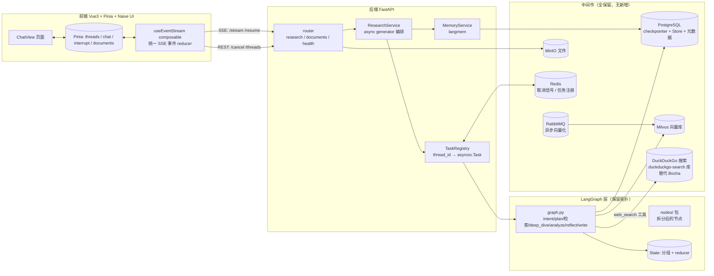

# DeepResearch 重构详细计划

> 版本：v1.2 · 2026-09-02（v1.1 基础上变更：web_search 由「自托管 SearXNG」改为 **DuckDuckGo（duckduckgo-search 库）**，不再依赖 searxng 本地仓库，也不新增自托管搜索服务）
> 依据：《DeepResearch_重构功能确认清单.md》（v1.2，关键决策已确认）
> 已确认决策：Vue3 + Pinia + Naive UI｜SSE｜langmem + LangGraph Store｜**中间件全保留（不新增搜索中间件）**｜HITL D1-D4 全做（D1 为批准/修改/否决+原因重生成）｜断点续研 c 档（崩溃可续）｜删除 Bocha 搜索，web_search 改接 DuckDuckGo

---

## 一、总体原则

1. **保留多智能体架构**：图拓扑（intent → plan → [web_search ∥ local_rag] → deep_dive → analyze → reflect/write）、8 个角色 prompt、RAG 核心、文档入库中间件链路（MinIO → RabbitMQ → Milvus）原样保留或仅做整理。
2. **工程实现照成熟项目重写**：流式/取消/恢复/HITL 编排照 langchain-ai/open_deep_research，事件协议照 vercel/ai-chatbot（AI SDK data stream），记忆照 langchain-ai/memory-template，报告引用照 gpt-researcher，产品交互照 lobe-chat。
3. **一个方向一个权威实现**：删除所有死代码与旧实现（`mult_agents/main.py` 旧节点、`codegen_node`、根目录 `main.py`、`test_bocha.py`），消灭"同名函数静默覆盖"类问题。
4. **每个 Phase 可独立验收**，前一 Phase 未通过验收不进入下一 Phase。

**参考仓库清单**（全部拉到本地 `参考项目/`，后续开发不再到网络查找；关键文件入口见《DeepResearch_参考仓库索引.md》）

| 状态 | 仓库 | 本地 commit | 用途（对应 Phase） |
|------|------|-------------|--------------------|
| ✅ 已有 | `open_deep_research` | `1b7d2e8` | **后端编排首选参考**（P1-P4）：clarify_with_user、Command(resume)、init_chat_model |
| ✅ 已有 | `ai-chatbot`（vercel） | `c2f8235` | **事件协议参考**（P0/P2/P6）：AI SDK data stream、流式状态机 |
| ✅ 已有 | `open-agent-platform` | `6a2ea0a` | 前后端围绕 LangGraph 协作的官方范本（P3/P4）：thread 状态 API、HITL 审批 UI |
| ✅ 已有 | `memory-template` | `c4e05d4` | langmem 双通道记忆范例（P5）：hot path + background |
| ✅ 已有 | `gpt-researcher` | `6f99857` | 报告引用体系参考（P7）：[n] 角标 + 参考列表 |
| ✅ 已有 | `lobe-chat` | `a45b700a` | 前端交互形态参考（P6）：消息渲染、会话管理、思考折叠、记忆面板 |
| ✅ 已有 | `langgraph` | `11ee185` | 官方示例与文档（P1-P4）：persistence / HITL / 流式 |
| ✅ 已有 | `open-canvas` | `0310cec` | 备用参考：多 Agent 前端交互 |
| ✅ 已有 | `langfuse` | `983c2a6` | 后续可选（本次不用）：可观测性 |

> **v1.2 变更**：`searxng` **不再拉取**——web_search 改用 `duckduckgo-search` Python 库（纯 pip 依赖，无需本地仓库、无需自托管服务）。
> 原因：searxng 上游 `utils/templates/` 下有 4 个含 `:` 的文件名（`searxng.conf:socket` / `searxng.ini:socket`），Windows git 在构建索引时对整树做路径校验，`--depth 1`、`--sparse`、cone 模式均无法绕过，检出必然中断。

拉取命令（缺失时补拉，均为浅克隆节省空间）：

```powershell
cd "D:\Code\LLMdev\学习文档\参考项目"
git clone --depth 1 https://github.com/langchain-ai/open_deep_research.git
git clone --depth 1 https://github.com/vercel/ai-chatbot.git ai-chatbot
git clone --depth 1 https://github.com/langchain-ai/open-agent-platform.git
git clone --depth 1 https://github.com/langchain-ai/memory-template.git
git clone --depth 1 https://github.com/assafelovic/gpt-researcher.git
git clone --depth 1 https://github.com/lobehub/lobe-chat.git
git clone --depth 1 https://github.com/langchain-ai/langgraph.git
git clone --depth 1 https://github.com/langchain-ai/open-canvas.git
git clone --depth 1 https://github.com/langfuse/langfuse.git
```

---

## 二、目标架构

### 2.1 总体架构



### 2.2 后端目录结构（目标）

```
app/
  app_main.py                 # 仅 lifespan + router 挂载（瘦身）
  backend/
    config/settings.py        # pydantic-settings，合并 .env + config.json
    router/
      research_router.py      # 会话/运行/取消/恢复/状态 API
      document_router.py      # 保留，微调
    schemas/
      events.py               # ★ 事件协议（唯一事件定义处）
      research.py             # 请求/响应模型
    service/
      research_service.py     # ★ 重写：async generator，只做事件转换
      task_registry.py        # ★ 新增：任务注册/取消/崩溃恢复扫描
      memory_service.py       # ★ 新增：langmem 封装
    infra/                    # PG/Milvus/RabbitMQ/MinIO/Redis 客户端（整理）
  mult_agents/
    graph.py                  # 保留拓扑，接入新 state
    state.py                  # ★ 重写：分组 + reducer
    nodes/                    # ★ 新增包：按节点拆文件
      intent.py  plan.py  web_search.py  local_rag.py
      deep_dive.py  analyze.py  write.py  clarify.py(新增)
    models.py                 # ★ 新增：init_chat_model 动态模型工厂
    prompts.py                # 保留
    tools.py                  # 保留，补 sources 结构化返回
    rag/                      # 保留 core.py
    memory/                   # ★ 重写为 langmem 适配层，删除 long_term.py 哈希方案
```

### 2.3 前端目录结构（目标）

```
front/agent_front/src/
  stores/
    threads.ts      # 会话列表（事件驱动刷新，去掉 10s 轮询）
    chat.ts         # 当前会话消息流（消息级 thinking/来源，切会话不丢）
    interrupt.ts    # ★ 审批/澄清状态（持久化，切会话回来还在）
    documents.ts
  api/
    sse.ts          # EventSource 封装 + 自动重连
    rest.ts
  composables/
    useEventStream.ts   # ★ 核心：统一事件 reducer，run/resume 共用（消灭重复的 70 行）
  components/chat/
    MessageList.vue  MessageItem.vue  MarkdownRender.vue(marked+highlight)
    ThinkingBlock.vue  AgentTimeline.vue(节点进度时间线)
    PlanApprovalCard.vue  ClarifyCard.vue  ReportReviewCard.vue
    SourceList.vue(引用来源侧栏)  StopButton.vue
  views/ChatView.vue       # 只做布局与组装（从 400+ 行瘦身）
```

---

## 三、事件协议规范（SSE）

所有 SSE 行均为 `data: {json}\n\n`，JSON 结构统一为：

```json
{ "type": "<事件类型>", "ts": 1690000000000, "data": { ... } }
```

| type | data 字段 | 说明 | 参考来源 |
|------|-----------|------|----------|
| `run.started` | thread_id, run_id | 一次研究开始 | — |
| `agent.status` | node, label, phase | 节点级进度（"正在检索…"） | open_deep_research 进度模式 |
| `message.start` | message_id, role, node | 一条消息开始（含中间结论） | vercel ai-chatbot |
| `message.delta` | message_id, text | **token 级增量**（核心） | vercel `text-delta` |
| `message.thinking` | message_id, text | 思考过程增量 | lobe-chat thinking |
| `sources.found` | sources[] | 检索到的新来源（url/title/snippet/source_type） | gpt-researcher |
| `interrupt.raised` | interrupt_id, kind, payload | kind: `plan_approval` / `clarification` / `report_review` | open_deep_research clarify |
| `run.completed` | message_id, final_state | 结束，报告 message_id | vercel `finish` |
| `run.cancelled` | reason | 用户取消完成 | — |
| `run.error` | code, message | **任何异常必发**，随后关闭流 | — |

协议落地形式：`app/backend/schemas/events.py` 中用 pydantic 定义全部事件（单一事实源），并生成一份 `docs/event-protocol.json` 供前端对齐类型。前端 TS 类型从该 JSON 生成，杜绝前后端字段不一致。

**不变式（重写要保证的硬性要求）**：
1. 流一定会结束：completed / cancelled / error 三者必有其一，且 finally 中只做"确保结束事件已发 + 关闭 generator"，不引用任何 try 块内变量（修复现有 `workflow_service.py:641` 的 NameError 挂起 bug）。
2. `message.delta` 按到达顺序追加即得完整文本，不依赖前端拼接逻辑猜格式。
3. 前端对未知 type 静默忽略（向前兼容）。

---

## 四、State 重构设计

现有 41 字段扁平 TypedDict 仅 messages 有 reducer，是"节点写错键被静默丢弃"的根源。目标结构：

```python
class ConversationState(TypedDict):
    messages: Annotated[list, add_messages]      # 对话流（含中间结论，供回放）
    clarifications: Annotated[list, add]          # D2 澄清问答记录

class ResearchState(TypedDict):
    research_topic: str
    plan: Annotated[list[dict], operator.add]     # 研究子问题（可被 HITL 逐条修改）
    sources: Annotated[list[dict], operator.add]  # 引用来源（F4 溯源基础）
    findings: Annotated[list[dict], operator.add] # 每个子问题的发现
    report: str | None

class ProgressState(TypedDict):
    current_node: str
    iteration: int          # reflect 轮次
    started_at: float

class AgentState(ConversationState, ResearchState, ProgressState): ...
```

配套改动：
- 每个节点返回值用 pydantic 模型校验（开发期 `validate=True`），写错键立刻报错而不是静默丢弃（修复 `nodes.py:1010` 的 `analysis_summary` 问题）。
- 删除对不存在字段 `hypotheses` 的引用（`nodes.py:622,646`）。
- 合并重复定义的 `_fallback_analysis`（`nodes.py:635,1362`）。

---

## 五、核心机制设计

### 5.1 token 级流式（替换现有 Thread + Queue 桥接）

```python
async def stream_research(...) -> AsyncGenerator[str, None]:
    config = {"configurable": {"thread_id": tid}}
    try:
        async for mode, chunk in graph.astream(
            input_state, config, stream_mode=["messages-tuple", "updates", "custom"]
        ):
            match mode:
                case "messages-tuple":    # (AIMessageChunk, metadata) → message.delta
                    ...
                case "updates":           # 节点完成 → agent.status
                    ...
                case "custom":            # 节点自定义事件 → sources.found 等
                    ...
        yield event("run.completed", ...)
    except asyncio.CancelledError:
        yield event("run.cancelled", ...); raise
    except Exception as e:
        yield event("run.error", ...)
    # 无 finally 引用局部变量 —— 结束事件在对应分支内发出
```

要点：`messages-tuple` 模式直接给出 (chunk, metadata)，天然 token 级；服务层是纯 async generator，直接挂 `StreamingResponse`，**彻底删除后台 Thread + asyncio.Queue 桥接**（当前 bug 温床）。LLM 客户端开启 `streaming=True`。

参考：open_deep_research 的 `deep_researcher.py` 流式消费方式；vercel/ai-chatbot 的 `app/(chat)/api/chat/route.ts`。

### 5.2 取消与断点续研（c 档）

- **主动停止**：`TaskRegistry` 维护 `thread_id → asyncio.Task`；`/cancel` 调 `task.cancel()`，`CancelledError` 传播到 LLM 调用处真正中断（不再依赖节点间隙轮询 flag）。Redis 存 `cancel:{thread_id}` 兜底（多 worker 场景）。
- **崩溃恢复**：Postgres checkpointer 本身每个 super-step 落盘。启动时（lifespan）扫描 PG 中 `status=running` 的 thread：
  - 有 checkpoint 且最后节点非 interrupt → 标记 `interrupted_by_restart`，前端重连时提示"研究已中断，点击继续"，`/resume` 用 `graph.astream(None, config)`（None 输入 = 从最后 checkpoint 续跑）；
  - 停在 interrupt → 直接恢复审批 UI。
- **线程模型**：同一 thread 并发 /run 直接 409（保留现有的重复提交拦截，但改为显式状态码）。

参考：LangGraph 官方 "time-travel / persistence" 文档；open-agent-platform 的 thread 状态 API。

### 5.3 HITL（D1-D4）

三个 interrupt 点 + 一个新增节点：

1. **clarify（新增，D2）**：intent 判定研究类问题后，`clarify` 节点用 `interrupt()` 向用户提澄清问题（可多轮），`interrupt.raised(kind=clarification)`；用户回答走 `/resume` 带 `{"answers": [...]}`。
2. **plan 审批（D1）**：plan 节点产出结构化研究计划（子问题列表）后 `interrupt()`；`kind=plan_approval`，payload 含子问题数组；前端渲染审批卡片，提供**批准 / 修改 / 否决**三个操作，选择"修改"时弹出原因输入框，用户说明调整意图后回传。`/resume` payload：`{"action": "approve" | "revise" | "reject", "reason": "..."}`；revise 分支携带 reason 回到 plan 节点**重新生成计划**（受轮次上限约束防死循环），reject 分支结束并保留已生成内容。
3. **报告审核（D3）**：write 完成后 `interrupt()`，`kind=report_review`；选项："采纳" → END；"再深入方向 X" → 追加子问题回到检索（受 iteration 上限约束）。
4. **interrupt 状态持久化（D4）**：新增 `GET /threads/{id}/interrupt`：从 `graph.get_state(config)` 读 `next` + `tasks[].interrupts`，返回结构化审批数据。前端 interrupt store 在切会话时调用该接口重建审批卡片，不再依赖内存。

参考：open_deep_research `clarify_with_user`（`deep_researcher.py:60-74`）的 `Command` 返回模式。

### 5.4 记忆（langmem + LangGraph Store）

- 删除 `memory/long_term.py`（MD5 哈希伪向量）与 `app/data/memory.db`。
- 基础设施：LangGraph `PostgresStore`（与现有 PG 共库，独立 schema），namespace 按 `(user_id, "memories")`。
- 写入：`langmem` 的 `create_memory_store_manager` 后台任务 —— 会话结束（run.completed）或 reflect 节点后异步提取记忆（用户偏好、研究主题历史），不阻塞主流程。
- 读取（热路径）：`create_memory_search_manager` 在 plan 节点前检索相关记忆注入 system prompt。
- embedding：使用通义 text-embedding-v3（真实向量，与 Milvus RAG 链路同源）。
- E3 记忆面板：`GET /memories` 返回全部记忆条目，前端侧栏展示（只读优先，编辑能力后续加）。

参考：`参考项目/memory-template/src/`（hot path + background reflection 双通道完整范例）。

### 5.5 网络搜索与引用溯源（F3/F4）

- **删除 Bocha 搜索**（API 易被墙，用户已确认移除）：`tools.py` 中 web_search 工具改接 **DuckDuckGo**（`duckduckgo-search` Python 库，`DDGS().text(...)`），**无需 API key、无需自托管服务**，新增 `requirements.txt` 依赖即可；接口层保留搜索工具抽象（`SearchProvider` 协议），后续如需换 Tavily / SearXNG / Bing 只改一个适配器实现。
- **DuckDuckGo 接入要点**：
  - 依赖：`duckduckgo-search>=7.0`；返回字段 `title / href / body`，直接映射到统一 `Source` 结构（url=href、snippet=body、source_type=`web`）。
  - 同步库 → 用 `asyncio.to_thread` 包裹，避免阻塞事件循环（与 5.1 节的 async generator 流式主链路对齐）。
  - **限流风险**：DDG 对高频请求会返回 202/429。必须做三件事：① 单次检索结果限 `max_results=5~8`；② 检索结果按 query 缓存到 Redis（TTL 1h）；③ 失败降级为"本轮无网络来源"并记 `sources.found` 空事件，**绝不阻塞主流程**（对应第八节新增风险项）。
  - 检索入口保持与 `local_rag` 并行（G1 拓扑不变）。
- `tools.py` 的 web_search / local_rag 返回统一 `Source` 结构（url、title、snippet、source_type: web|kb、chunk_id），写入 `ResearchState.sources`（reducer 累加去重）。
- write 节点 prompt（改 `prompts.py` 中报告模板）：要求每个主要论断标注 `[n]`，报告尾部输出编号的参考列表（gpt-researcher 的 report 结构）。
- 前端 `SourceList.vue` 渲染角标 tooltip + 侧栏来源列表，点击跳转 url / 打开知识库文档定位。

### 5.6 动态模型配置（G5）

`mult_agents/models.py`：

```python
llm_template = init_chat_model(configurable_fields=("model", "max_tokens", "api_key", "base_url"))
# config.json: { "plan": {"model": "qwen-plus"}, "compress": {"model": "qwen-turbo"}, ... }
```

节点通过 config 注入各自模型，默认 ChatTongyi(qwen)，支持任意 OpenAI 兼容 API（DeepSeek 等）。参考 open_deep_research `deep_researcher.py:56-58`。

### 5.7 前端关键机制

- **useEventStream**：唯一的事件消费入口。签名 `useEventStream(threadId)`，内部按 type 分发到 Pinia action，`run` 与 `resume` 共用同一条处理链（消灭 ChatView.vue:134-198 与 227-263 的重复）。
- **事件驱动会话列表**：`run.completed` / `run.error` 后局部刷新 threads store，删除 10 秒轮询。
- **UI 库选 Naive UI**（TS 支持好、树摇佳、深色模式完整，lobe-chat 风格易仿）。
- **Markdown**：`markdown-it` + `highlight.js` + `markdown-it-katex`（公式），替换手写渲染。
- **SSE 重连**：断线后按 thread 状态（GET /threads/{id}/state）决定"续传提示"还是"静默重放历史"。

---

## 六、分阶段任务拆解

> 每阶段含：任务、参考源码、验收标准。估算按单人投入。

### Phase 0 · 地基与止血（0.5～1 天）

| 任务 | 说明 |
|------|------|
| P0-1 删除死代码 | `mult_agents/main.py` 旧节点、`codegen_node`、根 `main.py`、`test_bocha.py`、`build_err.txt` |
| P0-2 统一配置 | `.env` + `config.json` 合并为 pydantic-settings（`backend/config/settings.py`） |
| P0-3 事件协议定义 | `schemas/events.py` + `docs/event-protocol.json`（第三节规范） |
| P0-4 git 分支策略 | 新建 `refactor/main` 分支，旧分支保留可回退 |

验收：后端可启动，现有非流式 /run 行为不回归；事件 schema 单测通过。
参考：vercel/ai-chatbot 的 stream protocol 定义。

### Phase 1 · State 与图重构（2～3 天）

| 任务 | 说明 |
|------|------|
| P1-1 重写 state.py | 第四节分组结构 + reducer + pydantic 校验 |
| P1-2 拆分 nodes 包 | nodes.py 巨文件按节点拆到 `nodes/`，修复重复定义/静默丢弃键/hypotheses 引用 |
| P1-3 models.py | 动态模型工厂 + config.json 节点级模型映射 |
| P1-4 graph.py 接线 | 新 state 接入保留的拓扑，加入 clarify 节点（先不启 interrupt） |
| P1-5 搜索工具替换 | **删除 Bocha**：web_search 改接 DuckDuckGo（`duckduckgo-search`），加 `asyncio.to_thread` 包装 + Redis 结果缓存 + 失败降级；定义 `SearchProvider` 抽象层，保留换源能力 |

验收：`pytest` 覆盖每个节点的输入输出契约；非流式 /run 全链路跑通并产出报告；web_search 实测能返回 ≥5 条结果且映射为统一 Source 结构；**人为让 DDG 返回 429 时，流程降级继续、不抛异常、不阻塞**。
参考：open_deep_research 的 state/nodes 组织方式；`duckduckgo-search` 官方 README。

### Phase 2 · 流式输出重写（2 天）

| 任务 | 说明 |
|------|------|
| P2-1 research_service.py 重写 | 5.1 节 async generator，删除 Thread+Queue 桥接 |
| P2-2 token 级直通 | `messages-tuple` → `message.delta` |
| P2-3 异常兜底 | 三不变式（第三节），含"必发结束事件"测试 |

验收：报告逐 token 显示；人为注入节点异常（测试桩），前端收到 `run.error` 且流关闭，不挂起；压测 3 并发流不串流。
参考：open_deep_research 流式消费；vercel/ai-chatbot route.ts。

### Phase 3 · 取消 / 恢复 / 断点续研（2～3 天）

| 任务 | 说明 |
|------|------|
| P3-1 TaskRegistry | thread_id→Task 注册、409 并发拦截、/cancel 真取消 |
| P3-2 崩溃恢复扫描 | lifespan 扫描 running thread → 标记/续跑（5.2 节） |
| P3-3 /resume 语义修正 | 修复"全新 initial_state 重跑全图"bug：统一走 `astream(None, config)` |
| P3-4 状态 API | `GET /threads/{id}/state` 返回可恢复点信息 |

验收：生成中点停止 → LLM 调用 5 秒内中断；`kill` 进程重启后，会话提示"已中断可继续"且续跑不丢已检索内容；同一 thread 并发 /run 得到 409。

### Phase 4 · HITL D1-D4（2～3 天）

| 任务 | 说明 |
|------|------|
| P4-1 三个 interrupt 点 | clarify / plan_approval / report_review（5.3 节） |
| P4-2 /resume 结构化 payload | 按 kind 校验；plan_approval 支持 approve / revise（携 reason 重新生成计划）/ reject 三分支 |
| P4-3 interrupt 状态 API | `GET /threads/{id}/interrupt` 从 get_state 重建 |

验收：四场景手测通过；**审批中途切换会话再切回，审批卡片完整还原**；plan_approval 选"修改"并填原因后计划被重新生成且受轮次上限约束；report_review 的"再深入"能回到检索且受轮次上限约束。
参考：open_deep_research `clarify_with_user`；LangGraph HITL 文档。

### Phase 5 · 记忆重写（1.5～2 天）

| 任务 | 说明 |
|------|------|
| P5-1 PostgresStore 接入 | 独立 schema，迁移脚本 |
| P5-2 langmem 双通道 | 后台提取（run.completed 后，含**跨 thread 研究主题记忆**：研究方向、领域偏好）+ 热路径检索（plan 前注入） |
| P5-3 删除旧记忆 | long_term.py、memory.db、manager.py 巨类（保留必要部分改造为 memory_service） |
| P5-4 /memories API | 记忆面板数据源 |

验收：会话 A 告知偏好，新会话 B 的 plan 节点 system prompt 中可见该记忆（通过日志验证注入）；语义相近查询能召回（对比旧哈希方案）。
参考：`参考项目/memory-template/src/`。

### Phase 6 · 前端重构（4～5 天，最大块）

| 任务 | 说明 |
|------|------|
| P6-1 脚手架 | Pinia + Naive UI + 目录结构（2.3 节） |
| P6-2 useEventStream | 统一 reducer，run/resume 共用 |
| P6-3 stores | threads（事件驱动）/ chat（消息级 thinking、来源）/ interrupt（持久化） |
| P6-4 组件 | MarkdownRender、ThinkingBlock、AgentTimeline、三张 HITL 卡片（含 plan 修改原因输入框）、SourceList、StopButton |
| P6-5 ChatView 瘦身 | 只保留布局组装，目标 <150 行 |
| P6-6 会话标题自动生成（A3） | 后端：run.completed 后异步 LLM 生成标题回填；前端：列表展示（参考 lobe-chat） |
| P6-7 回滚入口（A4） | 会话详情暴露 checkpoint 列表，选择后调既有 /rollback API |

验收：全流程 E2E（上传文档 → 提问 → 审批计划 → 中途停止 → 恢复 → token 流报告 → 引用展示）；切会话所有状态不丢；首轮研究后标题自动生成；无 console 报错。
参考：lobe-chat 的消息渲染与会话交互（`参考项目/lobe-chat/src`）。

### Phase 7 · 引用溯源 + 报告导出（1.5～2 天）

| 任务 | 说明 |
|------|------|
| P7-1 Source 结构化 | tools.py 统一返回 + state 累加去重 + `sources.found` 事件 |
| P7-2 报告引用标注 | prompts.py 报告模板改造（[n] 角标 + 参考列表） |
| P7-3 前端 SourceList | 角标 tooltip + 侧栏来源 |
| P7-4 导出 | Markdown 下载（前端生成）+ PDF（服务端 weasyprint，含参考列表排版） |

验收：报告中 ≥80% 主要论断带来源角标；点击来源可跳转/定位；导出的 md 含完整参考列表。
参考：gpt-researcher 报告结构（`参考项目/gpt-researcher/gpt_researcher/`）。

### Phase 8 · 收尾（可选，不阻塞）

测试补全（事件协议、resume、记忆检索单测）；Dockerfile 补全应用容器化（**无新增搜索服务编排**，web_search 为纯库调用）；`工程问题与解决方案记录.md` 更新。**langfuse 明确不纳入本次重构**（用户已确认，后续需要时再接入，本地 `参考项目/langfuse` 已备）。

---

## 七、迁移与兼容策略

1. **分支隔离**：`refactor/main` 上按 Phase 推进，主干保持可用；每个 Phase 合并一次。
2. **数据迁移**：PG checkpointer 表结构不变（LangGraph 管理的表不动）；新增 store schema 独立建表；`memory.db`（SQLite）**不迁移**——其中数据为哈希伪向量，无保留价值，清零重来。
3. **API 兼容**：REST 路径尽量保持（/run /stream /cancel /resume /threads/*），请求/响应字段按新 schema 调整；由于前后端同步重构，无旧客户端兼容负担。
4. **回退**：每个 Phase 合并前打 tag，出问题回退到上一 tag。
5. **旧文档归档**：`DeepResearch_HumanInTheLoop_改造计划.md` 等历史规划文档移入 `docs/archive/`，避免新旧计划并存误导。

---

## 八、风险与对策

| 风险 | 对策 |
|------|------|
| qwen 流式 API 在 LangGraph `messages-tuple` 中分块异常 | Phase 2 第一天先写 10 行最小验证脚本确认分块行为，再铺开 |
| c 档崩溃恢复的状态边界（半写事务、孤儿 checkpoint） | Phase 3 专门写"崩溃注入"测试（在节点中途 kill） |
| langmem 与 LangGraph 1.x 版本兼容 | Phase 5 开始前确认 memory-template 所用版本与本项目 langgraph 版本对齐 |
| 前端重构体量大、周期长 | P6 与 Phase 3-5 并行推进的可能性：协议（P0-3）冻结后前端可先按协议 mock 开发 |
| HITL 修改计划的状态回环 | revise 分支回 plan 节点重新生成，需轮次上限（如 max 3 次）防死循环；不直接改 state，风险低 |
| **DuckDuckGo 限流（429/202）导致检索为空** | 三道防线：`max_results=5~8` + Redis 结果缓存（TTL 1h）+ 失败降级为"本轮无网络来源"并继续流程。P1-5 验收必须包含 429 注入测试。若长期使用受限，因已抽 `SearchProvider` 接口，换 Tavily/Bing 只改适配器，不影响其他 Phase |

---

## 九、总工期估算

Phase 0-7 主线约 **16～22 个工作日**（单人），Phase 8 另计。关键路径：P0 → P1 → P2 → P3/P4（可部分并行）→ P6 → P7。

执行顺序建议：先把 Phase 0-4（后端全部核心痛点）做完并用现有旧前端验证，再启动 Phase 6 前端重构——这样前端重构时后端协议已稳定，避免前端跟着后端反复返工（这正是上一轮"越改越歪"的教训）。
