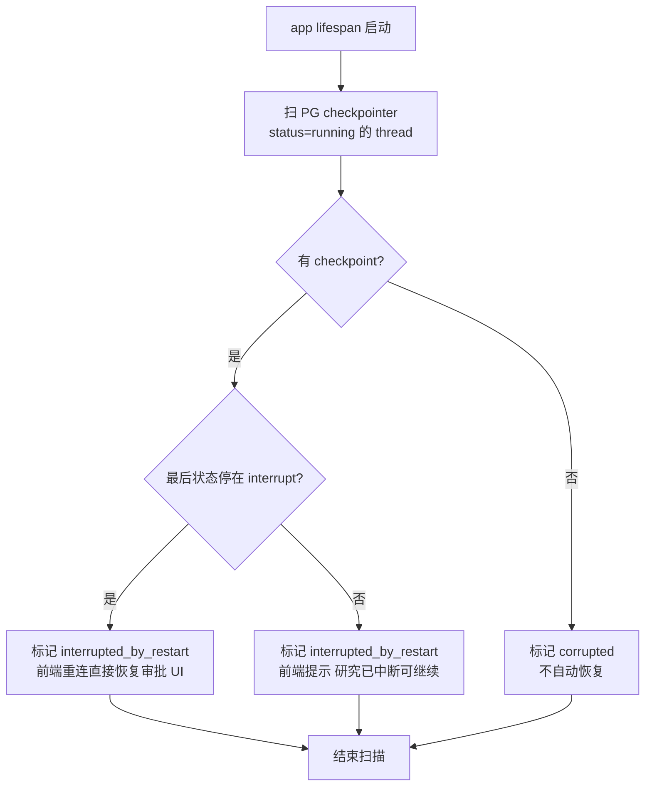

# Phase 3 · 取消 / 恢复 / 断点续研 · 开发文档

> 依据：《DeepResearch_重构详细计划.md》v1.2 第五节 5.2、第六节 Phase 3
> 工期：2～3 天｜前置依赖：Phase 2 验收通过（async generator 主链路）｜后续依赖本 Phase 的：P4（/resume 语义）、P6（前端停止按钮、重连提示）
> 参考仓库：`langgraph`（persistence/checkpointer 源码，commit `11ee185`）、`open-agent-platform`（thread 状态 API，commit `6a2ea0a`）

---

## 1. 目标与范围

**结论先行**：交付 c 档断点续研——①用户停止 5 秒内真正中断 LLM 调用（TaskRegistry + `task.cancel()`）；②进程崩溃/重启后基于 PG checkpointer 恢复，续跑不丢已检索内容（`astream(None, config)`）；③修复 resume "重跑全图" bug；④同一 thread 并发 /run 返回 409。

**范围边界**：
- ✅ 做：TaskRegistry、lifespan 崩溃恢复扫描、/resume 语义修正、`GET /threads/{id}/state` 状态 API
- ❌ 不做：interrupt 结构化 payload（P4 在本 Phase 的 resume 骨架上扩展）、前端（P6）

## 2. 现状锚点（已核实）

| 问题 | 位置 | 说明 |
|------|------|------|
| 取消只在节点间隙检查 | `workflow_service.py:278,308,411`（旧实现，P2 已删；行为问题延续记录） | cancel_event 轮询，节点内 LLM 调用无法中断 |
| 按 thread_id 存取消 flag 无并发保护 | `workflow_service.py:591-592` | 多请求同 thread 互相干扰 |
| resume 无 final 时重跑全图 | `workflow_service.py:330`（旧 resume 逻辑） | 全新 initial_state 输入 → 覆盖已有进度 |
| 重复提交拦截非显式状态码 | `/run` 路由 | 需改为显式 409 |

**依赖的既有资产**：PG checkpointer（每个 super-step 自动落盘，`checkpointer_backend: postgres` 已配）；Redis（cancel 兜底信号）；现有 REST 路径 `/cancel`（`research_router.py:77`）、`/resume`（:87）、`/state/{thread_id}`（:184）、`/history/{thread_id}`（:193）。

## 3. 任务分解

### P3-1 TaskRegistry（新增 `app/backend/service/task_registry.py`）

```python
# app/backend/service/task_registry.py（骨架）
import asyncio
from dataclasses import dataclass, field

@dataclass
class RunningTask:
    thread_id: str
    run_id: str
    task: asyncio.Task
    started_at: float

class TaskRegistry:
    """thread_id → asyncio.Task 注册表；单进程权威 + Redis 兜底（多 worker）。"""

    def __init__(self, redis):
        self._tasks: dict[str, RunningTask] = {}
        self._redis = redis

    async def register(self, thread_id: str, run_id: str, coro) -> asyncio.Task:
        if thread_id in self._tasks and not self._tasks[thread_id].task.done():
            raise ConcurrentRunError(thread_id)          # → router 层转 HTTP 409
        task = asyncio.create_task(coro, name=f"research:{thread_id}")
        self._tasks[thread_id] = RunningTask(thread_id, run_id, task, time.time())
        await self._redis.setex(f"cancel:{thread_id}", 86400, "running")
        task.add_done_callback(lambda _: self._cleanup(thread_id))
        return task

    async def cancel(self, thread_id: str) -> bool:
        entry = self._tasks.get(thread_id)
        if not entry or entry.task.done():
            # 本进程没有 → Redis 发兜底信号（多 worker 场景，运行方 worker 轮询感知）
            await self._redis.set(f"cancel:{thread_id}", "1")
            return False
        entry.task.cancel()                                # CancelledError 传播进 astream → 中断 LLM 调用
        return True
```

**要点**：
1. `task.cancel()` 使 `asyncio.CancelledError` 在 generator 内部的 `await` 点抛出——P2 的 `stream_research` 已有 `except asyncio.CancelledError: yield run.cancelled; raise` 分支，**真正中断发生在 LangGraph await LLM 流式响应处**，不再依赖节点间隙轮询。
2. Redis `cancel:{thread_id}` 兜底：服务层消费循环内每收到一批事件检查一次 Redis key（多 worker 部署时非宿主 worker 发起的取消）。单机开发模式可延迟实现，接口先留。
3. `/cancel` 路由：`200 {"cancelled": true}`（本进程命中）或 `202 {"cancelled": false, "reason": "signal_sent"}`（仅 Redis 信号）。

### P3-2 崩溃恢复扫描（lifespan）

**流程**（block-and-arrow）：



**实现要点**：
1. `app_main.py` 的 lifespan 中调用 `task_registry.scan_orphans()`：
   - "running" thread 的判定来源：Redis `cancel:{thread_id}` 值为 running 但进程内无对应 task（重启后 Redis 残留）＋ PG checkpointer 中该 thread 最新 checkpoint 存在。
   - 标记方式：Redis 写 `thread:{thread_id}:interrupted_by_restart`（TTL 7 天），`GET /threads/{id}/state` 读取后返回给前端。
2. **续跑语义（核心）**：`/resume`（或新增 `/resume` 后自动判断）用 `graph.astream(None, config)`——**None 输入 = 从最后 checkpoint 续跑**，从断点节点开始，已检索的 sources/findings 全部保留。
3. **状态边界测试（计划第八节风险项，硬性）**："崩溃注入"测试——在节点中途 kill 进程（见 T3-3），验证：无半写事务脏数据（checkpointer 事务由 LangGraph 保证）、无孤儿 checkpoint 影响续跑、续跑结果与不间断执行语义等价。

### P3-3 /resume 语义修正

**修复目标**：旧 `workflow_service.py:330` 的"无 final 时全新 initial_state 重跑全图"bug。

**新语义**：

```python
# research_service.py 内
async def resume_stream(graph, thread_id: str, resume_value: dict | None) -> AsyncGenerator[str, None]:
    config = {"configurable": {"thread_id": thread_id}}
    # resume_value 非 None（HITL 回答）→ Command(resume=resume_value) 输入，从 interrupt 点继续
    # resume_value None（崩溃续研）→ None 输入，从最后 checkpoint 续跑
    input_state = Command(resume=resume_value) if resume_value is not None else None
    async for sse_str in stream_research(graph, input_state, thread_id):
        yield sse_str
```

- P4 会扩展 resume_value 为结构化 payload（action/answers），本 Phase 先打通"输入路由正确"这一层。
- `/resume` 请求体加 `mode` 字段区分：`{"mode": "continue"}`（崩溃续研）vs `{"mode": "answer", "value": {...}}`（HITL 回答）。

### P3-4 状态 API

`GET /threads/{id}/state`（现 `research_router.py:184`）增强返回：

```json
{
  "thread_id": "...",
  "status": "idle | running | awaiting_input | interrupted_by_restart",
  "current_node": "web_search",
  "has_checkpoint": true,
  "resumable": true,
  "interrupted_by_restart": false,
  "next_nodes": ["web_search", "local_rag"]
}
```

- `next_nodes` 来自 `graph.get_state(config).next`——前端据此决定"续传提示"还是"静默重放历史"（P6 SSE 重连逻辑的数据源）。
- 参考实现：`open-agent-platform` 的 thread 状态 API（`apps/web/src/features/chat/` 与其后端交互层，索引 2.3 节）。

## 4. 线程模型约定（写入代码注释）

| 场景 | 行为 |
|------|------|
| 同一 thread 并发 /run | 409 Conflict（`ConcurrentRunError` → router 异常处理器） |
| 同一 thread /run 时 /resume | 409（同上） |
| 不同 thread 并发 | 正常并行（各自 generator + task） |
| 运行中 /cancel | task.cancel() → run.cancelled 事件 → 流关闭 |
| 未运行 /cancel | 200/202（幂等，不报错） |

## 5. 测试计划

| 用例 | 类型 | 断言 |
|------|------|------|
| T3-1 停止及时性 | 集成 | 生成中（write 节点长文本输出期）POST /cancel → 5 秒内 SSE 流收到 run.cancelled 并关闭；进程内 LLM 调用被中断（无后续 token） |
| T3-2 并发拦截 | 集成 | 同 thread 两个并发 /run → 第二个 409；第一个不受影响 |
| T3-3 崩溃注入续研 | 集成（核心） | deep_dive 节点执行中途 kill -9 进程 → 重启 → /threads/{id}/state 返回 interrupted_by_restart=true → /resume mode=continue → 续跑完成，**已检索 sources 在续跑后的 state 中完整保留**，报告正常产出 |
| T3-4 半写事务 | 集成 | T3-3 的 kill 点选在节点写 state 与 checkpoint 落盘窗口；重启后 get_state 无脏数据（checkpoint 要么旧要么新，无中间态） |
| T3-5 resume 不重跑 | 集成 | 对照：正常跑完 vs 中断后续跑，检索节点（web_search/local_rag）的执行次数不因 resume 翻倍（日志计数） |
| T3-6 cancel 幂等 | 集成 | 未运行 thread /cancel → 200；连续两次 /cancel → 均 200 |
| T3-7 状态 API | 集成 | 各生命周期阶段（idle/running/awaiting_input/interrupted_by_restart）state 字段正确；running 时 current_node 随推进变化 |

## 6. 验收清单

- [ ] 生成中点停止 → LLM 调用 5 秒内中断（T3-1）
- [ ] kill 进程重启后，会话提示"已中断可继续"且续跑不丢已检索内容（T3-3，含崩溃注入测试）
- [ ] 同一 thread 并发 /run 得到 409（T3-2）
- [ ] resume 语义修正：崩溃续研走 `astream(None, config)`，不重跑全图（T3-5）
- [ ] `GET /threads/{id}/state` 返回可恢复点信息（T3-7）
- [ ] TaskRegistry 落地，旧 cancel_flags 机制删除
- [ ] 打 tag `p3-done`

## 7. 风险与对策

| 风险 | 对策 |
|------|------|
| checkpointer 半写事务/孤儿 checkpoint | T3-4 专测；LangGraph PG checkpointer 每 super-step 事务落盘，依赖其原子性，不自造恢复逻辑 |
| kill -9 测试在 Windows 开发机不可用 | 用 `taskkill /F /PID` 或 pytest 内 `proc.kill()`（Python subprocess），跨平台脚本封装 |
| CancelledError 传播路径被 astream 吞掉 | P2 已验证异常路径；本 Phase T3-1 直接观测"无后续 token"作为硬证据 |
| Redis 兜底信号轮询引入延迟 | 单机模式下进程内 task.cancel() 已覆盖主场景；Redis 轮询间隔 2s，验收标准（5s）内可感知 |
| 重启扫描误判（Redis 残留 running 但该 thread 本就空闲） | 扫描条件要求 PG checkpoint 存在且 next 非空，双条件判定 |
