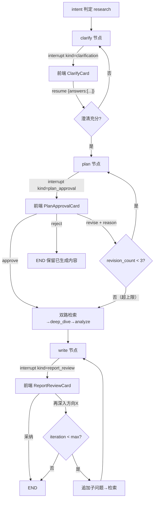

# Phase 4 · HITL 人机协同（D1-D4）· 开发文档

> 依据：《DeepResearch_重构详细计划.md》v1.2 第五节 5.3、第六节 Phase 4；功能确认清单决策 5（D1-D4 全做）、13（D1 三分支）
> 工期：2～3 天｜前置依赖：Phase 3 验收通过（resume 语义、TaskRegistry）｜后续依赖本 Phase 的：P6（三张 HITL 卡片）
> 参考仓库：`open_deep_research`（clarify_with_user 模式，commit `1b7d2e8`）、`langgraph`（examples/human_in_the_loop/）、`open-agent-platform`（审批 UI 闭环）

---

## 1. 目标与范围

**结论先行**：落地三个 interrupt 点（clarify 澄清 / plan_approval 计划审批 / report_review 报告审核）+ interrupt 状态持久化 API。核心机制全部照 `open_deep_research` 的 `interrupt()` + `Command(resume=...)` 模式；plan_approval 支持**批准 / 修改（携原因重新生成）/ 否决**三分支，回环受轮次上限约束防死循环。

**范围边界**：
- ✅ 做：三个 interrupt 点接线、/resume 结构化 payload 校验、`GET /threads/{id}/interrupt` 状态重建 API
- ❌ 不做：前端卡片（P6）、记忆（P5）

## 2. 现状锚点

| 问题 | 位置 | 说明 |
|------|------|------|
| interrupt 已埋三处但语义弱 | 现有 nodes（P1 拆包后为 nodes/ 包） | 前端用正则匹配"继续"关键词路由 resume（确认清单 D1 问题） |
| resume 非结构化 | 旧 resume 通道 | 无 kind 校验，任意 payload 直塞 |
| interrupt 状态切会话被清空 | 前端 session.ts:38（P6 修） | 本 Phase 提供后端重建接口 |
| config.json 已有 hitl_config | `hitl_config: {plan_review: true, analyze_clarify: true, write_review: false}` | 开关保留：write_review（即 report_review）默认关，配置开启后生效 |

## 3. interrupt 全景（数据流）



## 4. 任务分解

### P4-1 三个 interrupt 点

#### ① clarify 节点（D2，P1 已留占位壳子，本任务补全）

```python
# app/mult_agents/nodes/clarify.py
from langgraph.types import interrupt, Command
from typing import Literal

async def clarify_node(state: AgentState, config) -> Command[Literal["plan", "clarify", "__end__"]]:
    # 1. LLM（clarifier 角色）判断是否需要澄清 + 生成澄清问题列表
    questions = await ask_clarify_questions(state)        # 结构化: [{id, question, options?}]
    if not questions.needed:
        return Command(goto="plan", update={})
    # 2. interrupt 向用户提问（可多轮：answers 非空则 LLM 判断是否充分）
    answers = interrupt({"questions": questions.items})
    state["clarifications"].append({"q": questions.items, "a": answers})
    if questions.followup_needed(answers):
        return Command(goto="clarify")                    # 多轮澄清
    return Command(goto="plan", update={"clarifications": state["clarifications"]})
```

- 事件流：节点内 interrupt 抛出前，通过 StreamWriter 发 `interrupt.raised(kind=clarification, payload={questions:[...]})`；实际 interrupt 数据由 P4-3 API 从 `graph.get_state` 读取（双通道，事件给实时流，API 给重连重建）。
- **参考**：`open_deep_research:src/open_deep_research/deep_researcher.py:60-74`（`clarify_with_user` 的 `interrupt()` + `Command` 返回模式，含 `ClarifyWithUser` 结构化输出模型 `state.py:30`）；clarify prompt 参考 `prompts.py:3`。

#### ② plan_approval（D1，三分支）

```python
# app/mult_agents/nodes/plan.py 内 plan 节点尾部
if settings.hitl_config.get("plan_review", True):
    decision = interrupt({
        "sub_questions": plan_items,       # 结构化子问题列表 [{id, question, rationale, source_hint}]
        "revision_count": state["plan_revision_count"],
    })
    match decision["action"]:
        case "approve":
            return {"plan": plan_items, "plan_revision_count": 0}
        case "revise":
            # 携 reason 回 plan 节点重新生成（LLM 输入 = 原问题 + 修改原因 + 上一版计划）
            if state["plan_revision_count"] >= 3:          # 轮次上限，防死循环
                return {"plan": plan_items}                # 强制采纳，事件流提示已达上限
            return Command(goto="plan", update={
                "plan": [],                                 # 清空重生成（reducer 需配合 override）
                "plan_revision_count": state["plan_revision_count"] + 1,
                "plan_revision_reason": decision["reason"],
            })
        case "reject":
            return Command(goto="__end__", update={"report": "研究计划被否决。", "needs_more_research": False})
```

**State 配合**：`plan` 用 `operator.add` reducer 时，revise 清空需** override 语义**——方案：plan 字段改用 `add_messages` 风格的"支持删除的 reducer"，或 plan_revision 走单独键、最终 plan 在 approve 时以新键 `final_plan` 落地。**推荐后者**（改动最小、语义清晰）：`plan`（工作区，节点内整体覆盖写法，不挂 reducer）+ `final_plan`（approve 后固化，后续节点只读）。

#### ③ report_review（D3，write 节点尾部）

```python
# write 节点产出报告后
if settings.hitl_config.get("write_review", False):
    decision = interrupt({"report_preview": report[:2000], "full_message_id": mid})
    match decision["action"]:
        case "adopt":
            return {"report": report}
        case "deepen":   # "再深入方向 X"
            if state["iteration"] >= state["max_iterations"]:
                return {"report": report}                 # 超上限直接采纳
            return Command(goto="plan", update={           # 追加子问题回检索
                "plan": decision["extra_sub_questions"],   # 用户指定方向
                "iteration": state["iteration"] + 1,
            })
```

### P4-2 /resume 结构化 payload

**请求契约**（pydantic，`schemas/research.py` 扩展）：

```python
class ClarifyResumePayload(BaseModel):
    kind: Literal["clarification"]
    answers: list[str]                     # 与问题列表一一对应

class PlanApprovalResumePayload(BaseModel):
    kind: Literal["plan_approval"]
    action: Literal["approve", "revise", "reject"]
    reason: str | None = None              # revise 必填（校验器强制）

class ReportReviewResumePayload(BaseModel):
    kind: Literal["report_review"]
    action: Literal["adopt", "deepen"]
    extra_sub_questions: list[str] = []    # deepen 必填

ResumePayload = Annotated[Union[...], Field(discriminator="kind")]
```

- router `/resume`：按当前 `graph.get_state().tasks[*].interrupts` 的实际 kind 校验 payload 匹配（kind 不符 → 422），校验通过后 `Command(resume=payload.model_dump())` 进入 P3 的 resume_stream。
- **消灭正则路由**：前端不再匹配"继续"关键词（P6 配合删除）。

### P4-3 interrupt 状态 API（D4）

`GET /threads/{id}/interrupt`（新增）：

```python
# research_router.py
@router.get("/threads/{thread_id}/interrupt")
async def get_interrupt(thread_id: str):
    snap = await graph.aget_state({"configurable": {"thread_id": thread_id}})
    if not snap.next or not snap.tasks:
        return {"active": False}
    for task in snap.tasks:
        if task.interrupts:
            intr = task.interrupts[0]
            return {
                "active": True,
                "interrupt_id": intr.id,
                "kind": intr.value.get("kind"),        # 节点 interrupt() 载荷里带 kind
                "payload": intr.value,                  # 完整审批数据（问题列表/子问题/报告预览）
                "revision_count": ...,
            }
    return {"active": False}
```

- **约定**：每个 interrupt() 的载荷 dict 必须含 `kind` 键（三种枚举值），节点侧统一封装 `raise_interrupt(kind, payload)` 辅助函数保证一致。
- 前端（P6）切会话时调用本接口重建审批卡片，不再依赖内存——持久化由 PG checkpointer 天然保证（interrupt 状态存在 checkpoint 里）。
- **参考**：`open-agent-platform:apps/web/src/components/agent-inbox/`（inbox-view/thread-view 的 interrupt 列表 → 审批卡片 → resume 完整闭环，前端形态 P6 借鉴，后端 API 形态本任务对照）。

## 5. 测试计划

| 用例 | 类型 | 断言 |
|------|------|------|
| T4-1 澄清流程 | 集成 | research 类问题 → SSE 收到 interrupt.raised(kind=clarification) → /resume answers → 继续走 plan；多轮：首答不充分 → 二次 interrupt |
| T4-2 plan 审批-批准 | 集成 | approve → 计划固化 final_plan → 进入检索 |
| T4-3 plan 审批-修改 | 集成 | revise + reason → 重新生成计划（LLM 输入含 reason）→ 再次 interrupt；revision_count 递增 |
| T4-4 plan 轮次上限 | 集成 | 连续 3 次 revise 后第 4 次 → 强制采纳（不再 interrupt），事件含"已达修改上限"提示 |
| T4-5 plan 审批-否决 | 集成 | reject → 图结束，state 保留已生成内容（plan 草稿可见），报告为否决说明 |
| T4-6 报告审核-采纳/再深入 | 集成 | adopt → END；deepen + 方向 → 回检索且 iteration+1；超 max_iterations 时 deepen 直接采纳 |
| T4-7 payload 校验 | 集成 | kind 不匹配 → 422；revise 缺 reason → 422；action 非法值 → 422 |
| T4-8 interrupt 重建 | 集成（核心） | 触发 plan_approval 后**新建另一个 API 会话**调 GET /threads/{id}/interrupt → 返回完整审批数据（active=true, kind, payload）；resume 后该接口返回 active=false |
| T4-9 持久化跨重启 | 集成 | 停在 interrupt 时 kill 进程重启 → interrupt API 仍能重建（checkpoint 持久性） |

## 6. 验收清单

- [ ] 四场景（澄清/批准/修改/否决+报告审核）手测通过（T4-1～T4-6）
- [ ] 审批中途切换会话再切回，审批卡片数据可完整还原（T4-8，后端接口就绪；前端表现 P6 验收）
- [ ] plan_approval 选"修改"并填原因后计划被重新生成且受轮次上限约束（T4-3/T4-4）
- [ ] report_review 的"再深入"能回到检索且受 iteration 上限约束（T4-6）
- [ ] /resume 按 kind 校验 payload，非法请求 422（T4-7）
- [ ] 前端正则匹配"继续"路由 resume 的逻辑待删（P6 勾选，此处记录债务）
- [ ] 打 tag `p4-done`

## 7. 风险与对策

| 风险 | 对策 |
|------|------|
| revise 回环死循环 | 双保险：revision_count 上限 3（state 计数）+ LLM prompt 明确"基于 reason 调整"；T4-4 硬性验证 |
| interrupt() 载荷与 get_state().tasks[].interrupts 结构不符 | 统一 `raise_interrupt(kind, payload)` 封装；T4-8 即该契约的回归测试 |
| plan reducer 的"清空重生成"与 operator.add 冲突 | 采用 plan（工作区，无 reducer 整体覆盖）+ final_plan（固化）双键方案，绕开 override reducer 复杂性 |
| write_review 默认关闭导致 T4-6 无法自动化 | 测试 fixture 强制开启 hitl_config.write_review；默认配置行为单独断言（关闭时 write 直达 END） |
| clarify 多轮判断不稳定（LLM 主观） | followup 判定用结构化输出（needed: bool + followup_questions），且多轮上限 2 次兜底 |
