# Phase 5 · 记忆重写（langmem + LangGraph Store）· 开发文档

> 依据：《DeepResearch_重构详细计划.md》v1.2 第五节 5.4、第六节 Phase 5；功能确认清单决策 3（langmem 路线）、E1-E3
> 工期：1.5～2 天｜前置依赖：Phase 1（State/nodes 新结构）、Phase 2（run.completed 事件钩子）｜后续依赖本 Phase 的：P6（记忆面板）
> 参考仓库：`memory-template`（唯一主力参考，commit `c4e05d4`，9 个源文件半天可读完）

---

## 1. 目标与范围

**结论先行**：删除 MD5 哈希伪向量记忆（`memory/long_term.py` + `memory.db`），替换为 **LangGraph `PostgresStore`（独立 schema）+ langmem 双通道**——后台提取（run.completed 后异步）+ 热路径检索（plan 节点前注入 system prompt）。embedding 用通义 text-embedding-v3（真实向量，与 Milvus 链路同源）。新增 `GET /memories` 支撑前端记忆面板（E3）。

**范围边界**：
- ✅ 做：PostgresStore 接入与迁移、langmem 双通道、删除旧记忆体系、/memories API
- ❌ 不做：记忆编辑（只读优先，编辑后续加）、前端面板（P6）、多用户（namespace 预留 user_id）

## 2. 现状锚点（已核实）

| 问题 | 位置 | 说明 |
|------|------|------|
| MD5 哈希伪向量 | `app/mult_agents/memory/long_term.py:43-59` | 384 维假向量，语义检索召回≈随机（确认清单问题 #5） |
| 1434 行巨类 | `app/mult_agents/memory/manager.py` | 混合 Redis/PG/Milvus/摘要 LLM 多职责（问题 #6） |
| SQLite memory.db | `app/data/memory.db` | 哈希伪向量存储，无迁移价值，清零重来 |
| 短期记忆混杂 | `memory/short_term.py` | 重写为 LangGraph 原生 messages + checkpointer（E1） |

## 3. 目标架构

```mermaid
flowchart TB
    subgraph HOT["热路径（同步，plan 前）"]
        P[plan 节点开始] --> Q["store.asearch(namespace, query, limit=k)<br/>namespace=(user_id, memories)"]
        Q --> R[检索结果注入 plan system prompt<br/>memory_context 字段]
    end
    subgraph BG["后台通道（异步，run.completed 后）"]
        C[run.completed 事件钩子] --> M["langmem create_memory_store_manager<br/>提取用户偏好/研究主题历史"]
        M --> S[(PostgresStore 独立 schema)]
    end
    subgraph INFRA["基础设施"]
        S --> E["embedding: 通义 text-embedding-v3"]
        S --> PG[(与现有 PG 共库<br/>独立 schema: store 表族)]
    end
    R -.-> S
```



## 4. 任务分解

### P5-1 PostgresStore 接入

**步骤**：
1. **版本对齐（计划第八节风险项，开工首件事）**：确认 `memory-template` 所用 langmem / langgraph-checkpoint-postgres 版本，与本项目 langgraph 版本对齐后写入 requirements.txt。
2. 建独立 schema（迁移脚本 `scripts/migrate_store.sql` 或 lifespan 内 `setup()`）：`CREATE SCHEMA IF NOT EXISTS deepresearch_store;`，PostgresStore 表族（store / embeddings 等）落在该 schema；**与 checkpointer 表（LangGraph 管理）物理隔离**，互不影响。
3. `app/backend/infra/` 新增 `store_client.py`：应用级单例 `AsyncPostgresStore`，lifespan 内初始化（index 时机：启动时 `await store.setup()`）。

**参考**：`memory-template:src/chatbot/graph.py:11,53`（store 接入与远端 client 形态）。

### P5-2 langmem 双通道

**后台提取（run.completed 触发）**：

```python
# app/backend/service/memory_service.py（新增）
from langmem import create_memory_store_manager

memory_manager = create_memory_store_manager(
    "deep-researcher",                       # 提取 prompt 人格
    tools=[store_tool],                      # 绑定 PostgresStore 写入工具
    model=reflection_model,                  # 提取用 LLM（可用 qwen-turbo 省成本）
    namespace=("memories", "{user_id}"),     # 动态 namespace
)
# research_service.py 的 run.completed 分支后：
asyncio.create_task(memory_manager.improve_memory(thread_messages))   # 不阻塞主流程
```

**提取范围**（E2 + 跨 thread 研究主题记忆）：
- 用户偏好（表达习惯、报告详略偏好、语言偏好）；
- 研究主题历史（研究方向、领域偏好、反复出现的主题）——确认清单"长期记忆的范围含跨 thread 的研究主题记忆"。

**热路径检索（plan 节点前）**：

```python
# nodes/plan.py 头部（或独立 preprocess 节点）
namespace = (state["user_id"], "memories")
memories = await store.asearch(namespace, query=state["query"], limit=5)
memory_context = "\n".join(f"- {m.value['text']}" for m in memories)
return {"memory_context": memory_context}   # 注入 plan 的 system prompt
```

**参考**：`memory-template:src/chatbot/graph.py:31-36`（namespace 构造 + `store.asearch(namespace, query, limit=10)` 直接对应本设计）；后台完整参数范例 `src/memory_graph/graph.py:13,48`。

**embedding 配置**：PostgresStore 构造参数指定通义 text-embedding-v3（DashScope embedding API）；与 Milvus RAG 链路同源，复用 api_key 配置。

### P5-3 删除旧记忆

| 动作 | 文件 |
|------|------|
| 删除 | `app/mult_agents/memory/long_term.py`（哈希伪向量） |
| 删除 | `app/data/memory.db` |
| 拆解 | `memory/manager.py`（1434 行巨类）：有用部分（如 thread 元数据 CRUD 若被 thread_service 依赖）改造进 research_service/thread_service；记忆相关全部废弃 |
| 简化 | `memory/short_term.py`：短期记忆职责收归 LangGraph 原生 messages + checkpointer，文件删除或留空壳 |
| 保留改造 | `memory/base.py`/`utils.py` 中仍被引用的工具函数迁至 memory_service |

- 删除后全局 grep `from mult_agents.memory` 修复全部调用点（主要是 nodes 内 with_memory_context——P1 拆包后集中在 `_shared.py:65`）。
- config.json 中 `enable_memory / memory_top_k / short_term_* / long_term_* / milvus_collection` 等旧记忆配置项清理，新增 `memory: {embedding_model, hot_path_top_k, background_enabled}`。

### P5-4 /memories API

```python
# research_router.py 或独立 memories_router
@router.get("/memories")
async def list_memories(user_id: str = "default_user"):
    items = await store.asearch((user_id, "memories"), query="", limit=200)
    return {"memories": [
        {"id": m.key, "text": m.value["text"], "created_at": m.created_at,
         "updated_at": m.updated_at, "kind": m.value.get("kind", "general")}
        for m in items
    ]}
```

只读优先；user_id 参数预留（决策 7：不做多用户，API 层预留字段）。

## 5. 测试计划

| 用例 | 类型 | 断言 |
|------|------|------|
| T5-1 版本兼容 | 冒烟 | langmem + langgraph-checkpoint-postgres 版本组合启动无 import 错误；PostgresStore.setup() 建表成功 |
| T5-2 后台提取 | 集成 | 会话 A 中明示偏好（如"以后报告都给英文参考文献"）→ run.completed 后等待后台任务 → GET /memories 出现对应条目 |
| T5-3 热路径注入 | 集成（核心验收） | 会话 A 沉淀记忆后，新会话 B 提交相近主题 → **日志打印 plan 节点 system prompt，含会话 A 沉淀的记忆内容** |
| T5-4 语义召回对比 | 集成 | 同一查询下：新方案召回 top-5 与查询语义相关（人工判定）；对照旧哈希方案召回随机（对比结论记录存档） |
| T5-5 不阻塞主流程 | 集成 | 后台提取失败（mock LLM 报错）→ run 主流程不受影响，run.completed 正常发出 |
| T5-6 旧记忆清除 | 静态 | grep `long_term\|memory.db\|MemoryManager` 零残留命中；启动无 sqlite 访问 |
| T5-7 schema 隔离 | 集成 | checkpointer 表与 store 表族分属不同 schema；删 store schema 重建不影响 checkpointer 数据 |

## 6. 验收清单

- [ ] PostgresStore 独立 schema 落地，迁移可重复执行（T5-1/T5-7）
- [ ] langmem 双通道：后台提取（run.completed 后，含跨 thread 研究主题记忆）+ 热路径检索（plan 前注入）运行（T5-2/T5-3）
- [ ] **会话 A 告知偏好，新会话 B 的 plan 节点 system prompt 中可见该记忆（日志验证注入）**（T5-3，硬性验收）
- [ ] 语义相近查询能召回，优于旧哈希方案（T5-4 对比记录）
- [ ] `memory/long_term.py`、`memory.db`、manager 巨类已删除，无残留引用（T5-6）
- [ ] `GET /memories` 返回全部记忆条目（T5-2 依赖）
- [ ] 打 tag `p5-done`

## 7. 风险与对策

| 风险 | 对策 |
|------|------|
| langmem 与本项目 langgraph 1.x 版本不兼容 | 开工首日版本对齐验证（计划第八节既定动作）；冲突时以 memory-template 锁定版本组合为准 |
| 后台提取任务泄漏（create_task 无引用被 GC） | 统一走 memory_service 内的任务集合（`background_tasks: set` + done_callback 丢弃），并在 lifespan shutdown 时 await 全部 |
| DashScope embedding 限流 | 热路径 top_k=5、后台批量提取频率低；错误时 memory_context 置空字符串降级（不阻塞 plan） |
| namespace 设计不当导致跨用户串记忆 | namespace 第一维强制 user_id（默认 anonymous/default_user）；T5-3 用例可扩展双 user 隔离断言 |
| 删 manager.py 时牵连 thread 元数据功能 | P2 已把 thread CRUD 迁出；删除前 grep 确认 manager 的唯一消费方是记忆链路 |
