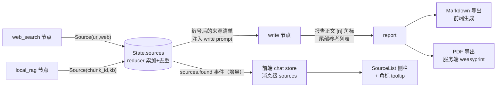

# Phase 7 · 引用溯源 + 报告导出 · 开发文档

> 依据：《DeepResearch_重构详细计划.md》v1.2 第五节 5.5（引用部分）、第六节 Phase 7；功能确认清单 F4、H2、H3
> 工期：1.5～2 天｜前置依赖：Phase 1（统一 Source 结构已落）、Phase 6（前端组件骨架）｜依赖本 Phase 的：无（P8 收尾）
> 参考仓库：`gpt-researcher`（报告引用体系，commit `6f99857`）

---

## 1. 目标与范围

**结论先行**：打通"检索 → State.sources → 报告 [n] 角标 → 前端角标 tooltip + 侧栏来源列表 → 导出（MD/PDF）含完整参考列表"的端到端引用链路。验收硬指标：**报告中 ≥80% 主要论断带来源角标**。

**范围边界**：
- ✅ 做：Source 结构化链路收口、报告模板改造（[n] 角标 + 参考列表）、SourceList 完整交互、Markdown/PDF 导出、研究过程时间线（H3，AgentTimeline 数据沉淀复用）
- ❌ 不做：Word 导出（决策 10 只做 MD+PDF）、引用点击定位到知识库文档正文段落（先做打开文档定位级）

## 2. 现状锚点

| 现状 | 位置 | 差距 |
|------|------|------|
| 检索结果已有结构（P1 统一 Source） | `nodes/web_search.py`、`nodes/local_rag.py` → `ResearchState.sources` | write 节点 prompt 未要求角标；前端无渲染 |
| 报告模板 | `prompts.py` write 角色 prompt | 无引用标注要求；需改造为 gpt-researcher 式结构 |
| 前端 SourceList | P6 占位组件 | 角标 tooltip + 侧栏 + 点击跳转待实现 |
| 导出 | 无 | MD 前端生成 + PDF 服务端 weasyprint |

## 3. 引用链路设计



**编号规则**：来源按进入 State.sources 顺序编号（1 起始，url/chunk_id 去重后稳定）；write prompt 中注入"编号 → 来源"清单，要求每个主要论断标注对应 [n]。

## 4. 任务分解

### P7-1 Source 结构化收口

1. `nodes/_evidence.py` 的 `_dedupe_sources`（P1 落位）确认去重键：web 用 url、kb 用 chunk_id；去重后保留首次出现顺序（编号稳定性）。
2. **节点 → 事件**：web_search/local_rag 每轮检索后通过 StreamWriter 发 `sources.found`（只发本轮新增，前端累加）；deep_dive 补充证据同样发。
3. **State → write**：write 节点入口把 `state["sources"]` 渲染为编号清单注入 prompt：

```
可用来源（引用时标注 [编号]）：
[1] {title} — {url}
[2] {title} — 知识库文档 {doc_name}，chunk {chunk_id}
...
```

### P7-2 报告引用标注（prompts.py 改造）

- write 角色 prompt 增加引用规范（**参考 gpt-researcher 报告结构**：`参考项目/gpt-researcher/gpt_researcher/actions/report_generation.py` 的 prompt 组织 + `markdown_processing.py` 的 [n] 角标与参考列表落地处理）：
  1. 每个主要论断/数据后标注 `[n]`，可多引 `[1][3]`；
  2. 报告尾部输出 `## 参考文献` 编号列表（web 给可点击 url；kb 给文档名+定位提示）；
  3. 无来源支撑的论断显式标注"（待验证）"而不是编造引用。
- **后处理兜底**（报告生成后、入库前）：正则校验报告内 [n] 引用是否都存在于来源清单；悬挂引用（编号无对应来源）剔除角标并记日志。质量指标统计：`带角标论断数 / 主要论断总数 ≥ 80%` 写入日志，联调期人工抽查。

### P7-3 前端 SourceList 完整交互

1. **MarkdownRender.vue 扩展**：`[n]` 角标渲染为上标可交互元素；hover 显示 tooltip（title + url/文档名 + snippet 前两行）；点击滚动侧栏对应来源并高亮。
2. **SourceList.vue**（侧栏）：按 source_type 分组（网络来源/知识库来源）；条目 = 编号 + title + 类型徽标；web 点击新开 url，kb 点击打开知识库文档定位（跳 KnowledgeView 或文档预览）。
3. 消息级 sources（P6 chat store 已有数据）与会话级汇总（当前报告全部来源）两种视图：报告消息用会话级汇总侧栏。

### P7-4 导出

**Markdown（前端生成）**：

```typescript
// MarkdownRender.vue / MessageItem.vue 导出按钮
function exportMarkdown(msg: Message, sources: Source[]) {
  const refs = sources.map((s, i) =>
    `[${i + 1}] ${s.title} — ${s.source_type === "web" ? s.url : `知识库 ${s.chunk_id}`}`).join("\n");
  download(`${title}.md`, msg.text + "\n\n## 参考文献\n" + refs);
}
```

**PDF（服务端）**：
- 新增 `POST /threads/{thread_id}/export/pdf`（research_router）：取最终报告 + sources → weasyprint 渲染（模板含标题、元信息、正文角标上标、尾部参考列表排版）→ 返回 `application/pdf` 流。
- 依赖：`weasyprint`（Windows 需 GTK 运行库——**风险项，见第 7 节**，装不上则降级方案：前端 print CSS 打印导出）。

### H3 研究过程时间线（顺带交付）

- AgentTimeline.vue（P6 已有节点进度）扩展：每节点完成后可展开查看该步的中间结论（messages 中间节点输出）与来源增量——数据全部来自既有事件流，无新增后端改动；导出 MD 时附加"研究过程"附录（可选开关）。

## 5. 测试计划

| 用例 | 类型 | 断言 |
|------|------|------|
| T7-1 来源去重与编号稳定 | 单测 | 同 url 两轮检索 → sources 仅一条且编号不变；web+kb 混合去重键正确 |
| T7-2 悬挂引用剔除 | 单测 | 报告含 `[5]` 但来源仅 3 条 → 后处理剔除该角标 + 日志记录 |
| T7-3 引用覆盖率 | 集成 | 真实研究报告统计：主要论断带角标比例 ≥80%（日志输出） |
| T7-4 角标渲染交互 | 手测 | hover tooltip 内容正确；点击侧栏滚动定位高亮；kb 来源跳转文档 |
| T7-5 MD 导出 | 手测 | 导出文件含完整正文 + 参考文献列表；编号与正文角标一致 |
| T7-6 PDF 导出 | 手测 | PDF 排版正常（角标上标、参考列表、中文不乱码） |
| T7-7 事件增量 | 集成 | 多轮检索场景 sources.found 事件只含本轮新增（前端无重复条目） |

## 6. 验收清单

- [ ] 报告中 ≥80% 主要论断带来源角标（T7-3 日志证据）
- [ ] 点击来源可跳转（web 新开页）/ 定位（kb 打开文档）（T7-4）
- [ ] 导出的 md 含完整参考列表且编号一致（T7-5）
- [ ] PDF 导出正常或降级方案落地（T7-6）
- [ ] 悬挂引用后处理兜底生效（T7-2）
- [ ] AgentTimeline 可展开中间结论与来源增量（H3）
- [ ] 打 tag `p7-done`

## 7. 风险与对策

| 风险 | 对策 |
|------|------|
| LLM 不守引用格式（漏标/乱标） | prompt 强约束 + 后处理兜底 + 覆盖率日志监控；覆盖率 <80% 时迭代 prompt（加 few-shot 示例） |
| weasyprint Windows 依赖 GTK 装不上 | 降级顺序：① weasyprint 正常；② 前端 print CSS + window.print()；③ 只交付 MD 导出，PDF 记入债务清单 |
| 角标与 md 语法冲突（`[1]` 被渲染为链接语法） | MarkdownRender 在渲染前用占位符替换 `[n]`，渲染后替换回自定义上标元素（gpt-researcher markdown_processing 同类处理） |
| sources 编号在 reflect 多轮后不稳定 | 去重保序（首次出现定编号），新增来源只追加不改旧编号；T7-1 覆盖 |
| 知识库来源点击定位粒度粗 | 首版做到"打开文档"级；chunk 级正文高亮记入后续迭代（前端需后端提供 chunk 文本接口——评估 `rag/db_viewer.py` 可复用性） |
