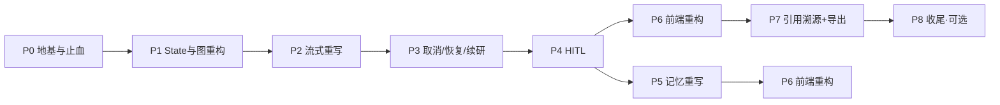
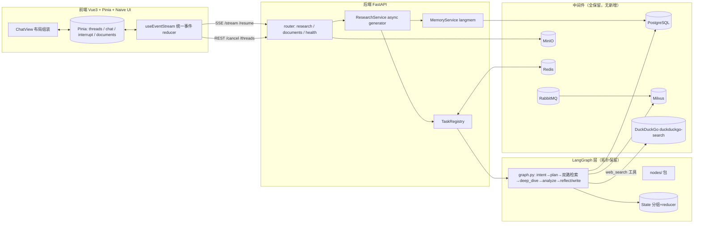

# DeepResearch 重构 · 分阶段开发文档集

> 版本：v1.0 · 2026-09-02
> 依据：《DeepResearch_重构详细计划.md》v1.2（已确认决策）、《DeepResearch_重构功能确认清单.md》v1.2、《DeepResearch_参考仓库索引.md》v1.0
> 本目录：`docs/dev/`，每 Phase 一份可直接执行的开发文档，含任务分解、接口契约、代码骨架、测试用例与验收清单。

---

## 一、文档索引

| Phase | 文档 | 主题 | 工期估算 | 关键交付物 | 状态 |
|-------|------|------|----------|-----------|------|
| 0 | [Phase0_地基与止血.md](Phase0_地基与止血.md) | 死代码删除、配置统一、事件协议定义、分支策略 | 0.5～1 天 | `schemas/events.py`、`event-protocol.json`、pydantic-settings | ✅ |
| 1 | [Phase1_State与图重构.md](Phase1_State与图重构.md) | State 分组重写、nodes 拆包、模型工厂、DuckDuckGo 接入 | 2～3 天 | `state.py`（分组+reducer）、`nodes/` 包、`models.py`、`SearchProvider` | ✅ |
| 2 | [Phase2_流式输出重写.md](Phase2_流式输出重写.md) | token 级流式、async generator、异常兜底 | 2 天 | `research_service.py` 重写（删 Thread+Queue 桥接） | ✅ |
| 3 | [Phase3_取消恢复断点续研.md](Phase3_取消恢复断点续研.md) | TaskRegistry、崩溃恢复扫描、/resume 语义修正 | 2～3 天 | `task_registry.py`、lifespan 恢复扫描、状态 API | ✅ |
| 4 | [Phase4_HITL.md](Phase4_HITL.md) | clarify / plan_approval / report_review 三个 interrupt 点 | 2～3 天 | 三个 interrupt 节点、结构化 /resume、interrupt 状态 API | ✅ |
| 5 | [Phase5_记忆重写.md](Phase5_记忆重写.md) | PostgresStore + langmem 双通道、删哈希伪向量 | 1.5～2 天 | `memory_service.py`、/memories API | ✅ |
| 6 | [Phase6_前端重构.md](Phase6_前端重构.md) | Pinia + Naive UI、useEventStream、HITL 卡片、标题生成、回滚入口 | 4～5 天 | stores 三件套、统一事件 reducer、ChatView 瘦身 | ✅ |
| 7 | [Phase7_引用溯源与报告导出.md](Phase7_引用溯源与报告导出.md) | Source 结构化、[n] 角标、SourceList、MD/PDF 导出 | 1.5～2 天 | 统一 Source 链路、报告模板改造、导出功能 | ✅ |
| 8 | [Phase8_收尾.md](Phase8_收尾.md) | 测试补全、容器化、文档更新（可选，不阻塞） | 另计 | 单测补全、应用 Dockerfile | ✅ |

## 二、执行纪律（所有 Phase 通用）

1. **顺序闸门**：前一 Phase 未通过验收清单，不进入下一 Phase；每个 Phase 合并前打 tag（`p{n}-done`），可回退。
2. **分支策略**：全部工作在 `refactor/main` 分支推进，主干保持可用。
3. **参考实现只查本地**：需要参考代码时按《DeepResearch_参考仓库索引.md》定位 `参考项目/` 内文件与行号，不联网搜索。引用格式统一为 `仓库:文件路径:行号`。
4. **先测试后实现**：每个任务先写失败测试（契约测试/注入测试），再实现，再验证——用户全局工程纪律，无例外。
5. **一个方向一个权威实现**：重写落地的同时删除旧实现，禁止新旧并存。
6. **文档同步**：每个 Phase 完成后更新本文档索引中该行状态，并同步 `工程问题与解决方案记录.md`。

## 三、路径勘误（相对计划文档）

计划文档中前端路径写作 `front/agent_front/`，**实际为 `agent_front/`**（仓库根下）。本目录全部文档统一按实际路径 `agent_front/src/` 书写。

## 四、关键路径与并行建议

- **主线顺序**：P0 → P1 → P2 → P3/P4（可部分并行）→ P6 → P7。
- **并行窗口**：P0-3（事件协议冻结）后，前端可先按 `event-protocol.json` mock 开发 P6，不必等后端 P2-P4 完成。
- **执行建议**（计划第九节）：Phase 0-4 全部完成后先用现有旧前端验证后端行为，再启动 Phase 6——避免前端跟着后端协议反复返工。

## 五、总体目标架构（重写后）

