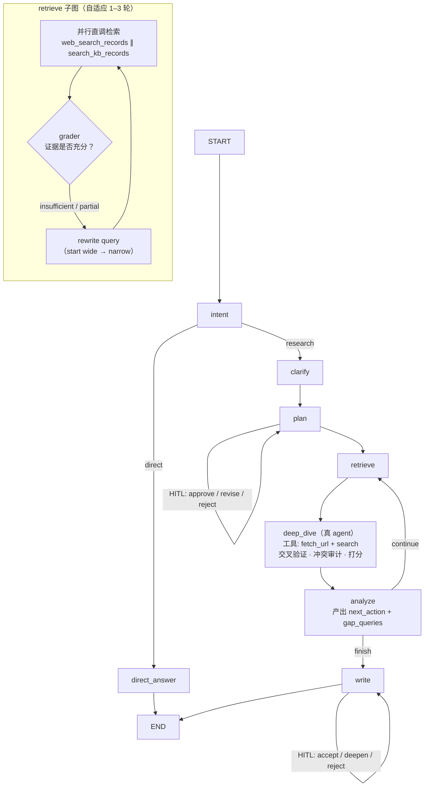

# 优化计划：多智能体架构升级（从 LLM 流水线到 Agentic RAG）

> 触发问题：当前 10 节点是否只是"流式 LLM 串行调用 + LangGraph 的循环和 state"，每个节点都只是单纯 LLM 调用，没有 tool / MCP / skills，按行业最佳实践该怎么优化。
>
> 结论日期：2026-09-18。所有代码结论附 `file:line`，外部结论附来源。

---

## 0. 一句话结论

**"节点太多"是表象，不是病因。** 真正的问题是：

> 这套系统把 LangGraph 的动态能力**只用在了控制流维度**（并行、循环、断点续研、HITL），
> 而**智能维度被冻结在"一个节点 = 一次 LLM 调用"**——没有任何一处 LLM 能决定"要不要检索、用哪个工具检索、结果够不够、要不要再读一次原文"。

优化方向**不是删节点**，而是：

1. **把 2 个节点升级为真正的 agent**（带工具、能迭代）——`retrieve`、`deep_dive`
2. **把 2–3 个节点降级为纯代码**（LLM 信息增量为零）
3. **把 State 从"证据堆"改成"证据库 + 上下文预算"**

---

## 1. 先对齐判断：哪些说法成立，哪些不成立

### 1.1 ✅ 成立的部分

| 判断 | 证据 |
| --- | --- |
| 7/10 节点是**单次结构化 LLM 调用**，`create_agent` 退化为"prompt + response_format 载体" | `models.py:172` 硬编码 `tools=[]`；`models.py:170-175` 只用到 system_prompt 与 response_format |
| **无 tool-calling** | `test_fix_regressions.py:1059` `assert all(tools == [] ...)` 锁死；全库无 `@tool` / `bind_tools` |
| **无 MCP** | 全库 grep 零命中 |
| 检索是**节点直调函数**，不是 agent 决策 | `web_search.py:47` `await asyncio.to_thread(web_search_records, query_text, 4)`；`local_rag.py:42` 同构 |
| **检索词不由 LLM 直接决策** | `plan.py:64` 调 `_derive_search_plan`（`_evidence.py:135-176`）：子问题来自 LLM，但检索词组装、去重、截断 `[:6]`、`_is_query_grounded` 过滤全是本地启发式；`_research_questions` 形参带下划线且函数体内从未使用 |
| **检索深度写死** | `top-4` 硬编码在 `web_search.py:47` / `local_rag.py:43`，无法自适应 |
| State 有 **7 个死字段 / 半死字段** | `code`（完全无读写）、`web_search`/`local_rag`/`deep_dive`/`audit`（只写不读）、`budget`（仅测试读）、`research_questions`（不参与检索） |
| `deep_dive` 写两个字段同一个值 | `deep_dive.py:99-100` |
| 有节点**信息增量为零** | `web_search`/`local_rag` 的 LLM 整理环节：降级路径 `_fallback_web_evidence` 与 LLM 路径产出**结构等价**，且 `_enrich_evidence_from_raw`（`web_search.py:127`）会把 url/domain/title 从原始记录回填——即 LLM 只做了"重新序列化" |

### 1.2 ❌ 不成立的部分（这点很重要）

**它不是"单纯串行 + 循环当装饰"。** 有三处是真正依赖图语义、平铺成 chain 做不到的：

1. **真并行 fan-out / fan-in**：`plan → {web_search ∥ local_rag} → deep_dive`（`graph.py:78-81`），靠 `operator.add` reducer 汇合（`state.py:46-47`）。不是串行。
2. **反思回环 + 双终止条件**：`analyze → reflect → {web_search ∥ local_rag} → deep_dive → analyze`（`graph.py:84-94`），终止判定在 `should_continue_research`（`graph.py:38-51`）：`iteration >= max_iter` 硬上限 **或** `needs_more_research` 软信号，两者缺一不可（这是 Anthropic 在 compliance 研究系统里明确推荐的双终止设计）。
3. **断点续研 + HITL**：Postgres checkpointer（`runtime.py:63-109`，带 Redis / 内存降级）+ 3 处 `interrupt`（`plan.py:66-137`、`analyze.py:49-75`、`write.py:153-199`）+ `Command(goto=...)` 动态边（`plan.py:124` revise 自环、`write.py:180,196` deepen 回 plan）。

**这三件事是这套架构真正的护城河，删掉任何一个节点都不该动它们。**

### 1.3 顺带发现的一个真缺陷（实测确认，非推测）

`state.py` 里 9 个字段声明了 `operator.add` reducer，但节点返回的是**已含旧值的全量列表**——reducer 会再拼一次，导致重复累加。

最小复现（llmdev 环境实测）：

```
输入 items = ['seed']，节点 return {'items': existing + ['new']}
结果 = ['seed', 'seed', 'new']        ← 重复了
对照：节点 return {'items': ['new']}
结果 = ['seed', 'new']                 ← 正确
```

受影响字段（模式一致）：`web_evidence`（`web_search.py:140,160`）、`local_evidence`（`local_rag.py:122,140`）、`web_search_trace`（`web_search.py:34,162`）、`local_rag_trace`、`evidence_pool`、`source_index`、`findings`、`missing_gaps`、`outline`。

递推关系 `e(n+1) = 2·e(n) + new` → **每轮迭代证据列表近似翻倍**。3 轮迭代后状态体积可达初始的 8 倍，直接放大 context 膨胀，也让 write 节点拿到大量重复证据。

> 现有测试抓不到：`test_state.py:34-37` 只用 `inspect.getsource` 断言源码里出现 `operator.add`，不校验运行时语义。
> **这是本计划里唯一一个"必须先修、再谈优化"的地基问题。**

---

## 2. 病因分层

把问题拆成三层，才能对应到不同的优化手段：

| 层 | 现状 | 行业基准 | 差距 |
| --- | --- | --- | --- |
| **控制流层** | 并行 + 循环 + 检查点 + HITL，设计良好 | LangGraph 状态机范式 | ✅ 基本达标 |
| **智能层** | 每节点一次 LLM 调用，无工具、无自适应检索、无交叉验证 | Agentic RAG 的 ReAct 循环 | ❌ **主要缺口** |
| **上下文层** | 证据一路 `append` 全量注入，无压缩、无分层、无预算 | Anthropic context engineering | ❌ **主要缺口** |

**用户感知到的"冗余"，本质是智能层和上下文层缺失后，控制流层被迫用"加节点"来补偿**——于是出现了只写不读的死字段、写两个字段同一值的节点、以及 LLM 只做重新序列化的节点。

---

## 3. 行业基准：四个参照系

### 3.1 Anthropic《Building Effective Agents》——先分类，再决定要不要升级

核心区分：**Workflow**（LLM 与工具被预定义代码路径串起来）vs **Agent**（LLM 动态决定流程与工具使用）。

五种 workflow 模式，本项目已有三种：

| 模式 | 定义 | 本项目对应 |
| --- | --- | --- |
| Prompt Chaining | 顺序步骤，每步处理上一步输出 | `plan → deep_dive → analyze → write` |
| Routing | 分类输入，送到专门路径 | `intent → direct_answer / clarify→plan` |
| Parallelization | 并行跑多个 LLM 调用 | `web_search ∥ local_rag` |
| **Orchestrator-workers** | 中央 LLM 动态拆任务、分发、合并 | ❌ 缺（plan 是静态拆解，不动态） |
| **Evaluator-optimizer** | 一个 LLM 生成，另一个评估反馈 | ⚠️ 形似（`analyze→reflect`），但 reflect 只生成检索词，不做质量评估 |

**两条关键忠告（原文）**：

> "The most successful implementations weren't using complex frameworks or specialized libraries. Instead, they were building with simple, composable patterns."
> "Success in the LLM space isn't about building the most sophisticated system. It's about building the right system for your needs."

**明确不适用的场景**：任务路径可预测 → 用 workflow；错误成本高且不可恢复 → workflow + 人工检查点。

→ **对本项目的含义**：`web_search` / `local_rag` 这两个"已知必须检索"的节点，**保持直调函数是正确的**，不要为了"上 tool"而改成 tool-calling。这正是项目 AGENTS.md 里"节点只直调函数"决策的合理性所在。

### 3.2 Anthropic《Effective Context Engineering》——本项目最大的缺口

核心概念：**context rot**——token 越多，注意力按 n² 摊薄，召回率渐变下滑。"context 多 ≠ context 好"。

长任务三种破局手段：

| 手段 | 定义 | 本项目 |
| --- | --- | --- |
| **Compaction** | 把消息历史摘要后重启 context，保留关键决策 | ❌ 无 |
| **Structured Note-taking** | agent 把笔记写到 context 外的文件，需要时读回 | ❌ 无 |
| **Sub-agent** | 主代理只维护高层计划，子代理带干净 context 深挖，只回传 1–2k token 浓缩结论 | ❌ 无 |

配套结论：
- **Just-in-time 检索**优于预加载——context 里只放指针（路径 / URL / query），运行时按需取。
- **工具集膨胀是最常见错误**："人都不知道选哪个"时，agent 也别想做对。给 minimal viable tools。
- 跨所有手段的指导原则：**do the simplest thing that works**。

→ **对本项目的含义**：当前 `evidence_pool` 一路全量累积、`write` 节点直接吞下所有证据，是最典型的反模式。加 `compaction` + `note-taking` 的收益，**大概率高于加任何新节点**。

### 3.3 Anthropic 多智能体研究系统——什么条件下才值得上多 agent

生产数据（Claude Research）：

| 指标 | 数值 |
| --- | --- |
| 多 agent（Opus 4 lead + Sonnet 4 workers）vs 单 Opus 4 | **+90.2%** |
| 性能方差由 token 用量解释的比例 | **80%** |
| token 消耗 | 单 agent 的 **4x**，普通 chat 的 **15x** |
| 并行化的效果 | 复杂查询研究耗时降低最多 **90%** |

架构：**LeadResearcher** 分析 → 动态 spawn **3–5 个并行 subagent** → 综合 → 判断是否还要研究 → **CitationAgent** 归因引用。

关键工程经验（可直接借鉴）：

1. **按复杂度显式分档**（写进 prompt，不是让模型自己猜）：
   - 简单事实查找：1 个 agent，3–10 次 tool call
   - 直接对比：2–4 个 subagent，各 10–15 次 call
   - 复杂研究：10+ subagent 分工
2. **Start wide, then narrow**：先短而宽的 query，评估可用信息，再逐步收窄。**反例是 agent 默认给出又长又具体的 query，返回结果极少**——本项目 `_derive_direct_search_queries` 正是长自然语言 query。
3. **教 orchestrator 怎么委派**：模糊指令导致重复劳动与覆盖缺口，必须给"目标 + 期望输出格式 + 建议工具 + 明确边界"。
4. **工具描述 = ACI 工程**：Anthropic 自建 SWE-bench agent 时"花在优化工具上的时间比优化 prompt 还多"。他们专门做了一个 **tool-testing agent** 去重写有缺陷的工具描述，**使后续 agent 任务完成时间下降 40%**。
5. **上下文超限时，把计划写入 Memory**，靠外部持久化跨截断保持连贯。
6. **Interleaved thinking**：subagent 用扩展思考来"执行前规划 → 每次搜索后评估结果 → 识别缺口 → 修正下一个 query"。

**明确的不适用场景（原文）**：
- ❌ 真正可并行的子任务很少（如多数编码任务）
- ❌ 需要所有 agent 共享同一份上下文
- ❌ agent 之间存在大量实时依赖
- ❌ token 预算紧张或任务价值低

### 3.4 Agentic RAG——本项目的核心升级方向

与传统 RAG / 与"把检索包成 tool 的 ReAct agent"的区别：

| 维度 | 传统 RAG | Agentic RAG |
| --- | --- | --- |
| 检索触发 | 一次查询一次检索 | Agent 决定是否检索、何时检索、检索什么 |
| 工具能力 | 仅向量检索 | 检索 + API + 计算 + 文件 |
| 查询理解 | 一次性 embedding | 自主分解为子问题 |
| **结果验证** | **无** | **反思机制，检查答案是否足够** |
| 上下文处理 | 全部塞入 | **动态上下文修剪 + 选择性注入** |
| 记忆 | 无状态 | 分层记忆（工作 / 情景 / 长期） |

核心循环（ReAct + 检索）：

```
分析问题 → 决定是否需要检索
    → 调用检索工具 → 评估结果质量
        → 不足 → 反思原因 → 调整策略（换词/扩范围/换数据源）→ 再检索
        → 足够 → 生成
```

标准 LangGraph 形态：`Router → Retriever → Grader →(差则重检索)→ Generator`。

**企业级补充**：Golden Set 评估集（约 200 条：问题 + 期望引用 + 期望要点），每次改流程跑一遍，算 **引用准确率 + 答案完整率**。

### 3.5 GPT-Researcher（开源参照）——踩过的具体坑

- **snippet 被误当正文**：旧逻辑 `if url and raw_content and len(raw_content) > 100` 就把搜索结果摘要当全文，URL 不再抓取 → **报告缺少可验证引用**（issue #1846/#1892）。后引入 `BaseRetriever.requires_scraping` 契约显式声明。23 个检索器中只有 5 个声明了，其余退回"长度启发式"。
- 其他工程细节：限制 Searx/DuckDuckGo 的 snippet 长度、不再把**反爬挑战页**当文章摄入、对抓取 URL 加 **SSRF 与本地文件读取防护**、`source curator` 里恢复被 markdown 代码围栏包裹的 LLM JSON（此前会**静默丢弃** curation 结果）。
- 多 agent 版本（`multi_agents/`）用 LangGraph + 条件边，角色为 `ChiefEditorAgent`（路由 fact_check）/ `EditorAgent`（路由 draft_review）+ **Fact Checker + Reviewer**。是**预定义图 + 条件路由**，不是完全动态编排。
- MCP：曾有 `mcp-server`，后**迁出到独立仓库**；主仓库保留 MCP 客户端章节与 `.mcp.json`。
- 单次研究上下文量级约 **40k 字符**。

---

## 4. 优化方案：三档，按 ROI 排序

### 方案 A —— 地基与上下文（1–2 天，ROI 最高，不改拓扑）

| # | 动作 | 位置 | 说明 |
| --- | --- | --- | --- |
| A1 | **修 reducer 双重累加** | `state.py:36-68` + 9 处节点返回 | 统一为"节点只返回增量"。改完后 `test_state.py` 需补运行时语义断言（现有断言只查源码字符串） |
| A2 | **清死字段** | `state.py` | 删 `code`；删或合并 `web_search`/`local_rag`/`deep_dive`/`audit`/`budget`；`research_questions` 要么接进检索，要么删。同步改 `test_state.py:72-96` 的 `REQUIRED_FIELDS` |
| A3 | **`deep_dive` 双写同值** | `deep_dive.py:99-100` | 保留一个字段 |
| A4 | **修 `thinking_nodes` 三方不一致** | `config.json:47` = `[]` vs `config.py:73` / `settings.py:105` 默认 = `["write","deep_dive","analyze"]` vs `test_thinking_stream.py:388-390` 断言 | 三处对齐，明确到底开不开 |
| A5 | **证据去重 + 分层注入** | 新增 `evidence_store` 辅助模块 | State 只存 `evidence_id` 列表；各节点按需取 top-k 切片注入 prompt，而不是全量塞 |
| A6 | **加 compaction** | `write` 节点前 | 对 `evidence_pool` 做一次压缩：保留 `claim → source_id` 映射，丢弃冗余 snippet |
| A7 | **加 structured note-taking** | 每轮迭代末 | 新增 `research_notes`：`已确认结论 / 待验证假设 / 已排除方向`，替代让下游重读全部 evidence |
| A8 | **token 预算** | `state.py` + 各节点 | 加 `context_budget`，节点按预算取证据 |

> A5–A8 是 Anthropic context engineering 的直接落地，**不新增节点、不改拓扑**，但能同时缓解"证据膨胀""write 上下文过长""迭代越多越慢"三个问题。

### 方案 B —— 智能层升级（3–5 天，改拓扑）

#### B1. 把 `web_search` + `local_rag` 收进 `retrieve` 子图，内部加 Grader + Rewrite 循环

这是**本计划最高价值的一项**，直接补上 Agentic RAG 的"结果验证"环节。

```
retrieve 子图：
  ┌─ 并行 fan-out（保持现有直调函数，不走 tool-calling）──┐
  │   web_search_records(q, top_k)  ∥  search_kb_records(q, top_k)
  └───────────────────────────────────────────────────┘
              ↓
        grader（新增，结构化 LLM）
          - 证据是否足以回答当前 sub_question？→ sufficient / partial / insufficient
          - 缺口是什么？
              ↓
   insufficient/partial 且轮次 < N  →  rewrite query → 回到 fan-out（N=2）
   sufficient                        →  出子图
```

收益：
- 检索深度从"固定 1 轮 × top-4"变成"自适应 1–3 轮"
- 补上 grader，等于引入 CRAG 的 retrieval evaluator
- **节点数 10 → 9**，且消除了 `web_search` / `local_rag` 里那段"信息增量为零"的 LLM 重写

注意：**fan-out 仍走直调函数**，不引入 tool-calling——尊重项目 AGENTS.md 的既有决策，也不打破 `test_fix_regressions.py:1059`。

#### B2. 新增 `fetch_url` 能力，突破 snippet 天花板

现状：`_minimal_record_filter(raw_records, ["title","snippet","url"])`——证据质量被搜索结果摘要锁死。GPT-Researcher 明确踩过这个坑。

建议：`deep_dive` 节点获得 `fetch_url` 能力，对**高价值或互相冲突**的证据抓全文核实。这是当前最该引入的"工具"，也是本项目"引用溯源"卖点的直接加固。

#### B3. `deep_dive` 升级为真正的 agent（带工具 + 迭代）

`deep_dive` 现在做的是去重 / 冲突审计 / 打分——**这件事天然需要"读原文核实"**。给它 `fetch_url` + `search`，让它对可疑证据做交叉验证，最多 2 轮。

这里才是引入 tool-calling 的正确位置：任务路径**不可预测**（哪些证据可疑是动态的），符合 Anthropic "Agent 适用条件"。

#### B4. `reflect` 合并进 `analyze`

现状：`reflect`（`analyze.py:89-123`）只做一件事——把 `missing_gaps` 转成 `supplementary_queries`，产物结构与 `search_plan` 重叠。而"是否继续研究"的决策在条件边函数里（`graph.py:38-51`）。

按 Anthropic "路由函数只做路由决策，复杂业务逻辑前置到决策节点"的实践：
- `analyze` 节点内**同时**产出 `next_action`（continue/finish）+ `gap_queries`
- 条件边退化为 `return state["next_action"]`
- `reflect` 节点删除

收益：**节点数 9 → 8**，且消除"决策逻辑散落在条件边"的坏味道。

#### B5. 查询策略对齐 "start wide, then narrow"

`_derive_direct_search_queries`（`_evidence.py:149`）产出的是长自然语言 query——正是 Anthropic 指出的反模式。建议：
- 首轮用短而宽的 query（实体 + 主题词）
- grader 判定不足时再收窄
- 保留 `_is_query_grounded` 作为护栏

#### 目标拓扑



### 方案 C —— 动态编排（不建议现在做）

即 Anthropic 的 orchestrator-worker：lead agent 运行时动态 spawn 3–5 个 subagent。

**为什么不建议现在做：**

1. **成本 15x token**，而本项目当前**连检索质量评估都没有**——跳过 grader 直接上动态子代理，会得到一个又贵又不可控的系统。Anthropic 的数据说"80% 方差由 token 解释"，但那是在已有 grader + 成熟 prompt 的前提下。
2. **它推翻项目 AGENTS.md 的既有决策**（"节点只直调函数，不经过 agent tool-calling"）。这个决策是有意的（确定性 + 可测试性），要推翻需要独立的评估依据。
3. Anthropic 自己列的不适用场景里，"需要所有 agent 共享同一份上下文"正好命中本项目的引用溯源需求——subagent 之间难以共享上下文。

**前置条件**（满足后再考虑）：
- 方案 A + B 全部落地
- 有 Golden Set 评估集（30–50 条，含期望引用）
- 能测出"当前架构在哪些 query 类型上系统性失败"

---

## 5. 关于"要不要上 MCP 和 skills"——直接回答

### MCP：**不建议引入 MCP server**，但**建议按 MCP 规范写工具**

理由：
- MCP 的价值是**接入外部不可控的工具生态**。本项目的工具集是**封闭且固定的 3 个**（web search / local rag / fetch_url），自己写 tool 更简单、更快、更好调试。
- GPT-Researcher 的 MCP server 也已**迁出主仓库**，主仓库只保留客户端——说明连大型开源项目也不把 MCP server 作为核心。
- Anthropic 的实践是：**MCP 工具描述质量参差会让 agent 走错路**，所以真正重要的是描述质量，不是协议本身。

**但要照 MCP 的规范把工具定义写好**（name / description / 参数 schema 自洽、错误信息可操作、用途无歧义），这样未来要接外部工具时迁移成本为零。这是"ACI 工程"的落点——Anthropic 说他们花在工具上的时间比 prompt 还多，且 tool-testing agent 让任务完成时间降了 40%。

### skills：**不引入 skill 框架**，但把领域知识接进检索路由

本项目的 `docs_konwledge/` 已经是领域知识载体。skill 的本质是"可复用的领域知识注入"，对应的正确做法是：**在 `plan` / `retrieve` 阶段按 query 类型注入领域 hint**，而不是引入一套 skill 框架。

---

## 6. 落地顺序与测试影响

| 阶段 | 动作 | 需同步修改的测试 |
| --- | --- | --- |
| A1 | 修 reducer | `test_state.py`（补运行时语义断言）；`test_p4.py:313-332`（手写 state 字典） |
| A2 | 清死字段 | `test_state.py:72-96` `REQUIRED_FIELDS` |
| A4 | 对齐 thinking_nodes | `test_thinking_stream.py:360-390` |
| B1 | 合并检索为子图 | `test_p1.py:96-133`（节点集合，子集断言，删节点会失败）；`test_structured_output.py:205-217`（7 节点 schema 精确映射，**必须同步**） |
| B4 | 删 reflect | `test_p1.py`；`test_structured_output.py:205-217`（`reflect→ReflectionDraft` 映射）；`test_structured_output.py:310-341`（`iteration==1` 断言） |

**每次改拓扑后必须跑：**

```bash
D:/develop_tools/miniconda3/envs/llmdev/python.exe -m pytest app/test --ignore=app/test/test_fix_regressions.py -q
D:/develop_tools/miniconda3/envs/llmdev/python.exe -m pytest app/test/test_fix_regressions.py -q \
  --deselect app/test/test_fix_regressions.py::TestMqProducerDlqResilience \
  --deselect app/test/test_fix_regressions.py::TestPublishMessagesHonoursReturnValue \
  --deselect app/test/test_fix_regressions.py::TestRetryFailedChunksKeepsMessageIds
```

基线：后端 536 passed / 2 skipped；回归专项 116 passed / 7 deselected。

**契约/回归断言补完后必须注入一次人为漂移**确认它真会失败（A1 尤其重要——现有断言只查源码字符串，注入漂移才能证明新断言有效）。

---

## 7. 验证与度量：怎么证明升级是对的

Anthropic 的数字（90.2% 提升 / 15x token）意味着**必须用评估集来判断值不值**，否则只是感觉变好了。

建议建 **Golden Set 30–50 条**（先小后大，不追求 200），每条含：问题 + 期望引用的来源 + 期望答案要点。

| 指标 | 含义 | 目标 |
| --- | --- | --- |
| **引用准确率** | 引用的来源里真正包含该论断的比例 | 上升 |
| **答案完整率** | Golden Set 要点覆盖比例 | 上升 |
| **平均检索轮次** | 反映问题复杂度与检索效率 | 自适应（简单问题应更低） |
| **证据去重率** | 修复 A1 后应显著改善 | 重复率 → 0 |
| **P95 延迟** | 端到端 | 不显著劣化 |
| **token / 单次研究** | 成本 | 与质量提升对比后判定 |

项目已有 `report_check` / `verify_pdf`，但**没有检索质量评估**——这是需要新建的部分。

> Anthropic 的评估经验：**不要评估 agent 是否走了特定步骤**（多 agent 是非确定性的，不同路径可以到达同一正确答案），要评估**结果**——是否找齐了必需信息、引用是否正确、结论是否准确、资源是否高效。

---

## 8. 明确不建议做的事（反模式）

| 反模式 | 为什么 |
| --- | --- |
| 为了"上 tool"把 `web_search` / `local_rag` 改成 tool-calling | 任务路径可预测 → workflow 更可控更便宜。Anthropic 明确说这种场景不该用 agent |
| 直接上 orchestrator-worker 动态子代理 | 15x token，且前置条件（grader + 评估集）不具备 |
| 引入 MCP server 接自己的 3 个工具 | 增加一跳、增加调试成本，收益为零 |
| 为了减少节点数而硬合并功能不相关的节点 | 节点数不是问题，**信息增量**才是。CSDN 那篇讲"节点职责单一"，但它的判据是"描述功能时需要用到'然后''接着'就该拆"——本项目的 `web_search` 恰恰是"检索 + 清洗 + LLM 整理"三件事塞一个节点，该拆而不是该合 |
| 只加节点不改 State / 上下文 | 这正是当前问题的来源：用加节点补偿上下文工程缺失 |

---

## 9. 附：本次分析中可用的面试素材

按项目既定准则（难点必须来自**客观约束**，不能来自自身疏忽）：

**✅ 可讲（客观约束驱动）**
- 并行 fan-out/fan-in 与 reducer 汇合的取舍
- 双终止条件设计（硬上限 + 软收敛信号）——这是 Anthropic 在合规研究系统里明确推荐的
- 断点续研 / HITL 与"节点直调函数"的架构一致性：为什么在**已知必须检索**的路径上选择 workflow 而非 agent（Anthropic 的分类法作为依据）
- 检索深度 vs 上下文预算的矛盾：top-k 与迭代轮次的取舍

**❌ 不可讲（自身疏忽，转成"我建立了什么机制"）**
- reducer 双重累加 → 讲"我为 State 语义补了运行时断言，而不只是源码字符串断言"
- 死字段 / 双写同值 → 讲"我建立了按信息增量评审节点的规则"

---

## 参考来源

- Anthropic, *Building Effective Agents*（2024-12-19，Erik Schluntz / Barry Zhang）— workflow vs agent 分类、五种模式、ACI 工程
- Anthropic, *Effective Context Engineering for AI Agents*（2025-09）— context rot、compaction / note-taking / sub-agent、just-in-time 检索
- Anthropic, *How We Built Our Multi-Agent Research System*（2025-06-13）— orchestrator-worker、90.2% / 15x 数据、按复杂度分档、tool-testing agent 降 40% 时间
- Anthropic, *Effective Harnesses for Long-Running Agents*、*Demystifying Evals for AI Agents*
- Agentic RAG 实战（2026-03）— ReAct + 检索循环、grader、动态上下文修剪、Golden Set
- GPT-Researcher（assafelovic/gpt-researcher）— snippet 误判为正文、requires_scraping 契约、SSRF 防护、多 agent 角色图
- OpenAI Deep Research（2025-02）— 单 agent 端到端、推理与浏览深度交织、约 5–30 分钟单次任务
- LangGraph Agent Orchestration Patterns（2026）— 五大编排模式、图 vs 单 agent 的判据、reducer 实践
- Preventing Infinite Cycles / Dead Ends / Agent Chatter in Enterprise LangGraph — 双终止条件的实证
