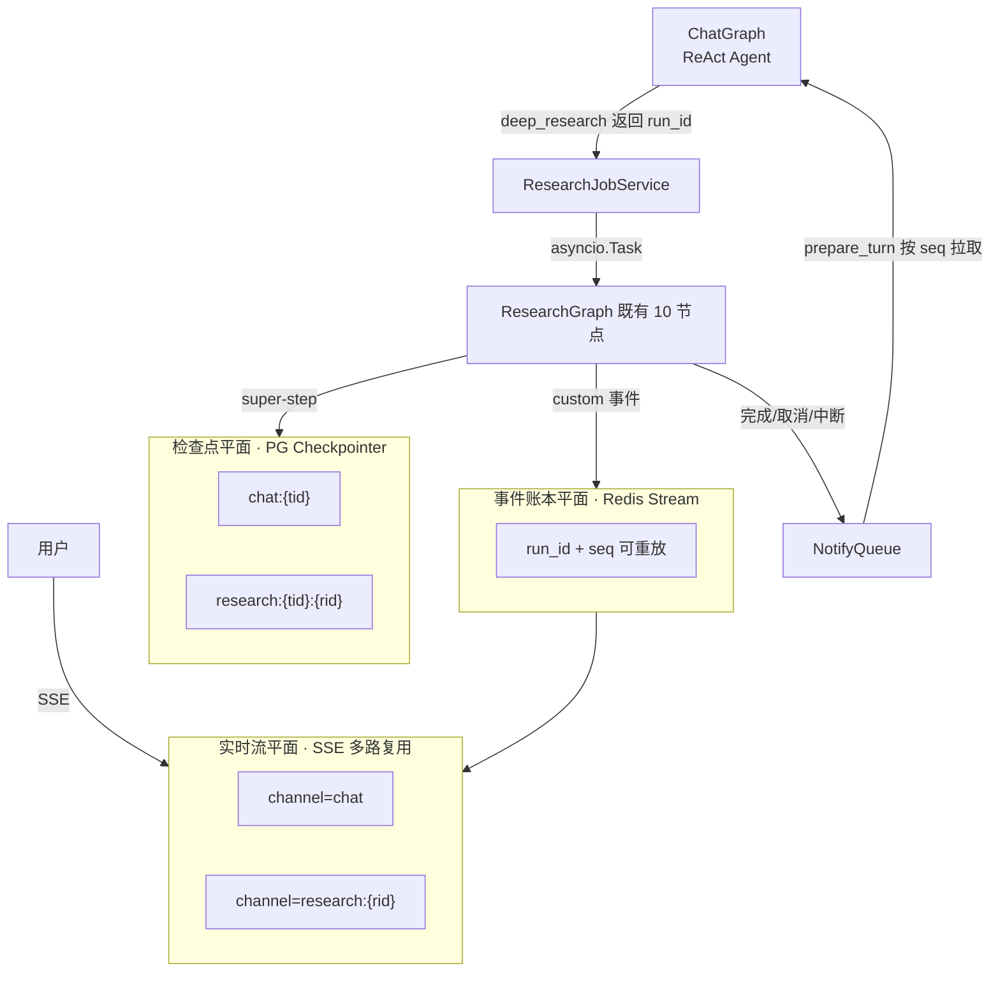

# 设计方案：对话式 ReAct Agent + 异步调研工具

> 目标：把现有「深度调研流水线」封装为 tool，重建一个对话式 ReAct agent 承载多轮对话，深度调研作为后台异步任务执行。
> 配套实现文档：`docs/plans/实现细节-对话式ReActAgent与异步调研工具.md`
> 日期：2026-09-22 ｜ 状态：待评审

---

## 1. 背景与目标

### 1.1 现状（已核实的代码事实）

| 事实 | 证据 |
| --- | --- |
| 研究图是 LangGraph `CompiledStateGraph`，`build_app(agents, checkpointer)` | `app/mult_agents/graph.py:68` |
| 外部调用全异步：`astream(input_state, config, stream_mode=["custom","updates"])` | `app/backend/service/research_service.py:420` |
| 拓扑 10 节点、两级循环（内层 `retrieve_grader` 重检 / 外层 `analyze` 续研） | `app/mult_agents/graph.py:84-117` |
| checkpointer = `AsyncPostgresSaver`，thread_id 由前端生成并透传 | `app/mult_agents/runtime.py:63`、`agent_front/src/stores/threads.ts:49` |
| 取消 = 应用层 `asyncio.Task.cancel()`，**不是** LangGraph interrupt | `app/backend/service/task_registry.py:122-136` |
| 事件走 LangGraph StreamWriter custom 通道 → `_StreamTranslator` → SSE | `app/backend/service/research_service.py:137-256` |
| 无独立任务表：运行态在 `TaskRegistry` 内存 dict + Redis 兜底 | `app/backend/service/task_registry.py:53` |

**问题**：一次 HTTP 请求 = 一轮完整研究的直线模型。研究跑 5–30 分钟（配置 `run_timeout_seconds: 900`），期间用户只能干等或取消；没有多轮对话能力，追问、改需求、边聊边调研都做不了。

### 1.2 目标

| 编号 | 目标 | 验收口径 |
| --- | --- | --- |
| G1 | 多轮对话：常驻对话式 ReAct agent，能聊天、能按需调工具 | 连续 10 轮追问不丢上下文 |
| G2 | 调研工具化：深度调研成为 agent 的一个 tool，由 agent 判断何时使用 | 轻量问题不误触发重调研 |
| G3 | 异步非阻塞：调研后台跑，用户可继续聊天 | 调研进行中发消息 < 1s 得到回复 |
| G4 | 可观测可控：进度实时可见、可取消、可断点续研、HITL 审批继续可用 | 取消后 checkpoint 保留可续跑 |
| G5 | 上下文不污染：报告全文不进 ReAct messages | 单轮 messages 增量 < 4k tokens |

### 1.3 非目标（明确不做）

- 不改现有研究图内部拓扑（10 个节点、两级循环保持不变）
- 不引入 LangGraph Platform / Agent Server（自建，成本与运维不可接受）
- 不替换现有 `/research/*` 路由 —— 新层**并存**，向后兼容

---

## 2. 客观约束（决定了后续所有选型）

| 编号 | 约束 | 来源 |
| --- | --- | --- |
| C1 | **LangGraph OSS 无后台 run API**。官方 background run 只在 Platform/Agent Server（`runs.create` / `runs.join` / `runs.cancel`），本地自建只能靠 `asyncio.Task` | [LangGraph SDK 文档](https://langchain-ai.github.io/langgraph/cloud/reference/sdk/python_sdk_ref/)（官方） |
| C2 | 研究图 5–30 分钟，远超 HTTP 网关与 LLM 调用超时舒适区 | 本仓 `config.json:53` |
| C3 | `interrupt()` 会冒泡到父图，且**父子图都从该节点开头重放**；resume 的 interrupt 索引须严格匹配 | [LangGraph interrupts 文档](https://docs.langchain.com/oss/python/langgraph/use-subgraphs)（官方） |
| C4 | **LangGraph OSS 无官方取消**。社区已确认 anyio 取消会连带取消 handler 内所有新任务、阻止 `AsyncPregelLoop.__aexit__`，导致子图继续跑；workaround 是 `asyncio.shield` | [langgraph#5682](https://github.com/langchain-ai/langgraph/issues/5682)（社区 issue） |
| C5 | **stream event ≠ checkpoint**：节点内未 `return` 就发出的 custom 事件在四种 durability 下都不进 checkpoint | [langgraph#5672](https://github.com/langchain-ai/langgraph/issues/5672)（社区 issue） |
| C6 | 工具返回值进 messages；大报告直接回传会爆上下文。Anthropic / Claude Code / open_deep_research 共识：只回 1–2k token 摘要 + artifact 句柄 | [Anthropic context engineering](https://www.anthropic.com/engineering/effective-context-engineering-for-ai-agents)、[Claude Agent SDK subagents](https://docs.claude.com/en/api/agent-sdk/subagents)（官方） |
| C7 | 本仓 reducer 纪律：累积字段只能返回增量，否则每轮翻倍 | `app/mult_agents/state.py:1-14` |
| C8 | Windows 无 `agent-browser`，E2E 只能 Playwright；后端基线 668 passed + 回归专项 116 passed | `AGENTS.md` 测试基线 |

---

## 3. 选型对比（核心决策）

### 3.1 方案 A：subgraph-as-tool —— **放弃**

官方写法：把 compiled subgraph 包成 `@tool`，tool 内 `subgraph.invoke()`，取末条 message 返回。([官方 how-to](https://docs.langchain.com/oss/python/langgraph/use-subgraphs))

放弃理由，逐条对号入座：

| 问题 | 对应约束 |
| --- | --- |
| **阻塞**：tool 内 invoke 是同步语义，父图整个节点挂住，这一轮对话无法结束 | 违反 G3 |
| **取消粒度**：父图 asyncio cancel 会波及子图；C4 的 anyio bug 会让子图在父图退出后继续跑 | C4 |
| **上下文**：子图返回的报告全文作为 ToolMessage 进 messages | C6 |
| **状态耦合**：研究图 40+ 字段与对话 messages 混在一个 namespace，checkpoint 体积与 history 语义都变脏；混合 thread 上 `/resume` 的 interrupt 索引匹配更难保证 | C3 |
| **已知限制**：per-thread 子图不支持并行工具调用（checkpoint 冲突） | LangGraph 官方 ToolNode 说明 |

### 3.2 方案 B：调研图服务化（独立进程 / worker 池）—— **备选，本期不采用**

优点：进程隔离彻底，可独立扩容，取消与重启互不影响。
放弃理由：当前是单体 FastAPI + 单机 PG/Redis，拆服务要引入服务发现、鉴权传递、跨进程事件回传，成本远超收益；PG checkpointer 已提供足够的持久化边界。
**保留为演进方向**：本方案的接口设计（run_id 句柄 + 事件流）让它未来可无痛替换，见 §8。

### 3.3 方案 C：进程内后台任务 + 句柄化工具 —— **采用**

核心思想：**ReAct agent 的 `deep_research` 工具不是"执行者"，而是"发起者"**。

- 工具调用**立即返回**一个 `run_id` 句柄；
- 真正的调研图在自己的 `asyncio.Task` 里、用自己的 thread namespace 跑；
- 完成后通过「通知队列」在**下一个轮次**回流到对话。

这与 Anthropic Agent SDK 的后台任务语义一致：后台任务的"结果在稍后的轮次作为完成通知到达"。



**三个平面解耦**（直接对应 C5 的教训 —— UI 流 / 应用 event ledger / checkpoint 必须分离）：

| 平面 | 职责 | 载体 |
| --- | --- | --- |
| 检查点平面 | 状态持久化与断点续跑 | PG checkpointer，chat 与每个 research run **各自 namespace** |
| 事件账本平面 | 可重放的事实记录（`run_id + seq`） | Redis Stream（多 worker）/ PG 表（单机兜底） |
| 实时流平面 | 传输 | SSE，按 `channel` 多路复用、`Last-Event-ID` 重放 |

---

## 4. 架构设计

### 4.1 分层

```
前端 Vue3
  useEventStream(多路复用) → chat 卡片 / research 进度卡 / interrupt 审批卡
      │ GET /chat/threads/{tid}/stream  (SSE)
FastAPI
  ├─ chat_router          对话入口（SSE 多路复用）
  ├─ research_router      既有路由保留 + 新增 /research/runs/*
  ├─ ChatService          驱动 ChatGraph
  └─ ResearchJobService   后台任务生命周期 launch/cancel/status/resume
       │
  ├─ ChatGraph (新)       prepare_turn → llm ⇄ tools → finalize
  │    tools: deep_research / research_status / research_result
  │           research_cancel / open_report
  │           web_search / fetch_url / kb_search（复用既有）
  └─ ResearchGraph (既有，不动)

基础设施（新增三个小模块）
  EventBus       Redis Stream 或 asyncio.Queue fan-out
  NotifyQueue    per-thread 通知流，seq 有序、消费幂等
  ArtifactStore  报告落盘 → artifact_id，支持分片读取
```

### 4.2 ChatGraph 拓扑

```
START → prepare_turn → llm ⇄ tools →(继续)→ llm
                             →(结束)→ finalize → END
```

| 节点 | 职责 |
| --- | --- |
| `prepare_turn` | **状态机关键节点**：① 从 NotifyQueue 拉取 `seq > notify_cursor` 的通知并按序排好；② 转成注入消息；③ 推进 cursor；④ 刷新 `active_jobs` 快照 |
| `llm` | 模型绑定全部工具，**不做结构化输出**（ReAct 只需 tool_calls）。需要结构化的场合走 `build_aux_llm` 后处理 |
| `tools` | `ToolNode` |
| `finalize` | 超阈值时压缩（`summary_model` 生成 `conversation_summary`，复用现有 `summary_service`） |

**不做结构化输出是硬决定**：本仓已踩过 `StructuredOutputValidationError`——带工具的节点必须 `ToolStrategy`、无工具的必须显式 `ProviderStrategy`，qwen 不在自动策略白名单内。ReAct 主循环绕开这套机制最省事也最稳。

### 4.3 关键设计：通知走「外部队列 + cursor」，不写进累积 state

若把通知 append 到 `Annotated[list, operator.add]` 再在节点里"消费"，累积列表只增不减，且 cancel/重放时会重复注入 —— 直接违反 C7。

采用：

- `notify_cursor: int` 存 graph state（**当前值语义**，后写覆盖）
- 通知 payload 存外部队列（Redis Stream）
- `prepare_turn` 按 `seq > cursor` 拉取 → 天然幂等、可重放、checkpoint 不被污染

### 4.4 注入消息的角色选择（一个容易踩的坑）

后台任务完成时，直觉是补一条 `ToolMessage(tool_call_id=...)` 配对的返回。但**多数 OpenAI 兼容实现要求 `ToolMessage` 必须紧跟在带 `tool_calls` 的 `AIMessage` 之后**；跨轮次注入时那条 AIMessage 早被滚动/压缩掉了，会直接报 400。

**决定：默认注入 `SystemMessage`**，形如：

```
[后台任务通知] run_id=r_01j… 状态=completed
标题：xxx
摘要：1–2k token
关键结论：…（top 5）
完整报告：artifact_id=art_01j…（用 open_report 分片读取）
```

system 角色在中途插入是 OpenAI 兼容协议允许的，且不要求配对。这一点写进实现文档的工具契约。

### 4.5 thread namespace 隔离

| 对象 | thread_id |
| --- | --- |
| 会话 | `chat:{chat_thread_id}` |
| 调研 run | `research:{chat_thread_id}:{run_id}` |

收益：checkpoint 完全隔离；`/resume` 的 interrupt 索引匹配（C3）只面对研究图自己的 interrupt 序列；研究失败/取消不影响会话继续聊天。

### 4.6 取消语义（对齐 LangGraph Platform 的 `action` 二分）

| action | 行为 | 后续 |
| --- | --- | --- |
| `interrupt`（默认） | 只 `task.cancel()`，**保留 checkpoint** | 可 `/resume` 续跑 |
| `rollback` | 额外删除该 run namespace 的 checkpoint | 不可续跑 |

取消后 `ResearchJobService` 落 `job.cancelled` 事件 + 推一条通知 → agent 下一轮告诉用户"已取消，已有哪些可用结论"。

**实现注意（C4）**：任务协程的退出清理用 `asyncio.shield` 包住，避免 anyio 取消作用域把 `AsyncPregelLoop.__aexit__` 一起取消，导致研究图在父任务退出后继续跑。

---

## 5. 工具契约（agent 视角）

| 工具 | 入参 | 返回 | 说明 |
| --- | --- | --- | --- |
| `deep_research` | `query`, `focus[]`, `mode`(background\|foreground), `max_iterations`, `timeout_seconds` | `{run_id, mode, status}` | background **立即返回**；foreground 带超时（默认 120s，上限 `run_timeout_seconds`） |
| `research_status` | `run_id` | `{phase, progress_pct, last_events[3], elapsed}` | 便宜，可高频调 |
| `research_result` | `run_id`, `max_chars=2000` | 完成→`{summary, key_findings[], artifact_id, source_count}`；未完成→`{status, hint}` | **永不返回报告全文**（C6） |
| `research_cancel` | `run_id`, `action` | `{ok, checkpoint_kept}` | |
| `open_report` | `artifact_id`, `offset_chars`, `max_chars` | 分片正文 | 按需取全文，不进主上下文 |
| `web_search` / `fetch_url` / `kb_search` | 复用 `app/mult_agents/tools.py` | | 轻量问题不必启动重任务 |

**提示词契约（不是代码问题，但决定成败）**：工具描述里必须明写「返回的是句柄而不是结果」「完成后会自动收到通知」。否则 LLM 会立刻追问结果或重复发起调研 —— 这是这类设计最常见的失效模式。

---

## 6. 事件协议扩展

`EventEnvelope` 增两字段：`channel`（`"chat"` / `"research:{run_id}"`）、`seq`（单调，用于 `Last-Event-ID` 重放）。

新增事件：

```
job.started / job.progress / job.completed / job.cancelled / job.failed / job.interrupted
chat.turn.started / chat.delta / chat.tool_call / chat.tool_result / chat.turn.completed
```

**必须同步三处**（本仓既有约定）：
1. `app/backend/schemas/events.py` 的 `EVENT_REGISTRY`
2. `docs/event-protocol.json` 重新导出（Pydantic → JSON Schema）
3. `app/test/test_event_protocol_contract.py` 校验其未过期

前端对未知 type 静默忽略（协议不变式 3），所以可以**先后端后前端灰度**。

---

## 7. 分阶段落地计划

| Phase | 内容 | 完成判据（DoD） |
| --- | --- | --- |
| **P0 地基** | `ArtifactStore`（报告落盘取 `artifact_id`）；事件协议扩展 + 契约测试更新 | 契约测试绿；`docs/event-protocol.json` 重新导出成功 |
| **P1 任务层** | `ResearchJobService`（launch/cancel/status/resume）+ `/research/runs/*` 路由；`TaskRegistry` 改造（按 run_id 注册、shield 退出、并发配额） | 后台任务可启动/取消；取消后 checkpoint 仍在 |
| **P2 对话层** | `ChatState` / `ChatGraph` / 6–8 个工具 / `ChatService` + 单测 | 单轮对话与工具调用跑通；基线不破 |
| **P3 通知回流** | `NotifyQueue` + `prepare_turn` 注入 + 取消/中断通知 | 完成通知幂等注入；重复 drain 不重复注入 |
| **P4 前端** | SSE 多路复用、调研进度卡、审批卡、报告面板 | 调研中可继续聊天；进度实时可见 |
| **P5 韧性与多 worker** | Redis Stream 事件总线、`Last-Event-ID` 重放、orphan 扫描、断点续跑 | 断线重连不丢事件；进程重启后能识别中断任务 |
| **P6 评测门禁** | 上下文膨胀、通知幂等、取消一致性、并发配额四项评测 | 四项评测纳入 CI 门禁 |

**每阶段收口动作**：跑 `python -m pytest app/test --ignore=app/test/test_fix_regressions.py -q`（基线 668 passed / 2 skipped）+ 回归专项（116 passed / 7 deselected）。新增的契约/回归断言**必须注入一次人为漂移**确认它真会失败。

---

## 8. 演进路径

若后续调研任务变多、需要独立扩容，把 `ResearchJobService` 换成「调研 worker 池 + 消息队列」（方案 B）即可，**接口不变** —— 因为 ChatGraph 只依赖 `run_id` 句柄与事件流，**不依赖执行位置**。这是本方案最重要的解耦收益，也是选 C 而非 A 的长期理由。

---

## 9. 风险与反模式清单

| # | 风险 | 依据 | 缓解 | 检测 |
| --- | --- | --- | --- | --- |
| R1 | ReAct 直接调长工具阻塞整轮 | C2 | 后台化 + 完成通知注入下一轮 | P3 用例：调研中发消息 < 1s 回复 |
| R2 | 报告全文回传爆上下文 | C6 | 只回摘要 + artifact_id；`open_report` 分片 | 单轮增量 token 断言 |
| R3 | cancel 与 checkpointer 竞态，checkpoint 半截 | C4 / #5682 | `asyncio.shield` 包退出清理；取消后恢复到最后已提交 super-step | `test_chat_cancel_race.py` |
| R4 | 通知重复注入 / 丢失 | C7 | 外部队列 + 单调 `seq` + cursor；消费幂等 | 并发投递 N 次只注入 N 条 |
| R5 | interrupt 索引不匹配导致 resume 失败 | C3 | 研究 run 独立 namespace；不在 research 里混 chat 的 interrupt | resume 用例覆盖审批/驳回/修订 |
| R6 | `ToolMessage` 跨轮次注入报 400 | OpenAI 兼容约束 | 默认 `SystemMessage` 注入 | 注入后真实调用一次模型 |
| R7 | 事件丢失（断线/多 worker） | C5 | 三层解耦；Redis Stream + `Last-Event-ID` 重放 | P5 断线重连用例 |
| R8 | LLM 反复发起调研 / 立刻追问结果 | 提示词契约缺失 | 工具描述明写句柄语义 | P6 评测：轻量问题不触发重调研 |
| R9 | 并发调研打爆 LLM 配额 | 运营 | per-user 并发上限（默认 3）+ 队列 | 配额用例 |

---

## 10. 已确认的可复用模块（避免重复造轮子）

| 能力 | 文件 | 复用方式 |
| --- | --- | --- |
| 模型工厂 | `app/mult_agents/models.py:78/105/144/196` | `build_agent` / `build_aux_llm` |
| 检索与抓取 | `app/mult_agents/tools.py:278/397/431/631` | `SearchProviderChain` / `fetch_url_tool` |
| checkpointer | `app/mult_agents/runtime.py:63/140/145` | `init_checkpointer` / `get_checkpointer` |
| 事件构造 | `app/backend/schemas/events.py:117/131` | `event()` / `sse()` |
| 取消注册 | `app/backend/service/task_registry.py:53` | 改造为按 run_id 注册 |
| 报告校验 / 导出 | `app/backend/service/report_check.py:93`、`pdf_export_service.py:45/65/105` | 复用 `check_report` / `verify_pdf` |
| 引用校验 | `app/mult_agents/citations.py:22` | `validate_and_fix_citations` |

---

## 11. 待确认的假设（评审时敲定）

1. **默认执行模式**为 `background`；`foreground` 仅用于明确"等我一下"的短调研（超时 120s）。
2. **单用户并发调研上限 3**，超出返回配额错误而非排队。
3. **单机优先**：P0–P4 用 `asyncio.Queue` + PG 兜底，P5 再切 Redis Stream。
4. **会话 thread 复用既有 `chat_threads` 表**（`postgres_client.py:114`），新增 `notify_cursor` 与 `active_jobs` 列或存 metadata JSON。
